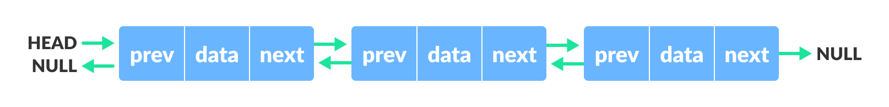
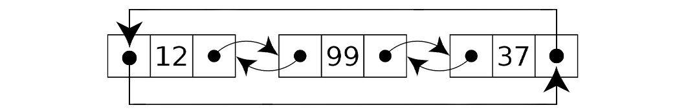

- [ADT 관점에서 List](#adt-관점에서-list)
- [ArrayList](#arraylist)
- [LinkedList](#linkedlist)
  - [circular linked list](#circular-linked-list)
  - [doubly linked list](#doubly-linked-list)
  - [circular doubly linked list](#circular-doubly-linked-list)
- [ArrayList와 LinkedList 차이 정리](#arraylist와-linkedlist-차이-정리)
  - [ArrayList와 Cache???](#arraylist와-cache)

 

## ADT 관점에서 List

 

> 리스트는 값을 저장하는 ADT이다.

- 특징
  - 순서가 있고
  - 중복을 허용한다.

 

> Set이나 Map을 사용하는게 더 적절한 상황이 아니라면  
> 거의 일반적인 대부분의 상황에서 List를 사용하는 것은 무리가 없다.

 

 

## ArrayList

 

> 배열을 사용하여 List를 구현한다.

 

## LinkedList

 

> 노드를 연결시키는 형태로 구현  
> `메모리 상에서 배열과 다르게 선형적으로 저장`되지 않는다.

- tail없이 head로만 운영한다면?

> 그러면 head로부터 끝에 있는 헤드까지가서  
> 노드를 만들고 마지막 노드를 만들어야한다.  
> 이때 삽입에서 손해를 본다.

 

### circular linked list

 

|                     Circular Linked List                     |
| :----------------------------------------------------------: |
|  |

 

> tail 없이 head 포인터만 존재하여  
> 마지막 노드가 첫번째 노드를 바라보게 하는 Linked List  
> 즉 list의 끝이 존재하지 않는 구조

 

### doubly linked list

 

|                    Doubly Linked List                    |
| :------------------------------------------------------: |
|  |

 

> 단순 연결리스트의 경우 head pointer로 이동할 수 있지만 이전 노드로는 갈 수 없다.  
> 따라서 해당 노드에 이전 노드의 주소값을 가리키는 prev를 만들어 준 형태이다.

 

### circular doubly linked list

 

|                         Circular Doubly Linked List                         |
| :-------------------------------------------------------------------------: |
|  |

 

> 자바의 linkedlist와 유사한 구조

## ArrayList와 LinkedList 차이 정리

|                  |                           ArrayList                           |                         LinkedList                         |
| :--------------: | :-----------------------------------------------------------: | :--------------------------------------------------------: |
|       구현       |                       배열(array 사용)                        |                    노드를 연결(linekd)                     |
|  삽입/삭제 시간  | 상수(삽입.삭제시 데이터 시프트가 필요한 경우 추가 시간 발생)  | 상수(삽입/삭제 위치에 따라 그 위치까지 이동하는 시간 발생) |
| 리스트 크기 확장 | 배열 확장이 필요한 경우 새로운 배열에 복사하는 추가 시간 발생 |                             -                              |
|       검색       |                유효한지 탐색하려면 n만큼 탐색                 |               유효한지 탐색하려면 n만큼 탐색               |
|     CPU 캐시     |                      CPU 캐시 이점 활용                       |                             -                              |
|     구현 예      |                       Java의 ArrayList                        |                     Java의 LinkedList                      |

 

> 거의 대부분 ArrayList를 쓰는게 더 좋다.  
> CPU 캐시 이점도 있고, datashift 밑 배열 확장 문제도  
> 하나하나 옮기는 것이 아닌 계산 성능을 더 좋게 개선 되었다.
>
> 심지어 조슈아 블로크(`Linked List 작성자이자 이펙티브 자바 작성자`)도  
> 누가 링크드 리스트를 쓰느냐고 트위터에...  
> 또한, FIFO 자료구조로 쓸때 심지어 LinkedList를 사용한다고 한 답변자에게  
> ArrayDequeue를 쓰라고 권장...
>
> 또한 두 자료구조 모두 검색에서는 용이한 편은 아니다.  
> 선형적으로 모두 탐색해야하는 corner case가 존재할 수 있기 때문

 

- 실제 내 생각

> 실제 내 프로젝트 경험에서 LinkedList를 사용한 경우는 없었다.  
> 대부분 DB에서 데이터를 가져온 후  
> 상위 몇 번째 혹은 하위 몇 번째 데이터를 찾거나  
> 보내주는 경우가 더 많았기 때문이다.

 

### ArrayList와 Cache???

 

> 케시메모리는 temporal locality와 spatial locality로 나뉜다.

 

- 시간 지역성
  - for나 while같은 반복문에 사용하는 조건 변수처럼 한 번 참조된 데이터는 잠시 후에 또 참조 될 가능성이 높다는 것.
- 공간 지역성
  - A[0], A[1]과 같은 데이터 배열에 연속으로 접근할 때 참조된 데이트 근처에 있는 데이터가 잠시후에 또 사용될 가능성이 높다는 것이다!

 

> 즉 cache locality에 의해 Array는  
> 연속적인 memory block으로 array에 처음 접근할 때  
> 전체 array가 cache에 로드 되어  
> 첫 액세스 이후로는 공간 지역성이 생기는 것  
> 사실 이 부분에 대해서 자바의 경우 jvm이 알아서 메모리를 관리해주기 때문에  
> array 사용시 cache locality가 적용되는지 여부는..?

 
