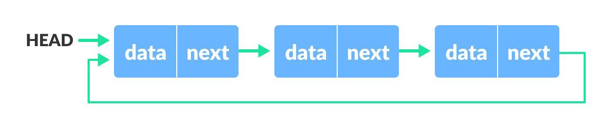

- [ADT 관점에서 List](#adt-관점에서-list)
- [ArrayList](#arraylist)
  - [java.util.ArrayList 살펴보기](#javautilarraylist-살펴보기)
- [LinkedList](#linkedlist)
  - [java.util.LinkedList 살펴보기](#javautillinkedlist-살펴보기)
  - [circular linked list](#circular-linked-list)
  - [doubly linked list](#doubly-linked-list)
  - [circular doubly linked list](#circular-doubly-linked-list)
- [ArrayList와 LinkedList 차이 정리](#arraylist와-linkedlist-차이-정리)
  - [ArrayList와 Cache???](#arraylist와-cache)

</br>

## ADT 관점에서 List

</br>

> 리스트는 값을 저장하는 ADT이다.

- 특징
  - 순서가 있고
  - 중복을 허용한다.

</br>

> Set이나 Map을 사용하는게 더 적절한 상황이 아니라면  
> 거의 일반적인 대부분의 상황에서 List를 사용하는 것은 무리가 없다.

</br>

</br>

## ArrayList

</br>

> 배열을 사용하여 List를 구현한다.  
> ArrayList를 사용하는 방식이 동적인 것은 사실이지만  
> 결국 특정 사이즈의 배열을 인스턴스 변수로 가진다는 것!

</br>

### java.util.ArrayList 살펴보기

</br>

- 살펴볼 인스턴스 변수

```java
public class ArrayList<E> extends AbstractList<E>
        implements List<E>, RandomAccess, Cloneable, java.io.Serializable
{
  private static final int DEFAULT_CAPACITY = 10;

  private static final Object[] EMPTY_ELEMENTDATA = {};

  private static final Object[] DEFAULTCAPACITY_EMPTY_ELEMENTDATA = {};

    /**
   * The array buffer into which the elements of the ArrayList are stored.
   * The capacity of the ArrayList is the length of this array buffer. Any
   * empty ArrayList with elementData == DEFAULTCAPACITY_EMPTY_ELEMENTDATA
   * will be expanded to DEFAULT_CAPACITY when the first element is added.
   */
  transient Object[] elementData; // non-private to simplify nested class access

  private int size;

}
```

</br>

- elementData

> ArrayList에서 원소를 저장할 배열  
> 문서를 잠깐 살펴보면  
> 어떤 빈 arrayList 즉 elementData == DEFAULTCAPACITY_EMPTY_ELEMENTDATA는  
> 첫번째 원소가 삽입되는 순간에 DEFAULT_CAPACITY로 확장 된다고 한다.

</br>

- 생성자

```java
public ArrayList(int initialCapacity) {
        if (initialCapacity > 0) {
            this.elementData = new Object[initialCapacity];
        } else if (initialCapacity == 0) {
            this.elementData = EMPTY_ELEMENTDATA;
        } else {
            throw new IllegalArgumentException("Illegal Capacity: "+
                                               initialCapacity);
        }
    }

    /**
     * Constructs an empty list with an initial capacity of ten.
     */
    public ArrayList() {
        this.elementData = DEFAULTCAPACITY_EMPTY_ELEMENTDATA;
    }

    /**
     * Constructs a list containing the elements of the specified
     * collection, in the order they are returned by the collection's
     * iterator.
     *
     * @param c the collection whose elements are to be placed into this list
     * @throws NullPointerException if the specified collection is null
     */
    public ArrayList(Collection<? extends E> c) {
        Object[] a = c.toArray();
        if ((size = a.length) != 0) {
            if (c.getClass() == ArrayList.class) {
                elementData = a;
            } else {
                elementData = Arrays.copyOf(a, size, Object[].class);
            }
        } else {
            // replace with empty array.
            elementData = EMPTY_ELEMENTDATA;
        }
    }
```

</br>

> 세 개의 생성자가 작성 되어 있다.  
> 우리가 흔히 생성하는 방식 List\<E> list = new ArrayList<>();과 같이
> Capacity를 지정하지 않고 선언하여 사용하는데,  
> 이 경우 elementData = DEFAULTCAPACITY_EMPTY_ELEMENTDATA로 정의한다.

</br>

- add(E e)

```java
public boolean add(E e) {
  modCount++;
  add(e, elementData, size);
  return true;
}

private void add(E e, Object[] elementData, int s) {
  if (s == elementData.length)
      elementData = grow();
  elementData[s] = e;
  size = s + 1;
}
```

</br>

- 1. 우리가 흔히 사용하는 add(E e)를 호출하면 class의 private void add(E e, Object[] elementData, int s)를 호출한다.
- 2. size가 현재 원소를 담는 elementData의 길이와 같으면 grow() 메서드를 호출한다.
- 3. 그 후 elementData[s]에 데이터를 저장한 후 size를 1 증가시킨다.

</br>

- grow()와 grow(int minCapacity)

> 위에서 살펴 봤듯, size와 element.length가 같으면  
> 데이터를 더이상 저장할 수 없음으로  
> 배열의 크기를 늘리는 grow() 메서드를 호출한다.
>
> 그리구 위 문서에서처럼 정말 초기 capacity를 정하지 않을때  
> `element = DEFAULTCAPACITY_EMPTY_ELEMENTDATA` 어떻게 동작하는지 살펴보자!

</br>

```java
  private Object[] grow(int minCapacity) {
      int oldCapacity = elementData.length;
      if (oldCapacity > 0 || elementData != DEFAULTCAPACITY_EMPTY_ELEMENTDATA) {
          int newCapacity = ArraysSupport.newLength(oldCapacity,
                  minCapacity - oldCapacity, /* minimum growth */
                  oldCapacity >> 1           /* preferred growth */);
          return elementData = Arrays.copyOf(elementData, newCapacity);
      } else {
          return elementData = new Object[Math.max(DEFAULT_CAPACITY, minCapacity)];
      }
  }
  private Object[] grow() {
      return grow(size + 1);
  }
```

</br>

- 1. grow()에서 현재 grow(int minCapcity)를 호출한다.
- 2. 일단 oldCapacity를 `현재 용량`이라고 부르겠다.
- 3. 분기문을 살펴볼 때 현재 용량이 0보다 크거나 elementData != DEFAULTCAPACITY_EMPTY_ELEMENTDATA 일 경우
  - 새로운 용량을 결정한 후 elementData의 정보를 복사 한다.
- 4. 현재 용량이 0이면서 element가 DEFAULTCAPACITY_EMPTY_ELEMENTDATA면
  - elementData의 크기를 DEFAULT_CAPACITY로 늘려서 배열을 재정의한다.

</br>

> 이제 3번을 좀 더 살펴보기로 하자.  
> 살펴보기로 할 내용은 과연 elementData의 사이즈를 늘릴때  
> 내부에서 얼마나 늘려주는지!

</br>

```java
package jdk.internal.util;

  public static final int SOFT_MAX_ARRAY_LENGTH = Integer.MAX_VALUE - 8;


  public static int newLength(int oldLength, int minGrowth, int prefGrowth) {
      // preconditions not checked because of inlining
      // assert oldLength >= 0
      // assert minGrowth > 0
      int prefLength = oldLength + Math.max(minGrowth, prefGrowth); // might overflow
      if (0 < prefLength && prefLength <= SOFT_MAX_ARRAY_LENGTH) {
          return prefLength;
      } else {
          // put code cold in a separate method
          return hugeLength(oldLength, minGrowth);
      }
  }

  private static int hugeLength(int oldLength, int minGrowth) {
    int minLength = oldLength + minGrowth;
    if (minLength < 0) { // overflow
        throw new OutOfMemoryError(
            "Required array length " + oldLength + " + " + minGrowth + " is too large");
    } else if (minLength <= SOFT_MAX_ARRAY_LENGTH) {
        return SOFT_MAX_ARRAY_LENGTH;
    } else {
        return minLength;
    }
}

```

> 예를 들어 현재 elementData.length가 10으로 현재 용량이 가득 찬 경우  
> oldLength = 10, minGrowth = 1, prefGrowth = 5가된다.
> grow에서 넣어주는 방식이 복잡해보이긴 하지만 쉽게 설명하면
> oldLength = a, minGrowth = 1, prefGrowth = a >> 1이다.

</br>

- 1. prefLength가 0보다 크고 prefLenth <= SOFT_MAX_ARRAY_LENGTH일 경우에는 prefLength를 반환해준다.
  - 즉 element.length = (현재 길이) + (현재 길이 / 2)로 설정된다.
- 2.hugeLenth의 경우 거진 발생하지 않는 상황이라 설명 생략

</br>

## LinkedList

</br>

> 노드를 연결시키는 형태로 구현  
> `메모리 상에서 배열과 다르게 선형적으로 저장`되지 않는다.

- tail없이 head로만 운영한다면?

> 그러면 head로부터 끝에 있는 헤드까지가서  
> 노드를 만들고 마지막 노드를 만들어야한다.  
> 이때 삽입에서 손해를 본다.

</br>

### java.util.LinkedList 살펴보기

</br>

- 기본 정보

```java
public class LinkedList<E>
    extends AbstractSequentialList<E>
    implements List<E>, Deque<E>, Cloneable, java.io.Serializable
{
    transient int size = 0;

    /**
     * Pointer to first node.
     */
    transient Node<E> first;

    /**
     * Pointer to last node.
     */
    transient Node<E> last;

    private static class Node<E> {
      E item;
      Node<E> next;
      Node<E> prev;

      Node(Node<E> prev, E element, Node<E> next) {
          this.item = element;
          this.next = next;
          this.prev = prev;
      }
    }
}
```

> Node first와 last를 인스턴스 변수로 가지고 있다.
> Node는 inner class로 next와 prev를 가지고 있다(`이중 연결리스트`)

</br>

- add(E e)

</br>

```java
  public boolean add(E e) {
      linkLast(e);
      return true;
  }

  void linkLast(E e) {
    final Node<E> l = last;
    final Node<E> newNode = new Node<>(l, e, null);
    last = newNode;
    if (l == null)
        first = newNode;
    else
        l.next = newNode;
    size++;
    modCount++;
  }
```

</br>

> 사실 참조에 대한 개념만 있다면 동작원리를 이해하는데 그렇게 어렵지 않다.

- 1. 지역변수로 last 노드를 저장해준다.
- 2. newNode를 만들고, prev에 last를 넣어준다.
- 3. last를 newNode로 정의한다.
- 4. 이후 분기점은 현재 Node가 첫번째 삽입이냐 아니냐를 판단한다.
  - l == null이면, 첫번째 삽입이면 first와 last가 같은 노드를 갖는다,
  - l == null이 아니면, 첫번째 삽입이 아니면, ㅣ의 next가 newNode를 가리키게 한다.

</br>

- get(int index)

```java
  public E get(int index) {
      checkElementIndex(index);
      return node(index).item;
  }
  private void checkElementIndex(int index) {
    if (!isElementIndex(index))
      throw new IndexOutOfBoundsException(outOfBoundsMsg(index));
  }

  private boolean isElementIndex(int index) {
      return index >= 0 && index < size;
  }

  Node<E> node(int index) {
    // assert isElementIndex(index);
    if (index < (size >> 1)) {
        Node<E> x = first;
        for (int i = 0; i < index; i++)
            x = x.next;
        return x;
    } else {
        Node<E> x = last;
        for (int i = size - 1; i > index; i--)
            x = x.prev;
        return x;
    }
  }
```

- 1. checkElementIndex를 통해 index 유효성 검증
- 2. index의 node를 찾을때
  - size / 2가 index보다 작으면 first를 기준으로 해당 인덱스의 node를 찾는다.
  - size / 2가 index보다 크면 last를 기준으로 해당 인덱스의 node를 찾는다.

</br>

### circular linked list

</br>

|                     Circular Linked List                     |
| :----------------------------------------------------------: |
|  |

</br>

> tail 없이 head 포인터만 존재하여  
> 마지막 노드가 첫번째 노드를 바라보게 하는 Linked List  
> 즉 list의 끝이 존재하지 않는 구조

</br>

### doubly linked list

</br>

|                    Doubly Linked List                    |
| :------------------------------------------------------: |
|  |

</br>

> 단순 연결리스트의 경우 head pointer로 이동할 수 있지만 이전 노드로는 갈 수 없다.  
> 따라서 해당 노드에 이전 노드의 주소값을 가리키는 prev를 만들어 준 형태이다.

</br>

### circular doubly linked list

</br>

|                         Circular Doubly Linked List                         |
| :-------------------------------------------------------------------------: |
|  |

</br>

> 자바의 linkedlist와 유사한 구조

## ArrayList와 LinkedList 차이 정리

|                  |                           ArrayList                           |                         LinkedList                         |
| :--------------: | :-----------------------------------------------------------: | :--------------------------------------------------------: |
|       구현       |                       배열(array 사용)                        |                    노드를 연결(linekd)                     |
|  삽입/삭제 시간  | 상수(삽입.삭제시 데이터 시프트가 필요한 경우 추가 시간 발생)  | 상수(삽입/삭제 위치에 따라 그 위치까지 이동하는 시간 발생) |
| 리스트 크기 확장 | 배열 확장이 필요한 경우 새로운 배열에 복사하는 추가 시간 발생 |                             -                              |
|       검색       |                유효한지 탐색하려면 n만큼 탐색                 |               유효한지 탐색하려면 n만큼 탐색               |
|     CPU 캐시     |                      CPU 캐시 이점 활용                       |                             -                              |
|     구현 예      |                       Java의 ArrayList                        |                     Java의 LinkedList                      |

</br>

> 거의 대부분 ArrayList를 쓰는게 더 좋다.  
> CPU 캐시 이점도 있고, datashift 밑 배열 확장 문제도  
> 하나하나 옮기는 것이 아닌 계산 성능을 더 좋게 개선 되었다.
>
> 심지어 조슈아 블로크(`Linked List 작성자이자 이펙티브 자바 작성자`)도  
> 누가 링크드 리스트를 쓰느냐고 트위터에...  
> 또한, FIFO 자료구조로 쓸때 심지어 LinkedList를 사용한다고 한 답변자에게  
> ArrayDequeue를 쓰라고 권장...
>
> 또한 두 자료구조 모두 검색에서는 용이한 편은 아니다.  
> 선형적으로 모두 탐색해야하는 corner case가 존재할 수 있기 때문

</br>

- 실제 내 생각

> 실제 내 프로젝트 경험에서 LinkedList를 사용한 경우는 없었다.  
> 대부분 DB에서 데이터를 가져온 후  
> 상위 몇 번째 혹은 하위 몇 번째 데이터를 찾거나  
> 보내주는 경우가 더 많았기 때문이다.

</br>

### ArrayList와 Cache???

</br>

> 케시메모리는 temporal locality와 spatial locality로 나뉜다.

</br>

- 시간 지역성
  - for나 while같은 반복문에 사용하는 조건 변수처럼 한 번 참조된 데이터는 잠시 후에 또 참조 될 가능성이 높다는 것.
- 공간 지역성
  - A[0], A[1]과 같은 데이터 배열에 연속으로 접근할 때 참조된 데이트 근처에 있는 데이터가 잠시후에 또 사용될 가능성이 높다는 것이다!

</br>

> 즉 cache locality에 의해 Array는  
> 연속적인 memory block으로 array에 처음 접근할 때  
> 전체 array가 cache에 로드 되어  
> 첫 액세스 이후로는 공간 지역성이 생기는 것  
> 사실 이 부분에 대해서 자바의 경우 jvm이 알아서 메모리를 관리해주기 때문에  
> array 사용시 cache locality가 적용되는지 여부는..?

</br>
