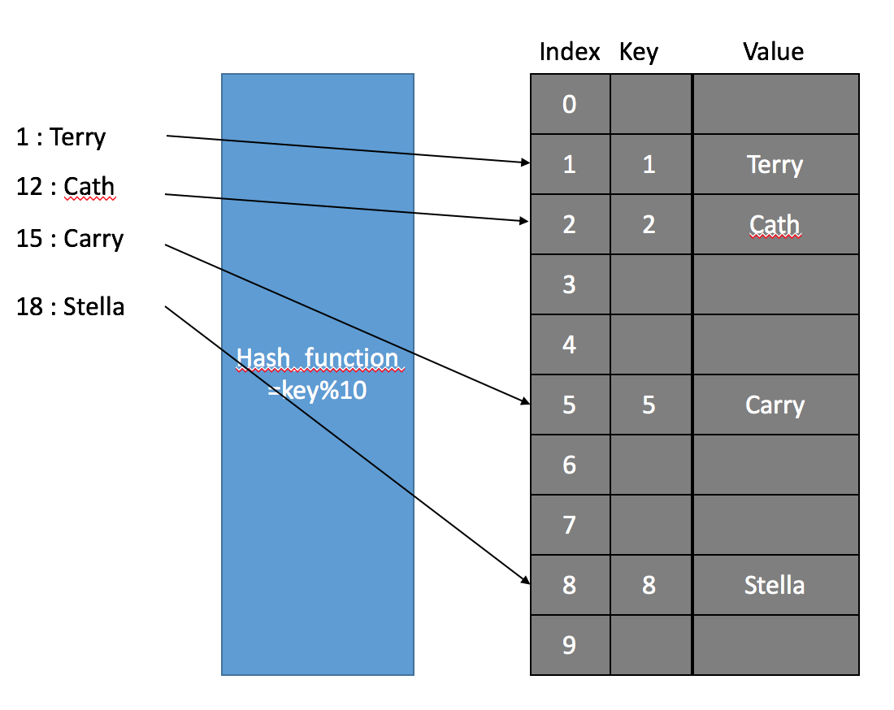

- [Hash Table](#hash-table)
  - [Hash Function](#hash-function)
  - [hash Table은 어떻게 동작하는가?](#hash-table은-어떻게-동작하는가)
  - [Hash Collision](#hash-collision)
  - [Hash Collision 해결 발법](#hash-collision-해결-발법)
  - [hash table resizing](#hash-table-resizing)
  - [java의 HashMap](#java의-hashmap)

## Hash Table

</br>

- 배열과 해시 함수를 사용하여 map을 구현한 자료 구조
- (일반적으로) 상수 시간으로 데이터에 접근하여 빠르다

</br>

### Hash Function

- 임의의 크기를 가지는 type의 데이터를 고정된 크기를 가지는 type의 데이터로 변환하는 함수
- hash table에서 임의의 데이터를 정수로 변환하는 함수

</br>

### hash Table은 어떻게 동작하는가?

</br>

- Map에 값을 넣을 때

</br>

```java
map.put("010-2222-2222", "Jung")
```

> hash function을 통해 202 hash가 나왔다고 가정한다.

</br>

| Capacity |
| :------: |
|    0     |
|    1     |
|    2     |
|    3     |
|    4     |
|    5     |
|    6     |
|    7     |

</br>

> 8개의 각각의 공간을 bucket(slot)이라고 부른다.  
> bucket 중에 한 곳에 `202`값을 저장해야한다.  
> 202 % 8 = 2, index 2번 위치에 `Jung`을 저장한다.

</br>

- Map에서 key로 값을 가져올 때

</br>

```java
map.get("010-1010-1001")
```

</br>

> key에 대하여 hash function을 실행시킨다.  
> hash가 834가 나온다고 가정한다.  
> 834 % 8 = 2 인데 이 경우 앞서 `jung`을 저장한 곳으로 간다.
> 그러면 어떻게 올바르게 저장할까?

</br>

> 834 % 8 = 2인 경우로 다시 돌아간다.  
> index 2번 위치로 간다.  
> 이때 "010-2222-2222"의 키값과 "010-1010-1001" 키 값을 비교한다.  
> equal이 되면 그때 value를 확정할 수 있지만, 현재는 다른 키 값이다.  
> 이 경우 원소가 하나인 hash table에서 올바른 키에 대한 밸류를 찾을 수 없다!

</br>

### Hash Collision

- key는 다른데 hash가 같을 때
- key도 hash도 다른데 hash % map_capacity 결과가 같을때

</br>

> hash collison은 피할 수는 없고  
> 발생 했을때 어떻게 해결해야하는가..?

</br>

### Hash Collision 해결 발법

</br>

- open Addressing

</br>

|                  open addressing                   |
| :------------------------------------------------: |
|  |

</br>

> collision이 발생할 경우 key값을 비교한 후  
> key값이 다를 경우 비어있는 bucket에 넣는다.  
> linear probing의 경우 바로 그 다음 bucket에 넣는다.
>
> 조회를 할 때 hash에 해당 키가 없으면 종료하는 것이 아니라  
> linear probing방식에서는 그 다음 버킷을 확인해봐야한다.  
> 즉, 같은 키가 나오거나 혹은 bucket이 비어있을때까지 탐색을 진행한다.
>
> 삭제 할 때는 해당 해시를 지울때,  
> 해시에 해당하는 다른 값을 삭제 된 bucket에 옮기던가  
> 혹은 dummy값을 넣어줘야 한다.

</br>

- seperate chaining

</br>

|                   serperate chainging                    |
| :------------------------------------------------------: |
|  |

</br>

> hash collision이 발생 할 경우 먼저 key값을 비교한다.  
> 이때 key값이 다를 경우, bucket 하나 하나를 linked list로 관리하여  
> key1 - value1의 next reference가 key2-value2를 가리키게 하여 저장한다.

</br>

- 최악의 경우

> n개의 key-value를 넣고 모두 hash collision이 발생하였을 때  
> 마지막 key-value의 노드를 조회할 경우 조회시 O(n)의 시간이 소요된다.

</br>

### hash table resizing

</br>

> 데이터가 많이 차게 되면 크기를 늘려줘야 한다.
> 자바의 해시맵은 전체 용량의 4분의 3이 찰 경우  
> 사이즈를 두 배로 늘려준다.

</br>

> capacity가 두배로 늘어나면 modular도 두 배로 늘어난다.  
> 그 후 저장된 해시값들을 modular로 나누어  
> 새로운 배열의 해시테이블에 저장한다.

</br>

### java의 HashMap

|           분류           |             Java HashMap              |
| :----------------------: | :-----------------------------------: |
|  데이터 접근/삽입/삭제   |    모든 데이터를 상수 시간에 접근     |
|   해시 충돌 해결 방법    |           Seperate chaining           |
| default initial capacity |                  16                   |
|      resize 타이밍       | map capacitydml 3/4이상 데이터 존재시 |
|       resize 규모        |                  2x                   |
|      shirink 타이밍      |                   -                   |
|   hash table capacity    |              power of 2               |

</br>
