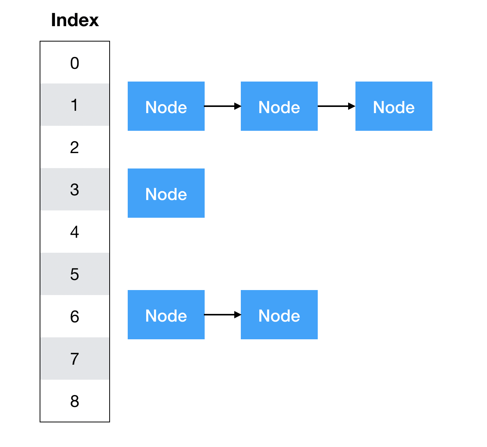

- [Map](#map)
  - [맵은 언제 쓸까?](#맵은-언제-쓸까)
  - [Map 구현체](#map-구현체)
- [import java.util.HashMap 살펴보기](#import-javautilhashmap-살펴보기)
  - [map.put() 살펴보기](#mapput-살펴보기)

</br>

## Map

- key - value pair들을 저장하는 ADT
- 같은 key를 가지는 pari는 최대 한 개만 존재
- associative array, dictionary라고 불리기도 함

</br>

### 맵은 언제 쓸까?

> 해당 키에 대한 count를 활용할 때도 쓸 수 있다.

</br>

### Map 구현체

- HashTable
- Tree-based

</br>

> 대표적으로 해시 베이스와 트리 베이스가 있다.  
> HashMap, LinkedHashMap, TreeMap이 대표적으로 Map의 인터페이스를 상속받고,  
> Thread-Safe한 ConcurrentHashMap은 import java.util.concurrent 패키지에 있고  
> CoucurrentHashMap은 ConcurrentMap 인터페이스를 상속받는다.

</br>

> 우선 대표적인 HashMap과 TreeMap을 살펴보겠다!

</br>

## import java.util.HashMap 살펴보기

</br>

|               HashMap 구조               |
| :--------------------------------------: |
|  |

</br>

> Java에서 hash map은 seperated chaining 기법을 사용한다.  
> 단 자바에서 hash map에서는 shirink를 지원하지 않는다.

</br>

- 내부 inner class로 Map의 내부 인터페이스 Entry를 상속 받는다!

```java
static class Node<K,V> implements Map.Entry<K,V> {
        final int hash;
        final K key;
        V value;
        Node<K,V> next;

        Node(int hash, K key, V value, Node<K,V> next) {
            this.hash = hash;
            this.key = key;
            this.value = value;
            this.next = next;
        }

        public final K getKey()        { return key; }
        public final V getValue()      { return value; }
        public final String toString() { return key + "=" + value; }

        public final int hashCode() {
            return Objects.hashCode(key) ^ Objects.hashCode(value);
        }

        public final V setValue(V newValue) {
            V oldValue = value;
            value = newValue;
            return oldValue;
        }

        public final boolean equals(Object o) {
            if (o == this)
                return true;

            return o instanceof Map.Entry<?, ?> e
                    && Objects.equals(key, e.getKey())
                    && Objects.equals(value, e.getValue());
        }
    }
```

</br>

- Map.Entry 인터페이스의 메서드

</br>

|            메서드             |                    설명                    |
| :---------------------------: | :----------------------------------------: |
|   boolean equals(Object o)    |         동일한 Entry인지 비교한다.         |
|        Object getKey()        |        Entry의 Key 객체를 반환한다.        |
|       Object getValue()       |       Entry의 value 객체를 반환한다.       |
| Object setValue(Object value) | Entry의 value 객체를 지정된 객체로 바군다. |

</br>

### map.put() 살펴보기

</br>

```java
public V put(K key, V value) {
  return putVal(hash(key), key, value, false, true);
}
```

</br>

```java
static final int hash(Object key) {
        int h;
        return (key == null) ? 0 : (h = key.hashCode()) ^ (h >>> 16);
    }

```

</br>

> 우선 key 값을 이용하여 hash를 실행한다.
> key가 null이면 그냥 0을
> null이 아니면, key의 hashcode와 그 hashcode를 16 right shift 하여  
> xor 연산을 실행한다.

</br>

```java
final V putVal(int hash, K key, V value, boolean onlyIfAbsent,
                   boolean evict) {
        Node<K,V>[] tab; Node<K,V> p; int n, i;
        if ((tab = table) == null || (n = tab.length) == 0)
            n = (tab = resize()).length;
        if ((p = tab[i = (n - 1) & hash]) == null)
            tab[i] = newNode(hash, key, value, null);
        else {
            Node<K,V> e; K k;
            if (p.hash == hash &&
                ((k = p.key) == key || (key != null && key.equals(k))))
                e = p;
            else if (p instanceof TreeNode)
                e = ((TreeNode<K,V>)p).putTreeVal(this, tab, hash, key, value);
            else {
                for (int binCount = 0; ; ++binCount) {
                    if ((e = p.next) == null) {
                        p.next = newNode(hash, key, value, null);
                        if (binCount >= TREEIFY_THRESHOLD - 1) // -1 for 1st
                            treeifyBin(tab, hash);
                        break;
                    }
                    if (e.hash == hash &&
                        ((k = e.key) == key || (key != null && key.equals(k))))
                        break;
                    p = e;
                }
            }
            if (e != null) { // existing mapping for key
                V oldValue = e.value;
                if (!onlyIfAbsent || oldValue == null)
                    e.value = value;
                afterNodeAccess(e);
                return oldValue;
            }
        }
        ++modCount;
        if (++size > threshold)
            resize();
        afterNodeInsertion(evict);
        return null;
    }
```

</br>

> 처음 Node로 구성된 배열의 테이블 참조변수가 null일 경우 resize()함수를 통해 생성하고,  
> 생성된 테이블의 인덱스에 값(Node)가 존재하지 않을 경우 new Node를 통해서 값을 넣어준다.  
> 해시맵은 해시된 값의 인덱스를 가지는 배열에 node의 값을 연결하여 데이터를 관리하여  
> 더 빠른 연산속도가 가능하다.

</br>
