- [Tree](#tree)
  - [트리 관련 주요 용어](#트리-관련-주요-용어)
  - [Tree의 특징](#tree의-특징)
- [Binary Tree](#binary-tree)
  - [Binary Tree의 특징](#binary-tree의-특징)
  - [형태에 따른 이진 트리 종류](#형태에-따른-이진-트리-종류)
- [Binary Search Tree(이진 탐색 트리) 기본 개념](#binary-search-tree이진-탐색-트리-기본-개념)
  - [순회](#순회)
  - [노드의 Succesor(후임자)](#노드의-succesor후임자)
  - [노드의 predecessor(선임자)](#노드의-predecessor선임자)
  - [이진 탐색 트리의 삽입/삭제/검색](#이진-탐색-트리의-삽입삭제검색)
    - [삽입](#삽입)
  - [삭제](#삭제)
  - [이진 탐색 트리 시간복잡도](#이진-탐색-트리-시간복잡도)
  - [이진 탐색 트리의 장점](#이진-탐색-트리의-장점)
  - [이진 탐색 트리의 단점](#이진-탐색-트리의-단점)
- [AVL](#avl)
  - [Balance Factor](#balance-factor)
  - [AVL 트리의 특징](#avl-트리의-특징)
  - [AVL 트리 예제](#avl-트리-예제)
  - [AVL 트리의 시간 복잡도](#avl-트리의-시간-복잡도)
  - [AVL 트리의 장단점](#avl-트리의-장단점)

 

## Tree

- 노드들의 집합
  - 각 노드는 값과
  - 다른 노드들을 가리키는 레퍼런스들로 구성

 

### 트리 관련 주요 용어

 

- 간선(edge) - a.k.a link, branch

  - 노드와 노드를 연결하는 선
  - 구현 관점에서는 레퍼런스를 의미

- 루트 노드

  - 트리의 최상단에 있는 노드
  - 트리의 시작점

- 자녀 노드

  - 모든 노드는 0개 이상의 자녀 노드를 가진다.

- 부모 노드, 내부 노드

  - 자녀 노드를 가지는 노드

- 형제 노드

  - 같은 부모를 가지는 노드들

- 조상 노드

  - 부모 노드를 따라 루트 노드까지 올라가며 만나는 모든 노드

- 자손 노드

  - 자녀 노드를 따라 내려가며 만날 수 있는 모든 노드

- 외부 노드 - a.k.a leaf 노드

  - 자녀 노드가 없는 노드

- 경로

  - 한 노드에서 다른 노드 사이의 노드들의 시퀀스(sequence)

- 경로 길이

  - 경로에 있는 노드들의 수

- 노드의 높이

  - 노드에서 자기 자손의 리프 노드까지의 가장 긴 경로의 간선 수
  - `(트리의 높이)` = `(루트 노드의 높이)`

- 노드의 깊이

  - 루트 노드에서 해당 노드까지 경로의 간선(edge) 수
  - 트리 높이 = 트리 깊이

- 노드의 차수(degree)

  - 노드의 자녀 노드 수

- 트리의 차수

  - 트리에 있는 노드들의 차수 중 가장 큰 차수

- 두 노드 사이의 거리

  - 두 노드의 최단 경로의 간선 수

- width

  - 임의의 레벨에서 노드의 수

- 노드의 크기
  - 자신을 포함한 자손 노드의 수

 

### Tree의 특징

- 루트 노드는 하나만 존재
- 자녀 노드는 하나의 부모 노드만 가져야한다.
- 데이터를 순차적으로 저장하지 않는 비선형 구조
- 트리에 서브트리가 있는 재귀적 구조
- 계층적 구조

 

## Binary Tree

 

### Binary Tree의 특징

- 각 노드의 자녀 노드 수가 최대 두 개인 트리
- left child | right child

 

### 형태에 따른 이진 트리 종류

- full binary tree(정 이진 트리)

  - 모든 노드는 자녀 노드가 없거나 두 개인 트리

- 완전 이진 트리

  - 마지막 레벨을 제외한 모든 레벨에서 노드가 빠짐없이 채워져 있고
  - 마지막 레벨은 왼쪽부터 빠짐없이 노드가 채워져 있는 트리

- 포화 이진 트리

  - 모든 레벨에서 노드가 빠짐없이 채워져 있는 트리

- 변질 이진 트리

  - 모든 노드는 하나의 자녀 노드만 가지는 트리
  - Pathological binary tree
  - left skewed binary tree
  - right skewed binary tree

- 균형 이진트리
  - 모든 노드에서 왼쪽 서브트리와 오른쪽 서브트리의 높이차이가 최대 1인 트리

 

## Binary Search Tree(이진 탐색 트리) 기본 개념

 

|             BST             |
| :-------------------------: |
| 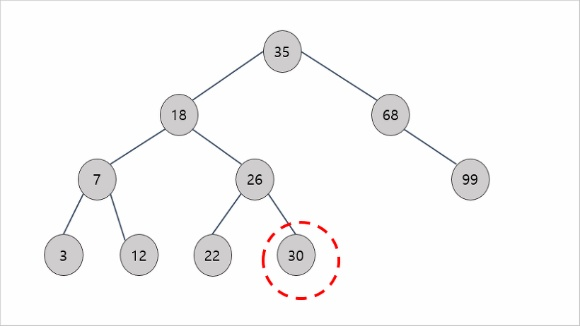 |

 

> 모든 노드의 왼쪽 서브트리는 해당 노드의 값보다 작은 값들만 가지고  
> 모든 노드의 오른쪽 서브 트리는 해당 노드의 값보다 큰 값들만 가진다.

 

- 이진 탐색 트리의 최소값
  - 트리의 가장 왼쪽에 존재
- 이진 탐색 트리의 최대값
  - 트리의 가장 오른쪽에 존재

 

### 순회

- 중위 순회
  - 재귀적으로 왼쪽 서브 트리 순회
  - 현재 노드 방문
  - 재귀적으로 오른쪽 서브 트리 순회

> 3 - 7 - 12 - 18 - 22 - 26 - 30 - 35 - 68 - 99

 

- 전위 순회
  - 현재 노드 방문
  - 재귀적으로 왼쪽 서브트리 순회
  - 재귀적으로 오른쪽 서브트리 순회

> 35 - 18 - 7 - 3 - 12 - 26 - 22 - 39 - 68 - 99

 

- 후위 순회
  - 재귀적으로 왼쪽 서브 트리 순회
  - 재귀적으로 오른쪽 서브 트리 순회
  - 현재 노드 방문

 

> 3 - 12 - 7 - 22 - 30 - 26 - 18 - 99 - 68 - 35

 

### 노드의 Succesor(후임자)

 

> 해당 노드보다 값이 큰 노드들 중에서 가장 값이 작은 노드

- 30의 successor : 35
- 35의 successor : 68
- 22의 successor : 26

 

### 노드의 predecessor(선임자)

> 해당 노드보다 값이 작은 노드들 중에서 가장 값이 큰 노드

- 30의 predecessor : 26
- 35의 predecessor : 18
- 22의 predecessor : 18

 

### 이진 탐색 트리의 삽입/삭제/검색

 

#### 삽입

- insert(50)
- insert(70)
- insert(90)
- insert(99)
- insert(80)
- insert(30)
- insert(40)
- insert(20)

|            트리 결과             |
| :------------------------------: |
| 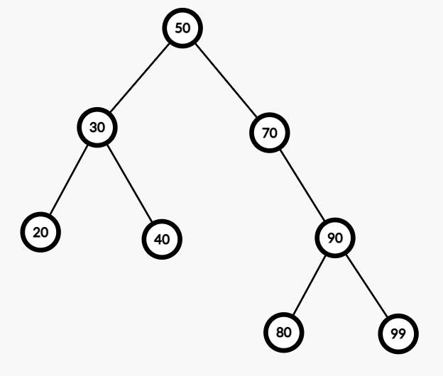 |

 

### 삭제

- delete 20

> 20이 50보다 작음으로 왼쪽
> 20이 30보다 작음으로 왼쪽
> 20 find!
> 20의 위치가 null

 

|               20 삭제                |
| :----------------------------------: |
| 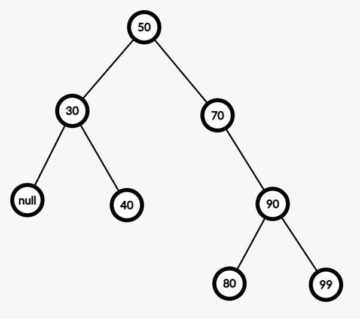 |

 

- 자녀가 없는 노드 삭제
  - 삭제될 노드를 가리키던 레퍼런스를 가리키는 것이 없도록 처리

 

- delete 30

 

- 30이 50보다 작음
  - 자녀가 하나인 노드 삭제
  - 삭제될 노드를 가리키던 레퍼런스를
  - 삭제될 노드의 자녀를 가리키게 변경

 

|                30 삭제                 |
| :------------------------------------: |
| 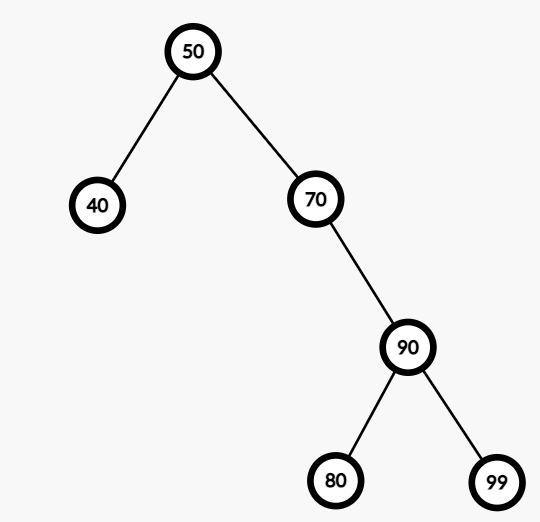 |

 

- delete 50

|                50 삭제                 |
| :------------------------------------: |
| 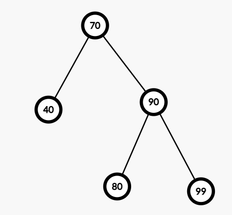 |

- 자녀가 두개인 노드 삭제
- 삭제 될 노드의 오른쪽 서브 트리에서 제일 값이 작은 노드가 삭제될 노드 대체

 

### 이진 탐색 트리 시간복잡도

 

|        | best |   avg   | worst |
| :----: | :--: | :-----: | :---: |
| insert | O(1) | O(logN) | O(N)  |
| delete | O(1) | O(logN) | O(N)  |
| search | O(1) | O(logN) | O(N)  |

 

> worst는 편향트리일 경우!

 

### 이진 탐색 트리의 장점

 

> 삽입 삭제가 유연하다 - 레퍼런스만 재조정 해주면 된다
> 값의 크기에 따라 좌우 서브트리가 나뉘어지기 때문에 삽입/삭제/검색이 (보통은) 빠르다
> 값의 순서대로 순회 가능하다.

 

### 이진 탐색 트리의 단점

 

> 균형을 유지하지 못한다면 편향된 트리 구조가 나와서 worst case가 나올 수 있다.

 

## AVL

 

- BST의 한 종류
- 스스로 균형을 잡는 트리
- balance factor를 통해 균형 유지

 

### Balance Factor

> 임의의 노드 x에 대하여
> `BF(x) = h(lSubtress(x)) - h(rSubTree(x))`

 

### AVL 트리의 특징

> 트리의 모든 노드들은 아래의 특징을 가진다  
> BF(x) ∈ {-1,0,1}  
> 즉 BF(x) <= |1|

 

> 트리 삽입 혹은 삭제후, BF를 유지하지 못하면  
> 균형을 맞추는 작업을 수행

 

### AVL 트리 예제

 

- insert 50
- insert 70

> BF(50) = -1 - 0 = -1 - 통과

 

- insert 90

> BF(70 = -1 - 0 = -1  
> BF(50) = -1 - 1 = -2 - 균형이 깨졌다.  
> 현재 50을 기준으로 오른쪽, 오른쪽으로 편향된 상태

 

> 우리는 균형을 맞춘 후에도 binary Tree의 특징을 유지해야한다.

 

|                 70을 기준으로 left rotate                 |
| :-------------------------------------------------------: |
| 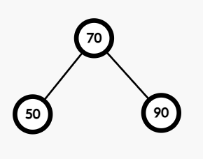 |

 

- insert 20

> BF(50) = 0 - (-1) = 1  
> BF(70) = 1 - 0 = 1 - 통과

 

- insert 60

> BF(50) = 0 - 0 = 0  
> BF(70) = 1 - 0 = 1

 

|               insert 60 이후                |
| :-----------------------------------------: |
| 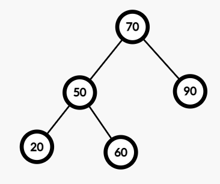 |

 

- insert 30

> BF(20) = -1 - 0 = -1  
> BF(50) = 1 - 0 = 1  
> BF(70) = 2 - 0 = 2 - 균형이 깨졌다.

 

- 50을 70위로 올린다.
- 70의 왼쪽 자식을 60으로 가리킨다.

 

|                  50을 기준으로 right rotate                   |
| :-----------------------------------------------------------: |
| 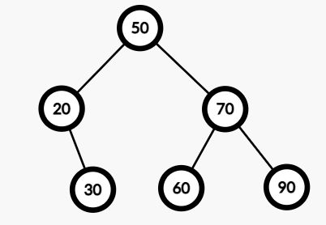 |

 

- delete 20

> BF(30) = -1 - (-1) = 0  
> BF(50) = 0 - 1 = -1

 

|               delete 20 이후                |
| :-----------------------------------------: |
| 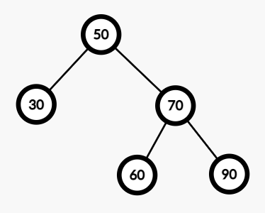 |

 

- insert 10
- insert 55
- insert 65

> 균형이 안깨지는 상황

- delete 30

 

|               delete 30 이후 균형 깨짐               |
| :--------------------------------------------------: |
| 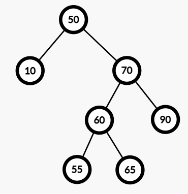 |

 

> BF(10) = -1 - (-1) = 0  
> BF(50) = 0 - 2 = -2 - 균형이 깨졌다.

 

|            60을 50과 70 사이로 올린다 right rotate            |
| :-----------------------------------------------------------: |
| 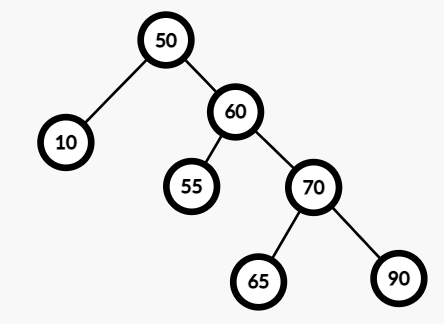 |

 

|               60을 50 위로 올린다 left rotate                |
| :----------------------------------------------------------: |
| 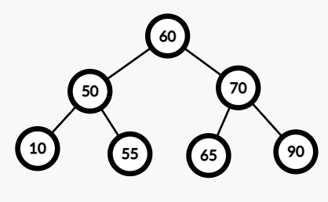 |

 

- insert 57
- delete 90

> 균형이 안깨지는 상황

 

|          insert 57, delete 90 이후 상황           |
| :-----------------------------------------------: |
| 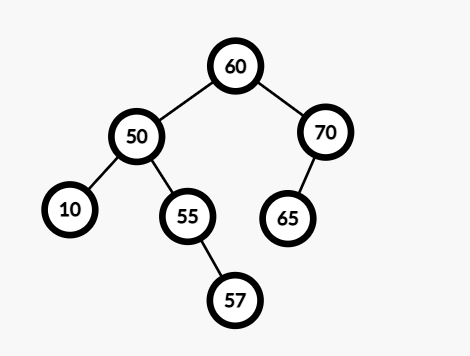 |

 

- delete 60

> BF(70) = -1 - (-1) = 0  
> BF(65) = 2 - 0 = 2 - 균형이 깨졌다.

 

|               delete 60 이후                |
| :-----------------------------------------: |
| 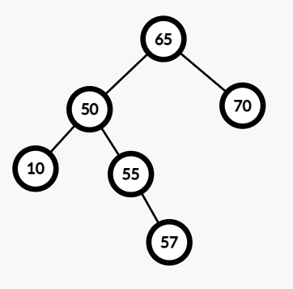 |

 

- 55를 50위로 올리고
- 55를 65 위로 올린다

 

|                   rotate 이후                   |
| :---------------------------------------------: |
| 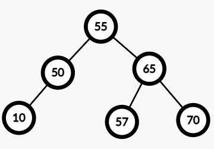 |

 

### AVL 트리의 시간 복잡도

 

|        | best |   avg   |  worst  |
| :----: | :--: | :-----: | :-----: |
| insert | O(1) | O(logN) | O(logN) |
| delete | O(1) | O(logN) | O(logN) |
| search | O(1) | O(logN) | O(logN) |

 

### AVL 트리의 장단점

- 장점
  - 최악의 경우에도 삽입/삭제/검색의 시간 복잡도는 O(logN)이다.
- 단점
  - 삽입/삭제 시 트리의 균형을 확인하고 만약 균형이 깨졌다면 트리 구조를 재조정하기 때문에 이 때 시간이 꽤 소요된다
