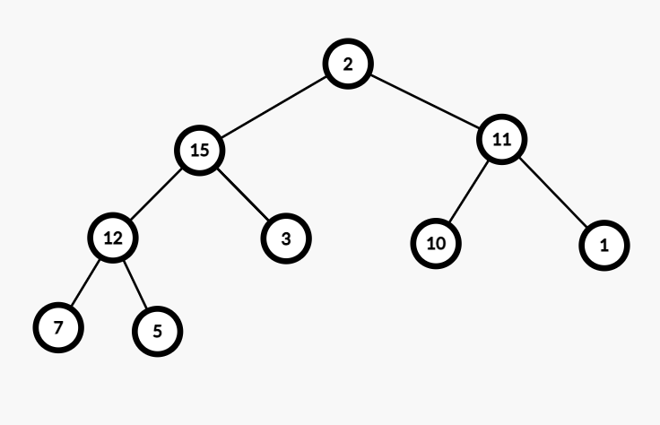
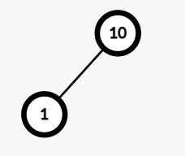

## Priority Queue

 

> 큐와 유사하지만 우선순위가 높은 아이템이 먼저 처리

 

## Heap

 

> 힙은 주로 이진 트리를 기반으로 구현

 

- maxHeap : 부모 노드의 키가 자식 노드들의 키보다 크거나 같은 트리

|               Max Heap               |
| :----------------------------------: |
|  |

- minHeap : 부모 노드의 키가 자식 노드들의 키보다 작거나 같은 트리

 

### 힙 주요 동작(위의 그림에서 진행)

- insert(17)

 

|               insert 17               |
| :-----------------------------------: |
|  |

 

- insert 17 이후 자기 부모와 비교를 시작한다.
- 3과 비교를 한 후 17이 더 크기때문에 `3과 17의 자리`를 바꾼다.
- 15와 비교한 후 17이 더크기때문에 `15와 17의 자리`를 바꾼다.
- 20과 비교 한 후 17이 더 작기 때문에 비교를 멈춘다.

 

|                        결과                         |
| :-------------------------------------------------: |
|  |

 

|               max heap               |
| :----------------------------------: |
|  |

- delete()

| root(20)을 삭제 한 후 가장 마지막 노드(2)를 root 위치로 이동하고, 원래 위치에서 삭제한다. |
| :---------------------------------------------------------------------------------------: |
|                                                           |

 

- 자녀 노드 15와 11 모두 2보다 크다 이 경우 15가 더 크기때문에 15와 2의 자리를 바꾼다
- 자녀노드 12와 3 모두 2보다 크다 이 경우 12가 3보다 더 크기때문에 12와 2의 자리를 바꾼다
- 자녀노드 7과 5 모두 2보다 크다. 7이 5보다 크기때문에 7과 2의 자리를 바꾼다.

 

|                 최종                  |
| :-----------------------------------: |
|  |

 

### 힙실습

- insert 1
- insert 10
- insert 5
- insert 4
- insert 7
- delete(첫번째)
- insert 15
- delete(두번째)
- insert 12
- insert 9
- delete(세번째)
- delete(네번째)

 

- insert 1
- insert 10
  - 마지막 노드 위치에 10을 넣는다
  - 그 후 부모 노드인 1과 비교후 10이 더크기때문에 자리를 바꾼다.
  - 루트(부모가 없음으로)라서 비교를 멈춘다

 

|                   insert 10 이후                   |
| :------------------------------------------------: |
|  |

 

- insert 5
  - 마지막 노드 위치에 5를 넣는다
  - 그 후 부모 노드인 10과 비교후 5가 더 작기 때문에 비교를 멈춘다

 

|                  insert 5 이후                   |
| :----------------------------------------------: |
|  |

 

- insert 4
  - 마지막 위치에 4를 넣는다
  - 그 후 부모 노드인 1과 비교후 4가 더 크기때문에 자리를 바꾼다
  - 그 후 부모 노드인 10과 비교후 4가 더 작기때문에 비교를 멈춘다

|                  insert 4 이후                  |
| :---------------------------------------------: |
|  |

 

- insert 7
  - 마지막 위치에 7을 넣는다
  - 그 후 부모 노드인 4와 비교후 7이 더 크기때문에 자리를 바꾼다
  - 그 후 부모 노드인 10과 비교후 7이 더 작기때문에 비교를 멈춘다

|                  insert 7 이후                   |
| :----------------------------------------------: |
|  |

 

- delete(첫번째)
  - root(10)을 지우고, 그 위치에 마지막 노드 4를 위치한다.
  - 4의 자식노드 7과 5가 있고 7이 더 큼으로 4와 7의 위치를 바꾼다.
  - 4의 자식노드 1이 있는데 더 작음으로 비교를 멈춘다.

|                 delete(첫번째) 이후                 |
| :-------------------------------------------------: |
|  |

 

- insert 15
  - 마지막 위치에 15를 넣는다
  - 부모노드인 4와 비교후 15가 더 크기때문에 자리를 바꾼다
  - 부모노드인 7과 비교후 15가 더 크기때문에 자리를 바꾼다.
  - 루트임으로 비교를 멈춘다

|                   insert 15이후                    |
| :------------------------------------------------: |
|  |

 

- delete(두번째)
  - root(15)의 위치와 4의 위치를 바꾸고 15를 지운다.
  - 4의 자식노드 7과 5 둘 중 7이 더 크기때문에 7과 자리를 바꾼다.
  - 4의 자식노드 1은 4보다 작음으로 비교를 멈춘다

|                 delete(두번째) 이후                  |
| :--------------------------------------------------: |
|  |

 

- insert 12
  - 마지막 위치에 12를 넣는다
  - 부모인 4와 비교후 12가 더 크기때문에 자리를 바꾼다.
  - 부모인 7과 비교후 12가 더 크기때문에 자리를 바꾼다.
  - 루트임으로 비교를 멈춘다.

|                   insert 12 이후                   |
| :------------------------------------------------: |
|  |

 

- insert 9
  - 마지막 위치에 9를 넣는다
  - 부모 5와 비교후 9가 더 크기 때문에 자리를 바꾼다
  - 부모 12와 비교후 9가 더 작기 때문에 비교를 멈춘다

|                  insert 9 이후                   |
| :----------------------------------------------: |
|  |

 

- delete(세번째)
  - root(12)와 마지막 노드의 위치를 바꾼후 root를 삭제한다.
  - 5의 자식노드 7과 9 중 9가 더 크기때문에 9와 자리를 바꾼다
  - 이후 5의 자식노드가 없음으로 비교를 멈춘다

|                 delete(세번째) 이후                 |
| :-------------------------------------------------: |
|  |

 

- delete(네번째)
  - root(9)와 마지막 노드(4)의 위치를 바꾼후 root를 삭제한다.
  - 4의 자식 노드 7과 5중 7이 더 크기때문에 7과 자리를 바꾼다.
  - 4의 자식노드 1이 더 작음으로 비교를 멈춘다

|                 delete(네번째) 이후                  |
| :--------------------------------------------------: |
|  |

 

## 힙과 우선순위 큐의 관계

 

> 힙의 키를 우선순위로 사용한다면 `힙은 우선순위 큐의 구현체가 된다.`

- 우선순위 큐 : ADT
- Heap : data structure

 

## 힙과 우선순위 큐 사용 사례

- 프로세스 스케줄링
