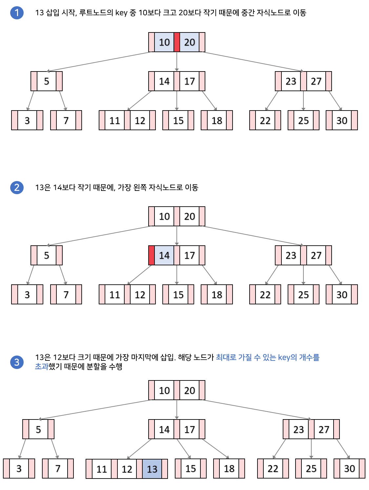
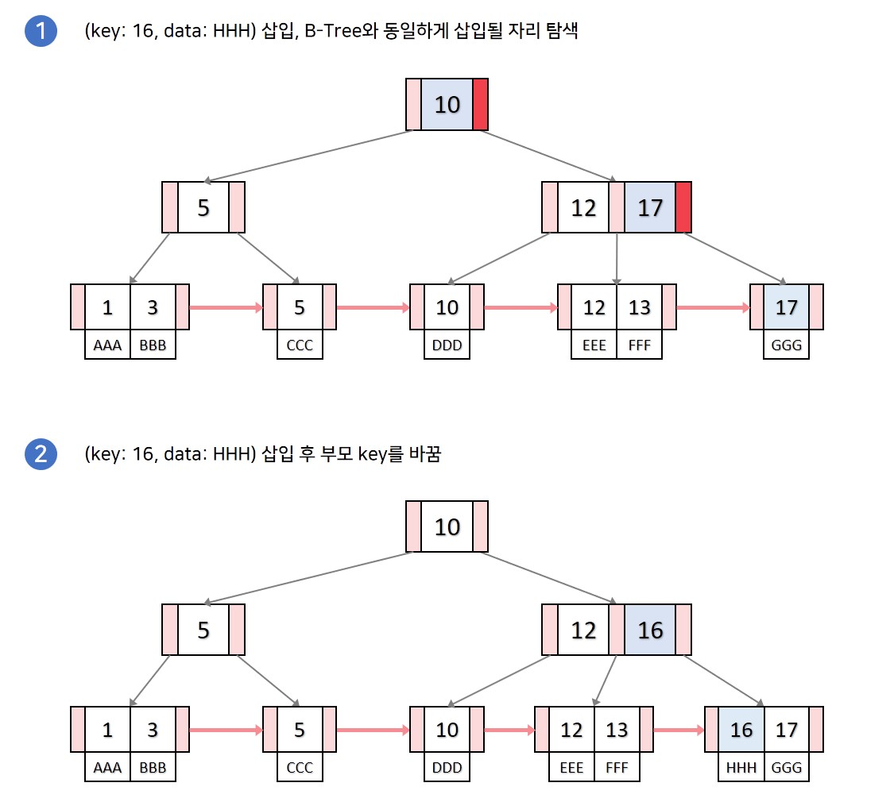
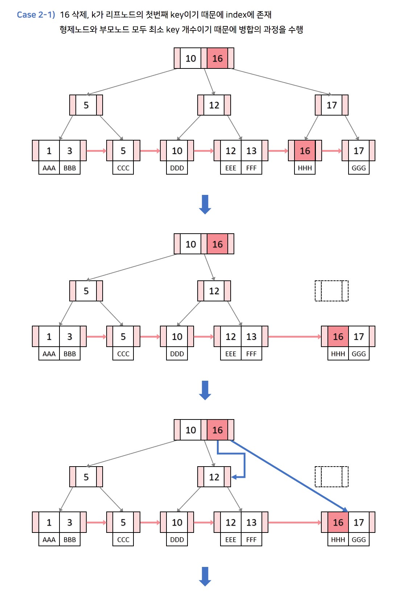

- [B-Tree](#b-tree)
  - [B트리와 이진트리의 차이점](#b트리와-이진트리의-차이점)
  - [Key 검색 과정](#key-검색-과정)
  - [key 삽입 과정](#key-삽입-과정)
  - [key 삭제 과정](#key-삭제-과정)
- [B+Tree](#btree)
  - [B+ 트리와 B트리의 차이점](#b-트리와-b트리의-차이점)
  - [B+ 트리와 B트리의 특징](#b-트리와-b트리의-특징)
  - [Key 삽입과정](#key-삽입과정)
  - [key 삭제과정](#key-삭제과정)

 

## B-Tree

 

- B트리는 이진트리에서 발전되어 모든 리프 노드들이 같이 레벨을 가질 수 있도록 자동으로 밸런스를 맞추는 트리
- 정렬된 순서를 보장하고, 멀티레벨 인덱싱을 통해 빠른 검색이 가능하여 DB에서 사용하는 자료구조
- 실제 DB에서 B트리에서 발전한 B+트리를 실제로 사용

 

### B트리와 이진트리의 차이점

> B트리는 하나의 노드에 하나의 정보를 가지는 이진트리와 다르게  
> 하나의 노드에 다수의 정보를 가질 수 있다.  
> `최대 M개의 자식을 가질 수 있는 B트리를 M차 B트리`라고 한다.

- 차수
  - 하나의 노드에 대하여 자식노드의 개수
  - 이진트리는 최대 차수가 2임

 

|              차수가 3인 Btree              |
| :----------------------------------------: |
|  |

 

- 최대 자식을 3개 가질 수 있다.
- 즉 Btree에서 하나의 노드에 대하여 최대 M개의 레퍼런스(포인터)를 가진다.
- key들은 노드안에서 항상 정렬된 값을 가진다.
- BST처럼 각 key들의 왼쪽 자식들은 항상 key보다 작고, 오른쪽은 크다.

 

### Key 검색 과정

 

> 루트 노드에서 시작하여 하향식으로 검색 수행. 검색하고자 하는 key를 k라고 할 때 검색 과정

- 루트 노드에서 시작하여 key들을 순회하면서 검사

  - 만일 k와 같은 key를 찾았다면 검색 종료
  - 검색하는 값과 비교후 현재 노드의 key들 사이에 k가 들어간다면 해당 key들의 자식 노드로 향한다.

- 해당 과정을 리프노드에 도달할때까지 반복하고, 만일 리프노드에서도 k와 같은 key가 없다면 검색 실패

 

|                  key 검색 과정                  |
| :---------------------------------------------: |
|    |
|  |

 

### key 삽입 과정

> key를 삽입하기 위해서
>
> 1. 요소 삽입에 적절한 리프노드를
> 2. 필요한 경우 노드를 분할 해야 한다.  
>    리프노드 검색은 하향식이지만 노드 분할 과정은 상향식으로 이루어 진다.

- 트리가 비어있으면 루트 노드를 할당하고 k를 삽입한다.
  - 만일 루트 노드가 가득찼다면, 노드를 분할하고 리프노드가 생성된다.
- 이후부터 삽입하기 적절한 리프노드를 찾아 k를 삽입한다.
  - 삽입위치는 key값과 k값을 검색 연산과 동일한 방법으로 비교하면서 찾는다.

 

|                 Case 1. 분할이 일어나지 않는 경우                 |
| :---------------------------------------------------------------: |
|  |

 

> 리프노드가 가득차지 않았다면, 오름차순으로 k를 삽입

 

|                  Case 2. 분할이 일어나는 경우                  |
| :------------------------------------------------------------: |
|   |
|  |
|  |

 

> 만일 리프노드에 key 노드가 가득 찬 경우, 노드를 분할해야 한다.

- 오름차순 요소로 삽입, 노드가 최대 담을 수 있는 최대 key 개수를 초과
- 중앙값에서 분할 수행, 중앙 값은 부모노드로 병합하거나 새로 생성, 왼쪽키는 왼쪽자식으로, 오른쪽 키들은 오른쪽 자식으로
- 부모 노드를 검사하여 다시 가득 찼다면 다시 부모노드에서 위 과정 반복

 

### key 삭제 과정

 

- 요소를 삭제하기 위해서
  - 삭제할 키가 있는 노드 검색
  - 키 삭제
  - 필요한 경우, 트리 균형 조정

 

- 용어 사전 정리
  - inorder predecessor: 노드의 왼쪽 자손에서 가장 큰 key
  - inorder successor 노드의 오른쪽 자손에서 가장 작은 key
  - 부모 key: 부모 노드의 key들 중 왼쪽 자식으로 본인 노드를 가지고 있는 key 값. 단 마지막 자식 노드의 경우 마지막 key

 

|                 Case 1. 삭제할 key K가 리프에 있는 경우                 |
| :---------------------------------------------------------------------: |
|  |

- 다른 노드에 영향 없이 해당 k를 단순 삭제

 

|                 Case 1.2 왼쪽 또는 오른쪽 형제 노드의 key가 최소 key 개수 이상이라면                  |
| :---------------------------------------------------------------------------------------------------: |
|  |

- 부모 key값으로 k를 대체
- 최소 키 개수 이상의 키를 가진 형제 노드가 왼쪽 형제라면 가장 큰 값을, 오른쪽 형제라면 가장 작은 값을 부모 key로 대체

 

|                 Case 1.3 왼쪽, 오른쪽 형제 노드의 key가 최소 key 개수이고, 부모노드의 key가 최소 개수 이상이면                  |
| :-----------------------------------------------------------------------------------------------------------------------------: |
|  |

 

- k를 삭제 한 후, 부모 key를 형제 노드와 병합
- 부모노드의 key개수 하나 줄이고, 자식 수 역시 하나를 줄여 B-Tree를 유지

 

- Case 1.4 자신의 형제, 부모 노드의 key 개수가 모두 최소 key 개수라면

> 부모 노드를 루트 노드로 한 부분 트리의 높이가 줄어드는 경우이기 때문에 재구조화의 과정이 일어난다.
> Case3의 2번 과정으로 이동.

 

|                  Case 2. 삭제할 key k가 내부 노드에 있고, 노드나 자식에 키가 최소 키수보다 많을 경우                  |
| :-------------------------------------------------------------------------------------------------------------------: |
|  |

- 현재 노드의 inorder predecessor 또는 inorder successor와 k의 자리를 바꾼다.
- 리프노드의 k를 삭제하게 되면, 리프노드가 삭제되었을때의 조건으로 변한다 삭제한 리프노드에 대해 case 1조건으로 이동

 

|                  Case 3. 삭제할 key k가 내부 노드에 있고, 노드에 key 개수가 최소key 개수만큼, 노드의 자식 key 개수도 모두 최소 key 개수인 경우                  |
| :-------------------------------------------------------------------------------------------------------------------------------------------------------------: |
|  |

> 삭제할 key k가 있는 노드도 최소, 자식노드들도 최소의 key 개수를 가지므로,  
> k를 삭제하면 트리의 높이가 줄어들어 재구조화가 일어나는 케이스입니다.  
> 재구조화의 과정은 다음과 같습니다.

 

- k를 삭제하고, k의 양쪽 자식을 병합하여 하나의 노드로 만듭니다.
- k의 부모key를 인접한 형제 노드에 붙입니다. 이후, 이전에 병합했던 노드를 자식노드로 설정합니다.
- 해당 과정을 수행하였을 때 부모노드의 개수가 에 따라 이후 수행 과정이 달라집니다.
  - 3-1. 만일 새로 구성된 인접 형제노드의 key가 최대 key 개수를 넘어갔다면, 삽입 연산의 노드 분할 과정을 수행합니다.
  - 3-2. 만일 인접 형제노드가 새로 구성되더라도 원래 k의 부모 노드가 최소 key의 개수보다 작아진다면, 부모 노드에 대하여 2번 과정부터 다시 수행합니다.

 

|                         3-3-2 새로운 트리에서 예시                          |
| :-------------------------------------------------------------------------: |
|  |

 

## B+Tree

 

> B트리와 동작 방식이 굉장히 유사하지만, 다른점이라고 한다면  
> `리프노드는 연결리스트의 형태를 띄어 선형검색이 가능하다는 점이다.`  
> 이러한 특징 때문에 B+트리를 사용할 경우 작은 시간복잡도로도 검색을 수행할 수 있다.  
> 실제 DB의 인덱싱은 B+트리로 이루어져 있고, 다음 그림은 인덱승을 나타낸 것이다.  
> 인덱싱은 어떠한 자료를 찾는데 key값을 이용해 효과적으로 찾을 수 있는 기능이다!

 

|                  인덱싱                   |
| :---------------------------------------: |
|  |

 

|                   위의 인덱싱을 b+트리로 나타내기                   |
| :-----------------------------------------------------------------: |
|  |

 

### B+ 트리와 B트리의 차이점

 

- 모든 key, data가 리프노드에 모여있다. B트리는 리프노드가 아닌 각자 key마다 데이터를 가진다면, B+트리는 리프노드에 모든 데이터를 가진다.
- 모든 리프노드가 연결리스트의 형태를 띄고 있다. B트리는 옆에 있는 리프노드를 검사할 때, 다시 루트노드부부터 검사해야 한다면, B+트리는 리프노드에서 선형 검사를 수행할 수 있어 시간복잡도가 굉장히 줄어든다.
- 리프노드의 부모 key는 리프노드의 첫번째 key보다 작거나 같다. 그림의 b+트리는 리프노드의 key들을 트리가 가지고 있느느 경우여서, data 삽입 또는 삭제가 일어날때 트리의 key 변경이 일어납니다. 해당 경우뿐만 아니라 data의 삽입과 삭제가 일어날때 트리의 key 변경이 일어나지 않게 하여 b+트리를 구현하는 방법도 있어 작거나 같다라는 표현 사용

 

### B+ 트리와 B트리의 특징

 

- 노드는 최대 M개 부터 M/2개 까지의 자식을 가질 수 있다.
- 노드에는 최대 M−1개 부터 [M/2]−1개의 키가 포함될 수 있다.
- 노드의 키가 x개라면 자식의 수는 x+1개
- 최소차수는 자식수의 하한값을 의미하며, 최소차수가 t라면 M=2t−1을 만족한다. (최소차수 t가 2라면 3차 B트리이며, key의 하한은 1개.)

 

### Key 삽입과정

 

- Case 1. 분할이 일어나지 않고, 삽입 위치가 리프노드의 가장 앞 key 자리가 아닌 경우
  - B 트리와 똑같은 삽입 과정을 수행

 

|                 Case 2. 분할이 일어나지 않고, 삽입 위치가 리프노드의 가장 앞 key 자리인 경우                  |
| :-----------------------------------------------------------------------------------------------------------: |
|  |

> 삽입 후 부모 key를 삽입된 key로 갱신하고, data를 넣어준다.

 

|                  Case 3. 분할이 일어나는 삽입과정                   |
| :-----------------------------------------------------------------: |
|  |
|  |

- 분할이 일어나는 노드가 리프노드가 아니라면 기존 B트리와 똑같이 분할을 진행한다. 중간 key를 부모 key로 올리고, 분할한 두개의 노드를 왼쪽, 오른쪽 자식으로 설정한다.
- 분할이 일어나는 노드가 리프노드라면 중간 key를 부모 key로 올리지만, 오른쪽 노드에 중간 key를 포함하여 분할한다. 또한 리프노드는 연결리스트이기 때문에 왼쪽 자식노드와 오른쪽 자식 노드를 이어줘 연결리스트 형태를 유지한다. 해당 부분이 B트리의 분할과 다른 점이다.

 

### key 삭제과정

 

> 삭제과정 역시 기존 B트리와 유사합니다만 삭제할 key k는 무조건 리프노드에 존재하는 점,  
> k를 삭제하기 위해 검색하는 과정에서 index에 존재할 수 있다는 점이  
> 다릅니다. 해당 부분을 위주로 삭제 과정을 적어보겠습니다.

 

|                 Case 1. 삭제할 key k가 index에 없고, 리프노드의 가장 처음 key가 k가 아닌경우                  |
| :-----------------------------------------------------------------------------------------------------------: |
|  |

 

|                  Case 2. 삭제할 key k가 리프노드의 가장 처음 key인 경우                   |
| :---------------------------------------------------------------------------------------: |
|  |
|  |

 

> 삭제할 key k가 리프노드의 가장 처음 key인 경우에는 항상 k가 index 내에 존재합니다.

- 먼저 리프노드의 k를 삭제하는 과정을 수행한다. key의 개수가 최소 key의 개수라면 B트리의 삭제 과정 중 형제노드의 key를 빌려오는 경우나 부모key와 병합하는 등 과정들은 동일하게 수행한다. 단, 리프노드가 병합할 때는 부모key와 오른쪽 자식의 처음 key가 동일하기 때문에 부모key를 가져오는 과정만 생략하고 왼쪽 자식과 오른쪽 자식을 병합만 하면 된다.

- 리프노드의 k를 삭제한 후, index내의 k를 inorder successor로 변경한다.
