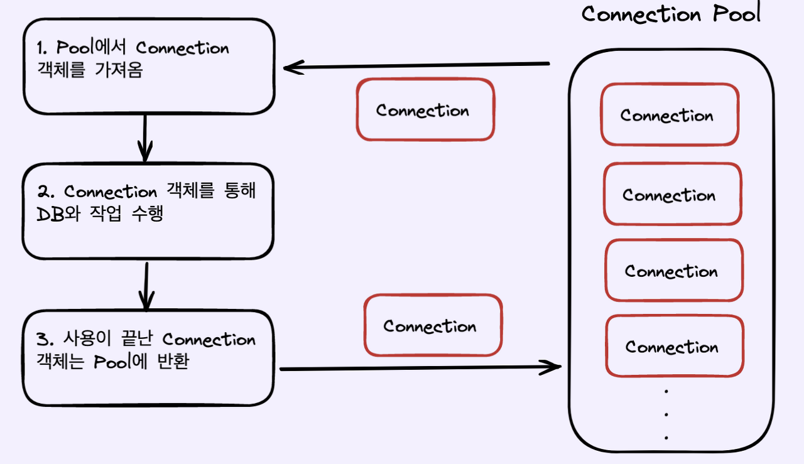
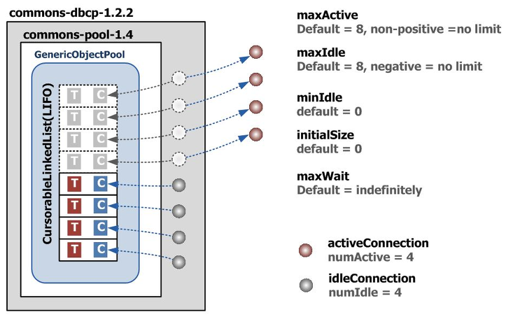

> 미리 일정 갯수의 Connection을 만들어 Pool에 저장 하고,  
> 사용자의 요청이 발생하면 Connection을 제공 한 뒤  
> 사용자의 연결이 종료된다면 Pool에 다시 반환하여 보관합니다.

 

## DBCP를 사용하는 이유

> Connection Pool을 사용하지 않고  
> 사용자의 요청에 따라 Connection이 생성되고 연결을 해제 한다면  
> 수 많은 사용자가 요청할 경우 서버에 과부하가 생길 수 있다.

 

## DBCP를 무조건 많이 만들면?

 

- Connection은 객체임으로 메모리 공간을 차지한다.
- 즉, 요청대비 너무 많은 개수를 설정하면 메모리 낭비가 발생할 수 있다.
  - 적당한 커넥션의 개수를 설정하고, 자원을 효율적으로 써야한다!

 

### Connection Pool 없이 연결하기

 

- 1. DB 서버 접속을 위해 JDBC 드라이버 로드
- 2. DB 접속 정보와 DriverManager.getConnection()을 통해 DB Connection 객체 얻기
- 3. Connection 객체로 부터 쿼리 수행하기 위해 PreparedStatement 객체 받기
- 4. executeQuery를 수행하여 그결고로 ResultSet 객체 받아서 데이터 처리
- 5. 처리 완료후 사용한 리소스를 close 하여 반환

 

## Connetion Pool의 구현체의 역할

|           DBCP           |
| :----------------------: |
|  |

 

- WAS가 실행되면서 미리 일정량의 DB Connection 객체를 생성하여 Pool에 저장
- HTTP 요청에 따라 필요할때 Pool에서 Connection 객체를 가져다 쓰고 반환
- 즉 HTTP 요청마다 DB Driver를 로드하고 물리적 연결에 의한 Connection 객체 생성 비용 감소

 

|              Connection pool value               |
| :----------------------------------------------: |
|  |

 

|    value    |                           description                           |
| :---------: | :-------------------------------------------------------------: |
|  maxActive  |             동시에 사용할 수 있는 최대 커넥션 개수              |
|   maxIdle   |     커넥션 풀에 반납할 때 최대로 유지될 수 있는 커넥션 개수     |
|   minIdle   |                  최소한으로 유지할 커넥션 개수                  |
| InitialSize | 최초로 getConnection()을 통해 커넥션 풀에 채워 넣을 커넥션 개수 |

- maxActive >= InitialSize
  - 최대 커넥션 개수는 초기에 생성할 커넥션 개수와 같거나 크게 설정
- maxActive = maxIdle
  - 예시)
    - maxActive = 10
    - maxIdle = 5
      - 항상 커넥션을 동시에 5개 사용하고 있는 상황에서 1개의 커넥션이 추가될 요청 될 경우
      - maxActive가 10임으로 1개의 추가 커넥션을 데이터베이스에 연결한 후 Pool은 비즈니스 로직으로 커넥션 전달
      - 이후 비즈니스 로직이 커넥션을 사용 후 풀에 반납할 경우, maxIdle = 5에 영향을 받아
      - 커넥션을 실제로 닫아버리게 되어, 일부 커넥션이 생성되고 닫는 비용 발생 가능

 

## DBCP 동작원리

- 사용자의 요청 발생시 Pool에서 Connection 객체 가져옴
- Connection을 사용해 DB 작업 수행
- 사용이 끝난 Connection을 Pool에 반환
- Pool에 빌려줄 수 있는 커넥션이 존재하지 않는 경우 error가 발생하지 않고 다른 클라이언트가 커넥션을 반환할 때까지 요청한 클라이언트는 대기 상태
- 그 후 다른 클라이언트가 커넥션 반환하면, 대기 상태인 클라이언트가 커넥션을 사용하는 구조

 

## 적절한 Connection의 개수

- 너무 많은 커넥션을 pool에 사전에 생성할 경우 메모리 낭비가 생길 수 있다.
- 너무 적은 커넥션을 생성할 경우 동시 접속자가 많을 때, 클라이언트의 대기시간이 길어질 수 있다.

- Hikari Cp
  - connections = (core_count) \* 2) + effective_spinidle_count
  - core_count \* 2
    - 컨텍스트 스위칭 및 disk I/O와 관련
    - 컨텍스트 스위칭으로 인한 오버헤드를 고려하더라도 DB에서 DISK/IO보다 CPU 속도가 월등히 빠르다
    - 따라서 Thread가 Disk와 같은 작업에서 블라킹 되는 시간에 따른 Thread의 작업을 처리할 수 있는 여유가 생기고,
    - 여유정도에 따라 멀티 쓰레딩 작업 수행 가능
  - effective_spinidle_count는 DB 서버가 관리할 수 있는 동시 IO 요청
    - 하드 디스크 하나는 spinidle 하나를 갖는다.
    - 디스크가 16개 일경우 시스템은 동시에 16개의 io 요청 처리 가능

 

## DBCP 종류

- tomcat-jdbc-pool

  - tomcat 내장
  - Apache Commons DBCP 라이브러리 바탕으로 구현
  - Spring boot 2.0.0 하위 버전에서 사용하는 기본 DBCP

- HikariCP
  - Spring boot 2.0부터 default Jdbc connection pool
  - zero-overhead
    - 어떤 요청을 처리하기 위해 들어가는 간접적인 처리 시간 및 메모리
