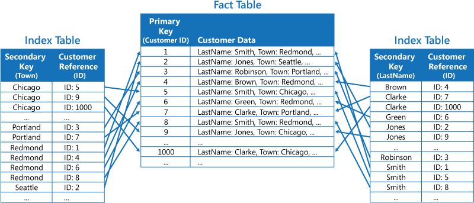
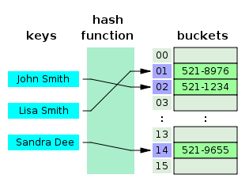
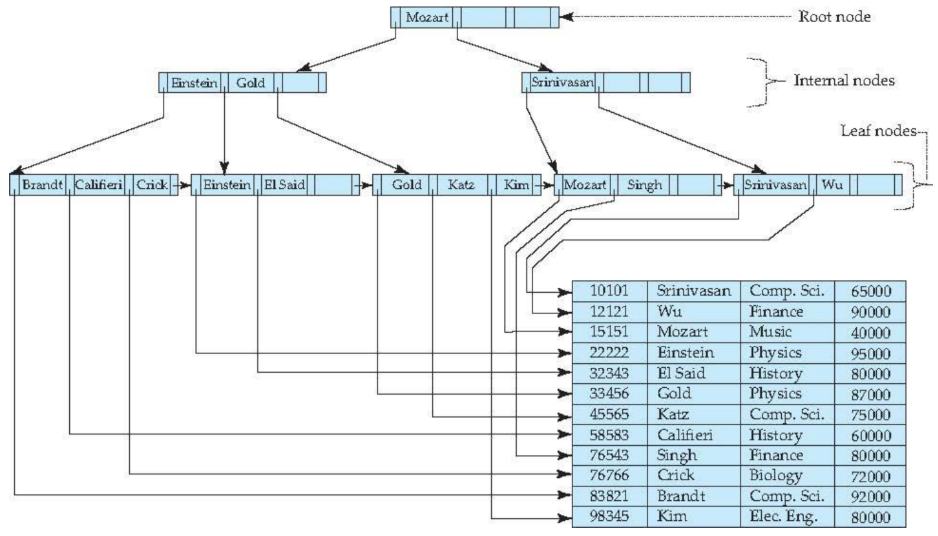

> DB를 사용하면서 데이터의 양(row)에 따라 실행 결과의 속도 차이가 난다.  
> 특히 데이터의 양이 증가할 수록 실행 속도는 느려지고, JOIN이나 서브 쿼리 사용 시 곱 연산이 일어나  
> 데이터의 양이 증가하기 때문에 WHERE 조건에서 필요한 데이터만 추출 후 사용하는 것이 좋다고 알고 있었다.  
> 보다 쿼리의 성능을 높이는데 중요한 것이 인덱스를 적재 적소에 활용하는 것이다.

## 카디널리티

> 전체 행에 대한 특정 컬럼의 중복 수치를 나타내는 지표이다.

- 카디널리티가 높다 : 중복되는 값이 거의 없다.(주민등록 번호 같은 경우)
- 카디널리티가 낮다 : 붕복되는 값이 높다.

## 인덱스

 

> 인덱스란 데이터 베이스 테이블에 대한 검색 성능의 속도를 높여주는 자료구조이다.  
> 틀정 컬럼에 인덱스를 생성하면, 해당 컬럼의 데이터를 정렬하여 별도의 메모리 공간에 데이터의 물리적 주소와 함께 저장된다.  
> 인덱스가 생성된 컬럼을 사용하면 쿼리문에 `WHERE 조건으로 거는 등`의 작업을 하면  
> 옵티마이저에서 판단하여 생성된 인덱스를 탈 수 있다.  
> 또한 인덱스를 오름차순으로 정렬하기 때문에 정렬된 주소체계를 표현할 수 있다.

 

- 인덱스는 조회 성능을 높여준다.
- 특정 인덱스를 생성하면, 해당 컬럼에 대하여 `정렬된 주소 체계`를 표현할 수 있다.
- 인덱스가 생성된 컬럼을 사용하면 옵티마이저가 판단하여 생성된 인덱스를 탈 수 있다.

|            Index 이미지            |
| :--------------------------------: |
|  |

## 인덱스의 장점

- 조건 검색 WHERE 절의 효율성
  - 인덱스가 없이 WHERE 절에 특정 조건에 맞는 데이터들을 찾아낼 때도 FULL TABLE SCAN이 발생한다.
- 정렬 ORDER BY 절의 효율성
  - 인덱스를 사용하면 ORDER BY에 의한 정렬 과정을 피할 수가 있다.
  - ORDER BY는 정렬과 동시에 1차적으로 메모리에서 정렬이 이루어지고
  - 메모리보다 큰 작업이 필요하면 디스크 I/O가 추가적으로 발생된다.
  - 인덱스를 사용하면 이미 정렬되어 있기 때문에 가져오기만 하면 된다.
- MIN, MAX의 효율적인 처리가 가능
  - 이미 정렬되어 있기에 얻을 수 있는 장점
  - FULL TABLE SCAN이 발생 없이 INDEX TABLE SCAN이 발생하여 효율적으로 찾을 수 있다.

 

## 인덱스의 단점

- 인덱스는 DML에 취약
  - INSERT, UPDATE, DELETE를 통해 데이터가 추가되거나 값이 바뀐다면 인덱스 테이블 내에 있는 값들을 다시 정렬해야 한다.
  - 그리고 인덱스 테이블, 원본 테이블 이렇게 두 테이블의 데이터 수정 작업을 해야한다는 단점도 발생한다.
  - DML이 빈번한 테이블 보다 검색을 위주로 하는 테이블에 인덱스를 생성하는 것이 좋다.
- 무조건 인덱스 스캔이 좋은 것은 아니다.
  - 인덱스는 테이블의 전체 데이터 중에서 10~15 이하의 데이터를 처리하는 경우만 효율적이다.
  - 그 이상의 데이터를 처리하는 경우 사용하지 않는 것이 낫다.

## 무조건 인덱스를 많이 만드는 것이 좋을까?

> 인덱스를 관리하기 위해서 데이터베이스의 대략 10%에 해당하는 저장공간이 추가로 필요하다. 무턱대고 인덱스를 만들어서는 안된다.

- 고려해야할 점
  - 속도 향상에 비해 COST를 비교해서 인덱스를 만들지 말지를 정해야 한다.

 

## 인덱스를 남발하면 안되는 이유

 

> 데이터베이스 서버에 성능 문제가 발생하면 가장 빨리 생각하는 해결책이 인덱스 추가이다.  
> 문제가 발생할 때마다 인덱스를 생성하면서 인덱스가 쌓여가는 것은 하나의 쿼리문을 빠르게 만들 수 있지만  
> 전체적인 데이터베이스의 성능 부하를 초래한다.  
> 조회 성능을 극대화하려고 만든 객체인데 많은 인덱스가 쌓여서 DML 수행시 부하가 발생해 전체적인 데이터베이스 성능을 저하한다.

 

- 인덱스를 도입하기 전에 SQL문을 효율적으로 짜는 방향으로 나가야 한다.
- 인덱스 생성은 마지막 수단으로 강구해야 할 문제이다.

 

## 인덱스 생성 전략

- 카디널리티가 높아야 한다.
  - 조건절에 자주 등장하는 컬럼
  - = 으로 비교되는 컬럼
  - ORDER BY 절에서 자주 사용되는 컬럼
  - JOIN으로 자주 사용되는 컬럼

## 인덱스의 자료구조

 

### 해시 테이블

 

|                 Hash Table                 |
| :----------------------------------------: |
|  |

 

- 해시 테이블은 key값을 이용해 고유한 index를 생성하여 그 index에 저장되어 있는 값을 꺼내오는 구조
- 해시 테이블의 시간 복잡도는 O(1)이며 매우 빠른 검색 지원

 

- 해시 테이블을 안 쓰는 이유
  - 해시는 등호(=)연산에만 특화
  - 해시 값이 1이라도 달라지면 완전히 다른 해시값 생성하는 특성
    - 부등호(>,<) 연산이 자주 사용되는 DB 검색에서는 해시테이블이 적합하지 않음

 

### B+ Tree

|               B+ Tree               |
| :---------------------------------: |
|  |

 

- DB의 인덱스를 위해 자식 노드가 2개 이상인 B tree를 개선시킨 자료구조
- 모든 노드에 데이터를 저장했던 B Tree와 다른 특성
  - 리프노드(데이터 노드)만 인덱스와 함께 데이터를 가지고 있고, 나머지 노드들은 데이터를 위한 인덱스만 갖는다.
  - 리프 노드들은 LinkedList로 연결되어 있다.
  - 데이터 노드 크기는 인덱스 노드의 크기와 갖지 않아도 된다.

 

> - DB의 인덱스 컬럼은 부등호를 이용한 순차검색 연산이 자주 발생
> - B Tree의 리프 노드들을 LinkedList로 연결하여 순차검색을 용이하게 하는 등 BTree를 인덱스에 맞게 최적화
> - Best Case에 대해 리포노드까지 가지 않아도 탐색할 수 있는 B Tree에 비해 무조건 리프노드까지 가야한다는 단점도 가짐
> - **B+ Tree는 O(log2n\*log2n)의 시간 복잡도를 갖지만 부등호 기반 탐색에 있어서 해시테이블보다 더욱 적합한 자료구조**

 

## 클러스터형 인덱스 vs 비클러스터형 인덱스

 

## 클러스터형

- 클러스터형 인덱스는 해당 키값을 기반으로 테이블이나 뷰의 데이터 행을 정렬하고 저장, 인덱스 정의에 여러 열이 포함, 테이터 행 자체는 한 가지 순서로만 저장될 수 있으므로 테이블당 클러스터형 인덱스는 하나만 있을 수 있다.
- 테이블의 데이터 행이 정렬된 순서로 저장될 때만 테이블에 클러스터형 인덱스가 포함. 클러스터형 인덱스가 없으면 해당 데이터 행은 힙이라는 정렬되지 않은 구조로 저장

## 비클러스터형

- 비클러스터형 인덱스의 구조는 데이터 행으로부터 독립적.
- 비클러스터형 인덱스에는 비클러스터형 인덱스 키 값이 있으며, 각 키 값 항목에는 해당 키 값이 포함된 데이터 행에 대한 포인터 존재
- 비클러스터형 인덱스의 인덱스 행에서 데이터 행으로의 포인터를 행 로케이터라고 지칭.
- 행 로케이터의 구조는 데이터 페이지가 힙에 저장되는지 아니면 클러스터형 테이블에 저장되는지에 따라 다름. 힙의 경우 행 로케이터는 행에 대한 포인터. 클러스터형 테이블의 경우 행 로케이터는 클러스터형 인덱스 키.

 

> 클러스터형 인덱스는 실제로 트리의 leaf node에 데이터가 정렬.  
> 따라서 하나의 테이블에는 하나의 클러스터형 인덱스를 가질수 있음.  
> (PK 설정시 자동으로 클러스터형 인덱스 생성)

 

> 비클러스터형 인덱스는 실제 정렬된 데이터를 가지는 것이 아니라  
> 리프 노드에 해당 데이터의 링크를 가지고 있는 구조.
