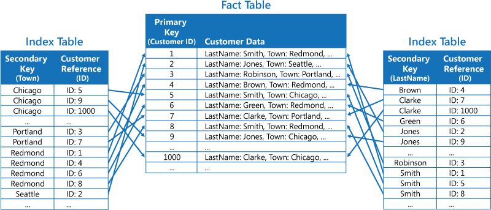

# INDEX

 

- 인덱스란 추가적인 쓰기 작업과 저장 공간을 활용하여 데이터베이스 테이블의 검색 속도를 향상시키기 위한 자료구조

 

|            Index 이미지            |
| :--------------------------------: |
|  |

 

- 장점
  - 테이블을 조회하는 속도와 그에 따른 성능을 향상 시킬 수 있다.
  - 전반적인 시스템의 부하를 줄일 수 있다.

 

- 단점
  - 인덱스를 관리하기 위해 DB의 약 10% 해당하는 저장공간이 필요
  - 인덱스 관리하기 위해 추가 작업 필요
  - 인덱스 잘못 사용할 경우 오히려 성능이 저하되는 역효과가 발생

 

> 간결하게 인덱스의 장단점에 대해 정리하자면 읽는 것은 빨라지지만,  
> 갱신(삽입, 삭제, 수정)에 대해서는 느려지는 Trade-off 관계  
> 삽입이나 수정시, 해당 인덱스를 다시 정렬 필요  
> UPDATE와는 달리 DELETE가 빈번하게 발생하면 실제 데이터는 10만건이지만  
> 100만건이 넘어가는 상황도 올 수 있다.

 

- 인덱스를 사용하면 좋은 경우
  - 규모가 작지 않는 테이블
  - INSERT, UPDATE, DELETE가 자주 발생하지 않는 컬럼
  - JOIN이나 WHERE 또는 ORDER BY에 자주 사용되는 컬럼
  - 데이터 중복도가 낮은 컬럼

 

## 인덱스의 자료구조

 

### 해시 테이블

 

|                 Hash Table                 |
| :----------------------------------------: |
|  |

 

- 해시 테이블은 key값을 이용해 고유한 index를 생성하여 그 index에 저장되어 있는 값을 꺼내오는 구조
- 해시 테이블의 시간 복잡도는 O(1)이며 매우 빠른 검색 지원

 

- 해시 테이블을 안 쓰는 이유
  - 해시는 등호(=)연산에만 특화
  - 해시 값이 1이라도 달라지면 완전히 다른 해시값 생성하는 특성
    - 부등호(>,<) 연산이 자주 사용되는 DB 검색에서는 해시테이블이 적합하지 않음

 

### B+ Tree

|               B+ Tree               |
| :---------------------------------: |
|  |

 

- DB의 인덱스를 위해 자식 노드가 2개 이상인 B tree를 개선시킨 자료구조
- 모든 노드에 데이터를 저장했던 B Tree와 다른 특성
  - 리프노드(데이터 노드)만 인덱스와 함꼐 데이터를 가지고 있고, 나머지 노드들은 데이터를 위한 인덱스만 갖는다.
  - 리프 노드들은 LinkedList로 연결되어 있다.
  - 데이터 노드 크기는 인덱스 노드의 크기와 갖지 않아도 된다.

 

> - DB의 인덱스 컬럼은 부등호를 이용한 순차검색 연산이 자주 발생
> - B Tree의 리프 노드들을 LinkedList로 연결하여 순차검색을 용이하게 하는 등 BTree를 인덱스에 맞게 최적화
> - Best Case에 대해 리포노드까지 가지 않아도 탐색할 수 있는 B Tree에 비해 무조건 리프노드까지 가야한다는 단점도 가짐
> - **B+ Tree는 O(log2n\*log2n)의 시간 복잡도를 갖지만 부등호 기반 탐색에 있어서 해시테이블보다 더욱 적합한 자료구조**

 

## 클러스터형 인덱스 vs 비클러스터형 인덱스

 

### 클러스터형

- 클러스터형 인덱스는 해당 키값을 기반으로 테이블이나 뷰의 데이터 행을 정렬하고 저장, 인덱스 정의에 여러 열이 포함, 테이터 행 자체는 한 가지 순서로만 저장될 수 있으므로 테이블당 클러스터형 인덱스는 하나만 있을 수 있다.
- 테이블의 데이터 행이 정렬된 순서로 저장될 때만 테이블에 클러스터형 인덱스가 포함. 클러스터형 인덱스가 없으면 해당 데이터 행은 힙이라는 정렬되지 않은 구조로 저장

### 비클러스터형

- 비클러스터형 인덱스의 구조는 데이터 행으로부터 독립적. 비클러스터형 인덱스에는 비클러스터형 인덱스 키 값이 있으며, 각 키 값 항목에는 해당 키 값이 포함된 데이터 행에 대한 포인터 존재
- 비클러스터형 인덱스의 인덱스 행에서 데이터 행으로의 포인터를 행 로케이터라고 지칭. 행 로케이터의 구조는 데이터 페이지가 힙에 저장되는지 아니면 클러스터형 테이블에 저장되는지에 따라 다름. 힙의 경우 행 로케이터는 행에 대한 포인터. 클러스터형 테이블의 경우 행 로케이터는 클러스터형 인덱스 키.

 

> 클러스터형 인덱스는 실제로 트리의 leaf node에 데이터가 정렬.  
> 따라서 하나의 테이블에는 하나의 클러스터형 인덱스를 가질수 있음.  
> (PK 설정시 자동으로 클러스터형 인덱스 생성)

 

> 비클러스터형 인덱스는 실제 정렬된 데이터를 가지는 것이 아니라  
> 리프 노드에 해당 데이터의 링크를 가지고 있는 구조.

 

|               non - clustered Index                |
| :------------------------------------------------: |
|  |
