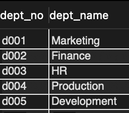
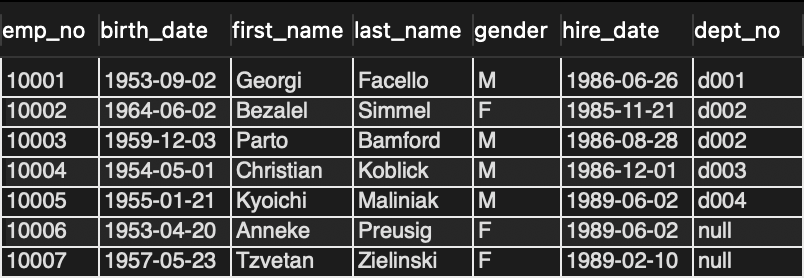
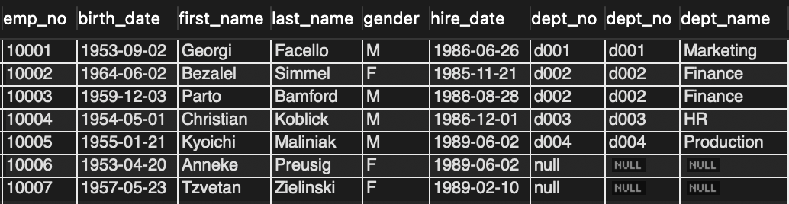

# Key와 Join

## Key

</br>

- Candidate Key
  - relation에서 tuple을 유일하게 식별하기 위해 사용하는 속성들의 부분집합.
  - 2가지 조건
    - 유일성 : key를 통해 하나의 tuple을 유일하게 식별 가능
    - 최소성 : 꼭 필요한 속성으로만 이루어져야 한다
      - 키를 구성하는 속성 중 하나라도 빠지면, 유일하게 식별되지 않도록 구성

</br>

- Primary Key
  - 후보키 중에서 선택한 main key
  - null값을 허용하지 않음
  - 기본키 정의된 속성엔 중복 값 저장 불가

</br>

- Alternate Key
  - 튜플들에 대해 유일성 만족, 최소성 만족을 안하는 키

</br>

- Foreing Key
  - 다른 릴레이션의 기본키를 참조하는 속성 집합

</br>

## Join

</br>

> 두 개 이상의 테이블을 결합하여 나타내는 방법

- 예제

</br>

|              departments talbe               |
| :------------------------------------------: |
|  |

</br>

|             employees table              |
| :--------------------------------------: |
|  |

</br>

- CROSS JOIN

```SQL
SELECT *
FROM employees CROSS JOIN departments;
```

</br>

- SELF JOIN

```SQL
SELECT a.emp_no, a.first_name, a.last_name
FROM employees a INNER JOIN employees b ON a.emp_no = b.emp_no;
```

- LEFT OUTER JOIN

```SQL
SELECT *
FROM employees e LEFT OUTER JOIN departments d ON e.dept_no = d.dept_no
```

</br>

|                LEFT OUTER JOIN                 |
| :--------------------------------------------: |
|  |

</br>

```SQL
SELECT *
FROM employees e RIGHT OUTER JOIN departments d ON e.dept_no = d.dept_no;
```

</br>

|                 RIGHT OUTER JOIN                 |
| :----------------------------------------------: |
|  |
