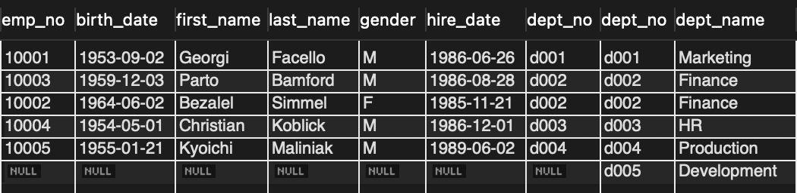

## Key

</br>

- Candidate Key
  - relation에서 tuple을 유일하게 식별하기 위해 사용하는 속성들의 부분집합.
  - 2가지 조건
    - 유일성 : key를 통해 하나의 tuple을 유일하게 식별 가능
    - 최소성 : 꼭 필요한 속성으로만 이루어져야 한다
      - 키를 구성하는 속성 중 하나라도 빠지면, 유일하게 식별되지 않도록 구성

</br>

- Primary Key
  - 후보키 중에서 선택한 main key
  - 유일한 값을 가져야 한다
  - null값을 허용하지 않음
  - 변경되는 경우가 없어야 한다.

</br>

- Alternate Key
  - 튜플들에 대해 유일성 만족, 최소성 만족을 안하는 키

</br>

- Foreing Key
  - 다른 릴레이션의 기본키를 참조하는 속성 집합

</br>

### 기본 키는 정수형 숫자 VS 문자열

</br>

> SQL server같은 경우 기본키를 선택할 때 공백, 특수문자, 혹은 대문자가 없는 후보를 찾는다.  
> 이는 정수형 숫자보다 힘들게 하고 오류 발생 확률이 높다.  
> 또한 위의 제약 조건을 서버에서 처리하고 DB값에 저장해야 한다.

- Integer가 Character 빠르게 수행되는 이유

  - SQL 서버는 Character를 ASCII로 수정하는 과정이 있다.

- FIXED-Length Character의 경우 Variable-length Character보다 수행 속도가 빠르다.
  - 왜냐하면 Variable-length Character같은 경우 압축을 해제하는 시간이 필요

</br>

## 기본 join 연산

</br>

> 두 개 이상의 테이블을 결합하여 나타내는 방법

- 예제

</br>

|              departments talbe               |
| :------------------------------------------: |
|  |

</br>

|             employees table              |
| :--------------------------------------: |
|  |

</br>

- CROSS JOIN

```SQL
SELECT *
FROM employees CROSS JOIN departments;
```

</br>

- SELF JOIN

```SQL
SELECT a.emp_no, a.first_name, a.last_name
FROM employees a INNER JOIN employees b ON a.emp_no = b.emp_no;
```

- LEFT OUTER JOIN

```SQL
SELECT *
FROM employees e LEFT OUTER JOIN departments d ON e.dept_no = d.dept_no
```

</br>

|                LEFT OUTER JOIN                 |
| :--------------------------------------------: |
|  |

</br>

```SQL
SELECT *
FROM employees e RIGHT OUTER JOIN departments d ON e.dept_no = d.dept_no;
```

</br>

|                 RIGHT OUTER JOIN                 |
| :----------------------------------------------: |
|  |

## NL 조인 vs Sort Merge Join vs Hash Join

</br>

### NL 조인

> NL 조인은 두 테이블이 조인할 때, outer 테이블에서 결합 조건에 일치하는 레코드를  
> inner table에서 조인하는 방식

- outer join에서 만족하는 레코드가 적을 수록 NL 조인에서 효율이 좋다.
- 조인 조건에 해당하는 컬럼들은 인덱스를 가지고 있어야 한다.

```sql
SELECT A.*, B.*
FROM ITEM A, UITEM B
WHERE A.ITEM_ID = B.ITEM_ID --- 1
AND A.ITEM_TYPE_D = '100100' --- 2
AND A.SALE_YN = 'y' --- 3
AND B.SALE_YN = 'y' --- 4

ITEM_X01 -> ITME_TYPE_CD
UITEM_PK -> ITEM_ID + UITEM_ID
```

> 위와 같은 sql문이 있다.
> 힌트를 사용하여 NL 조인을 하도록 유도한다

- 기준 테이블

  - outer table: ITEM
  - innner table: UITEM

- 해당 sql문의 동작 순서
  - 2 -> 3 -> 1 -> 4

|            NL JOIN             |
| :----------------------------: |
|  |

- 실행 순서

  - 1. 인덱스 ITEM_X01을 통해 ITEM_TYPE_CD = 100100인 것을 스캔
  - 2. 인덱스 ITEM_X01에서 읽은 rowid를 가지고 A 테이블에 액세스 해 SALE_YN = 'Y'인 필터 조건을 만족하는 레코드 검색
  - 3. A Table에서 읽은 ITEM_CD와 같은 값을 가진 B Table의 ITEM_ID를 찾기 위해 UITEM_PK를 스캔한다.
  - 4. B 테이블에 액세스 하여 SALE_YN='Y'인 레코드들을 찾는다.

- 해당 SQL문에서 최적의 인덱스

```sql
ITEM_X01 -> ITEM_TYPE_CD + SALE_YN
UITME_PK -> ITEM_ID + UITEM_ID + SALE_YN
```

> 이런식으로 설정하면 랜덤 액세스로 테이블에 접근할 일이 없어지기 때문에  
> 훨씬 성능이 좋아질 수 있다.

</br>

#### NL 조인의 특징

- Random 액세스 위주의 조인 방식이다. 따라서 인덱스 구성이 아무리 완벽하더라도 대량이 데이터를 조인할 때 매우 비효율 적
- 조인을 한 레코드씩 순차적으로 진행한다,
- 인덱스 구성 전략이 특히 중요. 조인 컬럼에 대한 인덱스가 있느냐 없느냐, 있다면 컬럼이 어떻게 구성됐느냐에 따라 조인 효율이 크게 달라진다
- 이런 여러가지 특징을 종합할 때, NL 조인은 소량의 데이터를 주로 처리하거나 부분 범위 처리가 가능한 온라인 트랜잭션 환경에 적합하다.

</br>

> MySQL에서는 오랫동안 NL 조인만 지원하고 있었다. (최근 MySQL 8.0.18버전 부터는 해시 조인도 지원)

|  결합 명칭   |                   힌트 방법                   |
| :----------: | :-------------------------------------------: |
| Nested Loops | SELECT /\* USE_NL(TABLE_NAME, TABLE_NAME2...) |
|  \*/COLUMN   |

</br>

### Hash Join

</br>

- MySQL 기준 배경

> NL Join에서 driving table로의 random access를 줄이는 BKA(Batched Key Access)를 사용하거나  
> Join의 대상을 작은 block으로 나누어 block 하나씩 Join 하는 BNL(Blocked Neted Loop) 방식이  
> 중간에 도입되었으나 여전히 hash 조인이 도입되기 전에 NL을 활용한 기능 개선이었다.

- Hash Join이란

> 해시 조인은 해시 테이블을 사용하여 두 입력간에 일치하는 행을 찾는 조인을 실행하는 방법이다.(입력은 하나 이상의 테이블)  
> 특히 입력 중 하나가 메모리에 들어갈 수 있는 경우 대용량의 처리에서 일반적으로 중첩 루포 조인보다 효율적입니다.  
> 작동 방식을 확인하기 위해 다음 쿼리를 예로 사용한다.

</br>

```sql
SELECT GIVEN_NAME, COUNTRY_NAME
FROM PERSONS JOIN COUNTRIES PERSONS.COUNTRY_ID = COUNTRIES_COUNTRY_ID;
```

#### in memory hash

> 해시 조인의 알고리즘 설명에서 일반적으로 해시 조인을 두 단계로 나누게 된다.

</br>

|                    The build phase                     |
| :----------------------------------------------------: |
|  |

</br>

> 빌드 단계에서 서버는 조인 속성을 해시 테이블 키로 사용하여 입력중 하나의 행이 저장되는 인 메모리 해시 테이블을 빌드 한다.
>
> 이 입력을 빌드 입력이라고 하며 이상적으로 MySQL 서버는 두 테이블 중 더 작은 것을 빌드 입력으로 선택한다. (행 수가 아니라 바이트로 측정)
>
> COUNTRIES 테이블이 빌드 입력으로 지정되었다고 가장한다.  
> 이후 `COUNTRIES,COUNTRY_ID`이 빌드 Input에 속한 조인 조건이며  
> 해시 테이블의 키로서 이용되게 된다.
>
> 모든 행이 해시 테이블에 저장되면 빌드 단계가 완료된다.

</br>

|                   The probe phase                   |
| :-------------------------------------------------: |
|  |

> 프로브 단계 동안 서버는 프로브 입력(PERSONS)에서 행 읽기를 실행한다.  
> 각 행에 대해 서버는 PERSONS.COUNTRY_ID의 값을 조회 키로 사용하여  
> 행과 일치하는 해시 테이블을 조사한다.  
> 각 일치에 대해 결합된 행이 클라이언트로 전송되고  
> 결국 두 서버는 두 입력간에 일치하는 행을 찾기 위해 일정한 시간 조회를 사용하여 각 입력을 한 번씩만 스캔 한다.

</br>

> 위 상황에서 MySQL 서버가 전체 빌드 입력을 메모리에 저장할 수 있다는 점을 감안하면 매우 잘 작동한다.  
> 사용 가능한 메모리 양은 시스템 변수 join_buffer_size에 의해 제어되며 런타임에 조정할 수 있다.  
> 그러나 빌드 입력이 사용 가능한 메모리보다 크면 디스크에 기록하게 된다.

#### 해시 조인 관련 optimizer_switch 및 힌트

> 해시 조인에 대한 사용 유무 관련된 설정은 optimizer_switch와 Hint로 제어할 수 있다.

</br>

- 8.0.18 버전에서는 아래와 같이 제어 가능

  - HASH_JOIN/NO_HASH_JOIN / 힌트
  - set optimizer_switch='hash_join=on/off'

- 8.0.19 버전에서는 아래와 같이 제어

  - BNL/NO_BNL 힌트
  - set optimizer_switch='block_nested_loop=on/off'

- 8.0.20 부터는 block nested loop가 remove 되었지만 hash join에대한 enable/disable의 힌트를 유지한다.

```sql
set optimizer_switch='block_nested_loop=off';
EXPLAIN
SELECT * FROM t1
  JOIN t2 ON (t1.c1 = t2.c1 AND t1.c2 = t2.c2)
  JOIN t3 ON (t2.c1 = t3.c1);
```

> NO_BNL 힌트를 사용하거나 set optimizer_switch='block_nested_loop=off'를 사용하게 되면  
> 플랜은 해시조인 대신 nested loop join으로 수행된다.

### Sort Merge

</br>

> Sort Merge 조인은 두 테이블을 각각 조건에 맞게 먼저 읽는다.  
> 그리고 읽은 두 테이블을 `조인 컬럼을 기준으로 정렬`해놓고, 조인을 수행한다.  
> 주로 `조인 컬럼에 인덱스가 없거나, 출력해야 할 결과 값이 많을 때` 사용된다.
>
> NL 조인을 효과적으로 수행하려면 조인 컬럼에 인덱스가 필요한데 만약 적절한 인덱스가 없다면  
> Inner 테이블을 탐색할 때마다 반복적으로 Full Scan을 수행하므로 매우 비효율 적이다.  
> 그럴 때 옵티마이저는 소트 머지 조인이나 해시 조인을 고려한다.
>
> 만약 두 테이블의 정렬 조건의 데이터 차이가 커서, 정렬의 시간 차이가 커지는 경우  
> 다른 테이블의 정렬 작업이 끝날때까지 대기하여야 하므로, 비효율적이다.  
> 또한 정렬 데이터가 많아, 메모리에서 수행이 불가능한 경우 임시영역을 사용하게 되므로  
> 성능이 떨어질 수 있다.

</br>
