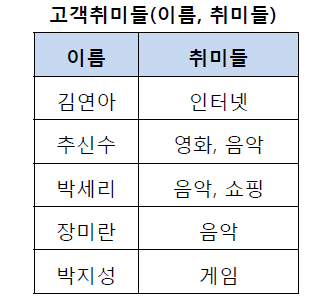
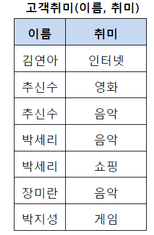
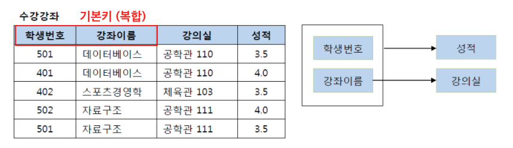
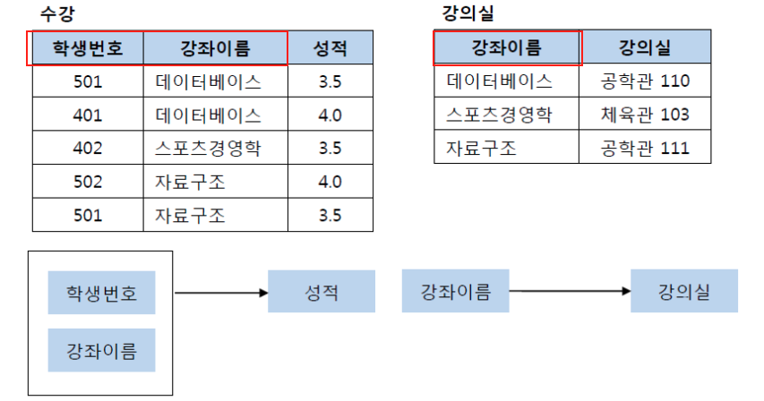
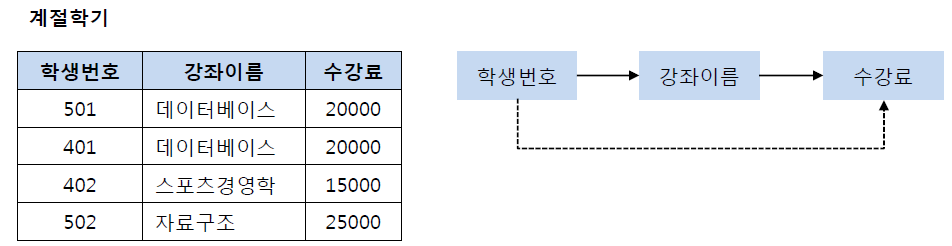
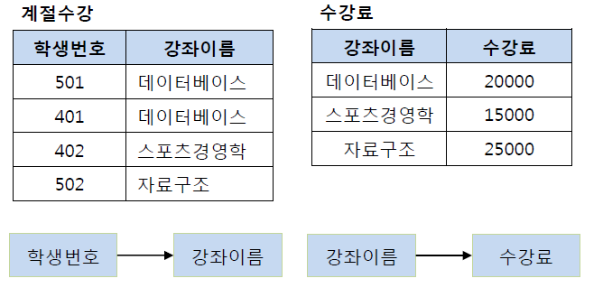
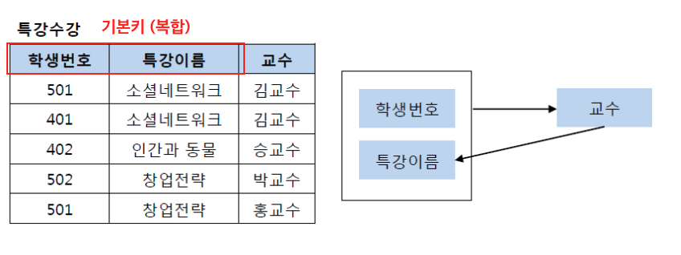

## 정규화

 

> RDBMS의 삽입,삭제,갱신 이상 현상을 최소화 하기 위해  
> 좀 더 작은 단위의 테이블로 설계하는 과정이다.

 

- 정규화 용어 정리
  - 함수적 종속성
    - 테이블의 특정 컬럼 A의 값을 알면 다른 컬럼 B값을 알 수 있을 때 컬럼 B는 컬럼 A에 함수적 종속성이 있다고 한다.
  - 결정자
    - 함수적 종속성 예시에서 컬럼 A는 결정자.
  - 다치 종속
    - 결정자 A에 의해 컬럼 B의 값을 다수 알 수 있을 경우 컬럼 B는 컬럼 A에 다치종속
    - ex) `학번`을 알면 해당 학생의 다수 개 `수강과목`을 알 수 있을 경우 column `수강과목`은 학번에 다치종속 관계

 

### 정규화 장점

- 상호 종속성이 강한 데이터 요소들을 분리, 독립된 개념으로 정의하게 되어 테이블 컬럼의 결합도가 낮아져 유연성이 증가
- 세분화된 테이블에 따라 재사용 가능성 높아짐
- Non-key 데이터 요소가 한 번만 표현되어 중복 최소화
  - 저장공간 절약
  - DML 성능 향상 기대
- 종속성 삭제로 데이터의 일관성과 무결성 보장
- 갱신이상 현상 감소

- 정규화 단점
  - 릴레이션의 분산으로 릴레이션 간의 Join 연산이 많아진다.

 

- 정규화 이론

  - 1차,2차,3차 BCNF는 함수 종속성에 근거하여 정규화 수행
  - 4차 정규화는 속성의 값이 여러 개 발생하는 다치 종속,
  - 5차 정규화는 조인에 의해 발생하는 이상현상 제거

 

### 1차 정규화

- 모든 속성은 원자 값을 가져야 한다.

|              1차 정규형 위반              |
| :---------------------------------------: |
|  |

- 추신수, 박세리의 취미는 원자값 X

|            1차 정규형 위반 해소             |
| :-----------------------------------------: |
|  |

 

### 2차 정규화

- 1차 정규화를 만족
- 기본 키에 종속적이지 않거나 기본 키 일부 컬럼들에만 종속적인 컬럼을 분리

|              2차 정규형 위반              |
| :---------------------------------------: |
|  |

 

- {강좌이름} -> 강의실
  - 기본 키 일부 컬럼(강좌이름)에 종속성 발생

|               2차 정규형 위반 해소               |
| :----------------------------------------------: |
|  |

 

- {성적}은 {학생 번호, 강좌 이름}으로 결정
- 또 강의실 릴레이션을 분리하여 2차 정규화 적용

 

### 3차 정규화

- 2차 정규화를 만족
- 이행적 종속이 발생해서는 안된다.

 

|              3차 정규형 위반              |
| :---------------------------------------: |
|  |

 

- 위 사례는 {학생 번호}가 {강좌 이름}을 결정하고 {강좌 이름} -> {수강료}를 결정한다.
- {학생 번호} -> {강좌 이름} -> {수강료}
  - {학생 번호} -> {수강료}

 

- 501 학생의 {강좌 이름}을 다른 과목으로 변경 할 경우 {수강료}도 변경해야하는 문제

 

|               3차 정규형 위반 해소               |
| :----------------------------------------------: |
|  |

 

- 학생번호 -> 강좌이름
- 강좌이름 -> 수강료를 결정하는 방식으로 릴레이션 변경

 

### BCNF

 

- 3차 정규화 만족하지만 후보키가 여러개일 경우

 

|              BCNF 위반              |
| :---------------------------------: |
|  |

 

- {학생 번호, 특강 이름}이 PK인 테이블
- 교수는 non-key로 결정자가 아니어서 식별 불가
- 특강 개선 사례가 적합하지 않음으로 다른 예시를 찾거나 만들기

 

## 비정규화

 

> 하나 이상의 테이블에 데이터를 중복해 배치하는 최적화 기법

- 장점

  - 빠른 데이터 조회
    - 조인비용 줄어듦
  - 조회 쿼리가 간단해진다
    - 버그 발생 가능성 줄어듦

- 단점
  - 데이터 갱신 및 삽입 비용 높음
  - 데이터의 일관성이 깨질 수 있다.
  - 중복하여 저장하여 더 많은 저장 공간 필요

## 비정규화 대상

- 자주 사용되는 테이블에 액세스하는 프로세스의 수가 많고, 일정한 범위만 조회할 경우
- 테이블에 지나친 조인을 많이 사용하게 되어 데이터 조회하는 것이 어려울 경우
