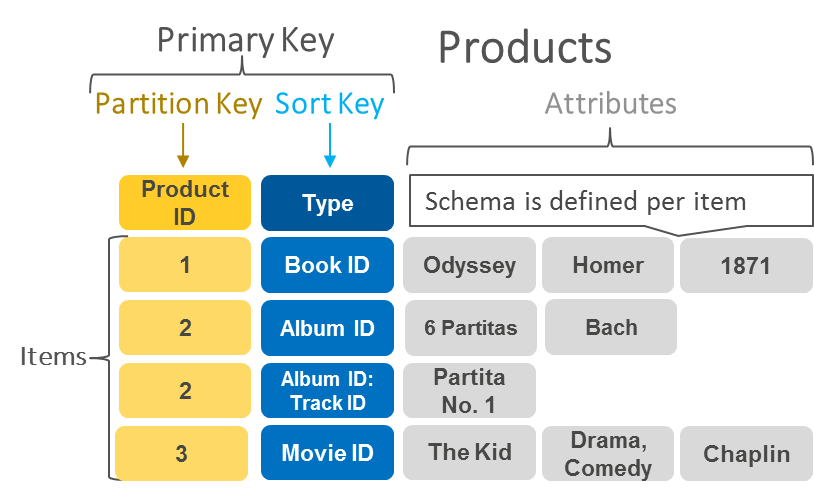
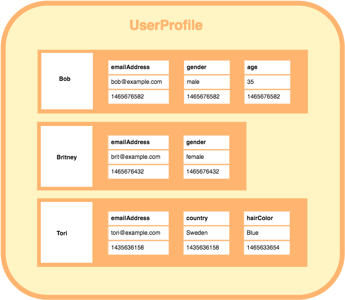
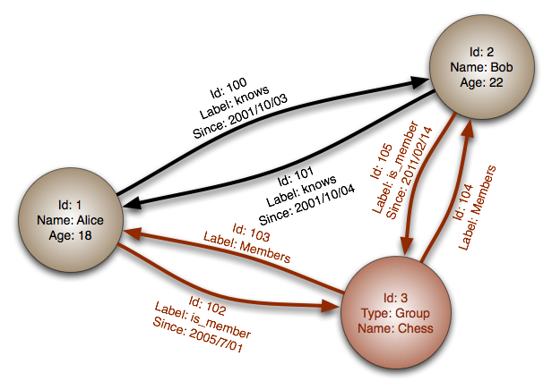

## RDBMS

- 관계형 모델을 기반으로 하는 DBMS
- 테이블은 Row, Column
- 테이블의 관계는 FK로 연관을 맺으며 존재
- 테이블의 정의로 스키마에 따라 데이터 저장
- 수직적인 확장
  - CPU나 RAM과 같은 부품을 업그레이드하거나, 하드웨어를 추가해 서버 성능 향상
- ACID 특성

</br>

### RDBMS 장점

</br>

- 정해진 스키마에 따라 데이터를 저장하므로 명확한 데이터 구조 보장
- 데이터를 중복 없이 1번만 저장
- 데이터의 분류, 정렬, 탐색 속도 빠름

</br>

### RDBMS 단점

</br>

- 테이블간 관계가 복잡할 때, Join이 많은 복잡한 쿼리가 만들어짐
- 성능 향상을 위해선 수직적 확장을 해야 하는데 이에 대한 비용이 크다.
- 지켜야할 스키마로 인해 데이터가 유연하지 않다.
  - 스키마 변경이 어렵다.

</br>

## NoSQL

- 데이터, 테이블 간의 관계를 정의 하지 않음, 스키마가 존재하지 않는다.
- 데이터를 자유롭게 저장 할 수 있다.
- 수평적인 확장
  - 서버를 추가하여 서버를 전체적으로 분산
- 비정규화
  - 중복 존재한다
- CAP 이론
  - Consistency(일관성)
    - 모든 요청은 최신 데이터 또는 에러를 응답
      - DB가 3개로 분산 됐을 때, 하나의 DB에서 데이터가 수정 되면 나머지 2개의 DB에서도 수정 된 데이터 응답
      - 같은 시간에 조회 하는 데이터는 항상 동일한 데이터
    - Availability
      - 모든 요청은 정상 응답
        - 특정 DB에 장애가 발생하더라도 서비스 가능
    - Partitions Tolerance(분리 내구성)
      - DB간 통신이 실패해도 시스템은 동작

</br>

### key - value

</br>

- 데이터를 Key와 Value 쌍으로 저장
- Value는 어떤 형태의 데이터도 (이미지, 비디오 포함)
- 검색, 질의 속도 매우 빠름
- Redis, Riak, Amazon, Dynamo DB

</br>

|                 Key - Value                 |
| :-----------------------------------------: |
|  |

</br>

### Document

</br>

- 데이터를 Key와 Document 형태로 저장
- Key - Value 모델과 달리 Value가 계층적인 형태의 다큐먼트로 저장됨
- Key - Value와 마찬가지로 검색 속도가 매우 빠름
- 검색, 질의 결과는 Json이나 XML의 형태로 출력
- 사용이 번거롭고 쿼리가 SQL과 다름
- B tree 인덱스를 사용
- MongoDB, CouthDB

</br>

```json
[
  {
    "year": 2013,
    "title": "Turn It Down, Or Else!",
    "info": {
      "directors": ["Alice Smith", "Bob Jones"],
      "release_date": "2013-01-18T00:00:00Z",
      "rating": 6.2,
      "genres": ["Comedy", "Drama"],
      "image_url": "http://ia.media-imdb.com/images/N/O9ERWAU7FS797AJ7LU8HN09AMUP908RLlo5JF90EWR7LJKQ7@@._V1_SX400_.jpg",
      "plot": "A rock band plays their music at high volumes, annoying the neighbors.",
      "actors": ["David Matthewman", "Jonathan G. Neff"]
    }
  },
  {
    "year": 2015,
    "title": "The Big New Movie",
    "info": {
      "plot": "Nothing happens at all.",
      "rating": 0
    }
  }
]
```

</br>

### Wide Column

- Column - family Model 기반
- Key - Value를 이용해 필드를 결정한 이전의 모델과 달리 키에서 필드 결정
- Row, Column-family, Column-name으로 구성됨
- 연관된 데이터는 Column-family 안에 있으며 각자의 Column-name이 있다
- RDBMS로 설명하면 attribute(Column)이 계층적인 구조를 가진 것
- 질의, 검색은 Row, Column-family, Column-name을 통해 수행됨
- 쓰기에 최적화된 모델
  - 채팅, 내용 저장, 실시간 분석을 위한 데이터 저장소에 사용
- HBase, Hyptertable

</br>

|                      Wide - Column                       |
| :------------------------------------------------------: |
|  |

</br>

### Graph

</br>

- Node, Edge, Property를 사용하여 데이터를 그래프 구조로 표현하고 저장
- 개체와 관계를 그래프 형태로 표현
- RDBMS와 같이 ACID를 지원
- 데이터 간의 관계가 탐색의 키일 경우 적합
- SNS에서 친구의 친구를 찾거나 연관 데이터를 찾는 등에 쓰임

</br>

|                   Graph                    |
| :----------------------------------------: |
|  |

</br>

### NoSQL 장점

</br>

- 스키마가 없기 때문에, 유연하고 자유롭게 데이터 저장 가능
- 복잡도가 낮기 때문에, 대용량의 데이터를 저장하고 관리 가능
- 데이터 분산이 가능하기 때문에 수평적 확장으로 큰 비용없이 성능 향상 가능

</br>

### NoSQL 단점

- 데이터의 중복이 발생, 중복된 데이터가 변경된다면 해당 데이터가 있는 모든 컬렉션을 수정
  - 데이터 update 속도 느림
- 명확한 데이터 구조 보장
