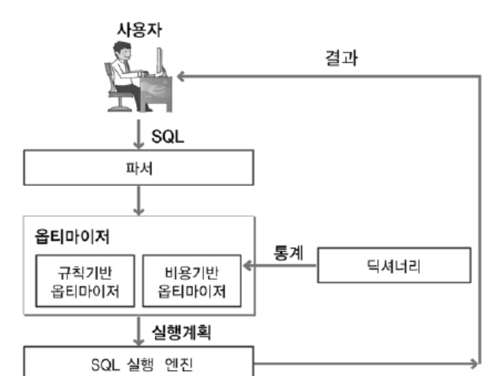
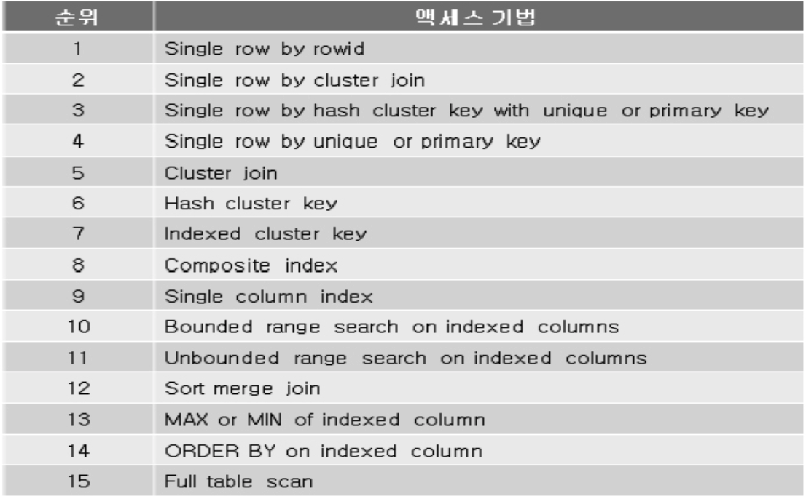
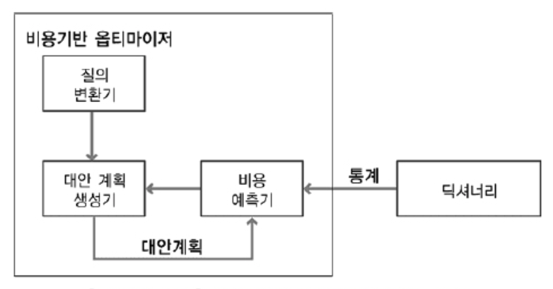

# 옵티마이저

- 사용자가 질의한 SQL문에 대한 최적의 실행 방법을 결정하는 역할 수행
- 최적의 실행 방법 : 실행 계획
- 다양한 실행 방법들 중에서 최적의 실행 방법을 결정하는 것이 옵티마이저의 역할
- RDBMS는 옵티마이저가 결정한 실행 방법대로 실행 엔진이 데이터를 처리하여 결과 데이터를 사용자에게 전달

</br>

|                  optimizer                  |
| :-----------------------------------------: |
|  |

</br>

## 규칙기반 옵티마이저 - RBO

</br>

|               RBO               |
| :-----------------------------: |
|  |

</br>

- 규칙(우선 순위)를 가지고 실행 계획 생성
- 규칙 기반 옵티마이저가 실행계획을 생성할 때 참조하는 정보
  - SQL문을 실행하기 위해서 이용 가능한 인덱스 유무(유일, 비유일, 단일, 복합 인덱스) 종류
  - 연산자 (=, < , >, LIKE, BETWEEN)
  - SQL문에서 참조하는 객체(힙 테이블, 클러스터 테이블)

</br>

- 1순위 Single row by rowid
  - rowid를 통해서 테이블에서 하나의 행을 액세스 하는 방식
- 4순위 Single row by unique or primary key
  - 유일 인덱스를 통해서 하나의 행을 액세스
    - 인덱스를 먼저 액세스하고 인덱스에 존재하는 rowid를 추출하여 테이블의 행을 액세스
- 8순위 Composite Index
  - 복합 인덱스에 동등 조건으로 검색
    - 복합인덱스 사이의 우선 규칙
      - 인덱스 구성 컬럼의 개수가 더 많고 해당 인덱스의 모든 구성 컬럼에 대해 =로 값이 주어질수록 우선순위 높음
- 9순위 Single column index : 단일 컬럼 인덱스에 = 조건으로 검색
- 10순위 Bounded range search on indexed columns
  - 인덱스가 생성 되어 있는 컬럼에 양쪽 범위를 한정하는 형태
    - Between 10 and 20, like '1%'
- 11순위 UnBounded range search on indexed columns
  - 인덱스가 생성되어 있는 컬럼에 한쪽 범위만 한정
    - <, > 등
- 15순위 full table scan
  - 전체 테이블을 액세스 하면서 조건절에 주어진 조건을 만족하는 행만을 결과로 추출
    - 조인 순서 결정 : 조인 컬럼 인덱스의 존재 유무
    - 1. 조인 컬럼에 대한 인덱스가 양쪽 테이블에 존재 할 경우
      - 우선 순위가 높은 테이블을 선행 테이블로 선택
    - 2. 한쪽 조인 컬럼에만 인덱스가 존재하는 경우
      - 인덱스가 없는 테이블을 선행 테이블로 선택해서 조인을 수행
    - 3. 조인 컬럼에 모두 인덱스가 존재하지 않는 경우
      - from 절의 뒤에 나열된 테이블을 선행 테이블로 선택
    - 4. 조인 테이블의 우선 순위가 동등 할 경우
      - from 절에 나열된 테이블의 역순으로 선행 테이블 선택

</br>
</br>
</br>

```sql

select ename
from emp
where sal between 3000 and 6000

```

- index
  - emp_job : job
  - emp_sal : sal
  - pk_emp : empno(unique)

</br>

- where조건 절에서
  - job 컬럼의 조건은 =
  - sal 조건은 between
  - 각각으 ㅣ컬럼에 단일 컬럼 인덱스가 존재
- 우선 순위 규칙에 따라
  - job 조건은 순위 9 의 단일 컬럼 인덱스 만족
  - sal 조건은 순위 10 인덱스상의 양쪽 한 정 검색 만족
- 따라서 우선순위가 높은 emp_job 인덱스를 이요해서 조건을 만족하는 행에 대해 emp 테이블 액세스

</br>

## 비용기반 옵티마이저 - CBO

</br>

- sql문을 처리하는데 필요한 비용이 가장 적은 실행 계획을 선택하는 방식
  - 비용을 예측하기 위해 규칙기반 옵티마이저가 사요하지 않는 테이블, 인덱스, 컬럼 등의 다양한 객체 통계 정보와 시스템 통계 정보 이용
  - 정확한 통계 정보를 유지하는 것이 비용기반 최적화에서 중요한 요소

</br>

|               CBO               |
| :-----------------------------: |
|  |

</br>

- 질의 변환기 : 사용자가 작성한 SQL문을 처리하기에 보다 용이한 형태로 변환
- 대안 계획 생성기 : 동일한 결과를 생성하는 다양한 대안 계획을 생성
- 대안 계획 : 연산의 적용 순서 변경, 연산 방법 변경, 조인 순서 변경등을 통해 생성
- 비용 예측기 : 대안 계획 생성기에 의해 생성된 대안 계획의 비용을 예측

</br>

> 비용 기반의 경우 규칙 기봔과 다르게 인덱스를 사용하는 비용이 전체 테이블 스캔 비용보다 크다고 판단 되면  
> 전체 테이블 스캔을 수행하는 방법으로 싱행 계획 생성

</br>
