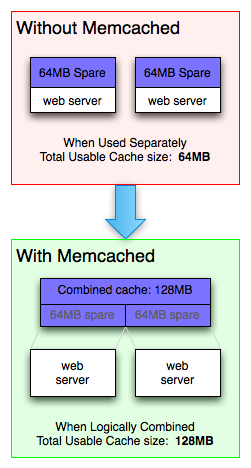

# Redis와 Memcached의 차이

## Redis, Memcached

- 분산 메모리 캐싱 시스템
- 데이터를 Key-Value 형태로 메모리에 저장(NoSQL)
  - 디스크 기반 DB보다 빠르게 데이터를 읽음
- DB 부하를 줄여 동적 웹 애플리케이션의 속도 개선을 위해 사용
- 데이터 파티셔닝을 통해 많은 데이터를 효과적으로 처리
  - 수평 확장

 

|              Mem cached              |
| :----------------------------------: |
|  |

 

## Redis

 

- 싱글스레드
- 다양한 자료구조, API 지원
- 데이터 스냅샷, AOF 로그로 장애 상황시 데이터 복구가 가능해 영속성 보장

 

- 데이터 스냅샷

 

> 메모리의 내용을 Disk에 옮겨 담는 방식  
> Redis의 동작을 잠시 멈추고 스냅샷을 저장하는 Save 방식과  
> 별도 프로세스를 띄워 redis 동작 중에 스냅샷을 저장하는 BG SAVE가 있음

 

- AOF 로그

 

> redis의 모든 write/update 연산을 log 파일에 기록  
> operation이 발생할 때마다 기록하기 때문에 특정 시점이 아닌 현재 시점까지의 로그를 기록  
> redis를 정지하지 않는 방식

 

- 트랜잭션 지원
- 마스터-슬레이브 구조로 여러 개의 복제본을 생성할 수 있다.
  - 이러한 Copy-on-Write 방식을 사용할 메모리의 2배가 필요하다
- 데이터 삭제 정책이 다양함
- 세션 관리(Refresh Token), 캐싱에 주로 사용

 

## Memcaches

- 멀티 스레드
- 문자열 지원
- 데이터 삭제 정책에는 LRU 알고리즘만 사용

 

## Redis vs Memcached

 

|                  |                Redis                |                       Memcached                       |
| :--------------: | :---------------------------------: | :---------------------------------------------------: |
|   데이터 타입    | String, Set, Sorted Set, Hash, List |                        String                         |
|   데이터 저장    |            Memory, Disk             |                        Memory                         |
|  메모리 재사용   |                  X                  | 메모리 부족 시 LRU 알고리즘으로 데이터 삭제 후 재사용 |
|      스레드      |             단일 스레드             |                      멀티 스레드                      |
|    캐싱 용량     |         Key, Value 모두 512         |                Key 250 Byte, Value 1MB                |
|  메모리 사용량   |                많음                 |                         적음                          |
| 데이터 삭제 정책 |                다양                 |                          LRU                          |

 

- 성능 차이 크지 않음
- Redis는 메모리가 날라가도 복구 가능
- Redis는 다양한 자료구조 지원

 
