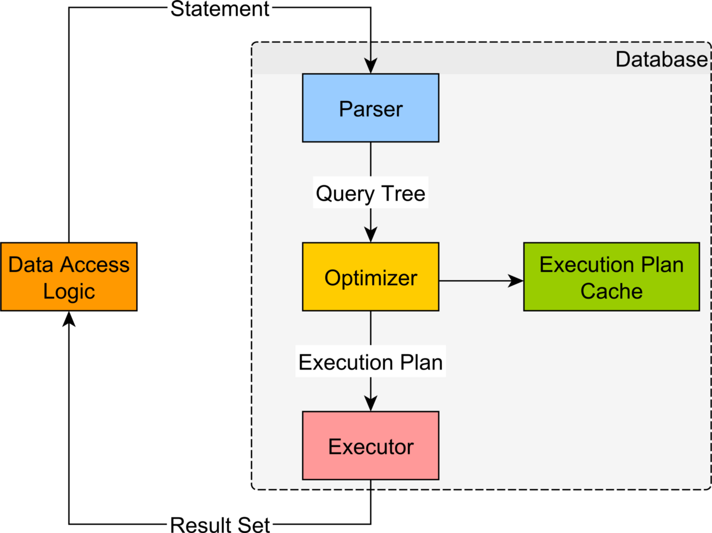
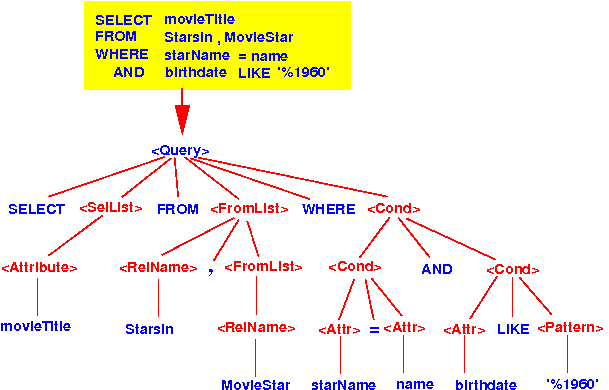
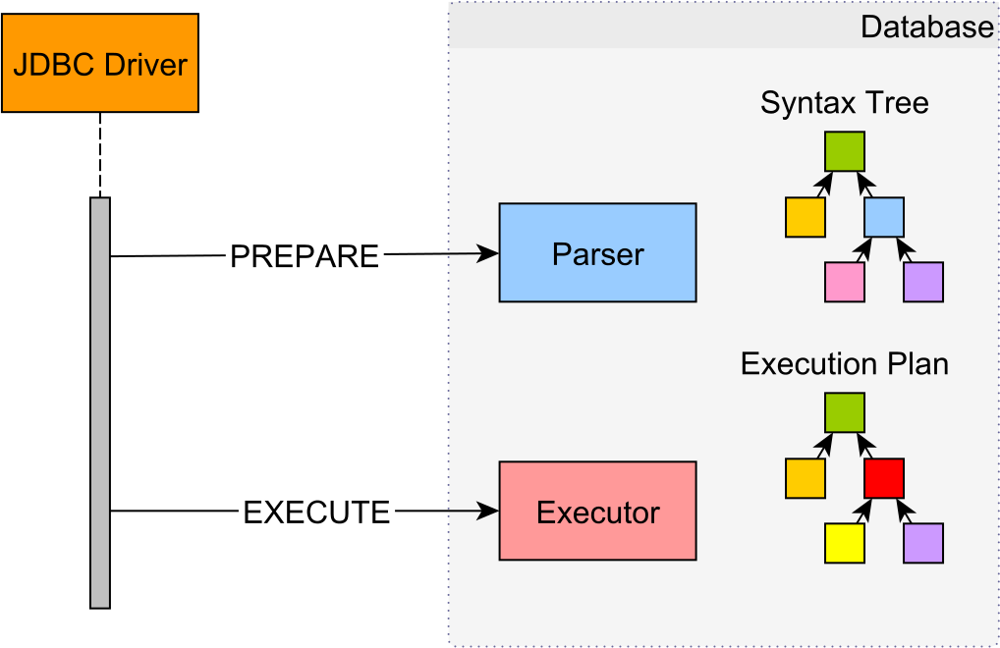
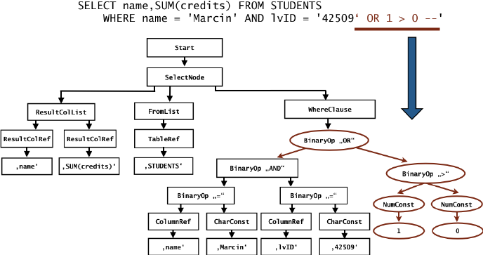

## Statement

</br>

- Statement는 executeQuery()나 executeUpdate()를 실행하는 시점에 파라미터로 SQL문을 전달하는데, 이때 전달 되는 SQL문은 완성된 형태로 어떤 SQL문인지 파악하기 쉽다.
- SQL문을 수행하는 과정에서 매번 컴파일 실행하여 효율성이 떨어진다.
- 쿼리에 파라미터 값이 미리 입력되어야 함으로 동적으로 파라미터에 값을 부여할 수 없다.

</br>

### Statement Life Cycle

</br>

|                        LifeCycle                         |
| :------------------------------------------------------: |
|  |

</br>

- Parser
  - 가장 먼저 SQL 명령문이 문법적으로나 의미적으로 정상적인지 확인
  - Parsing이 진행도는 동안 SQL 명령문은 `syntax tree`라고 불리는 DB 내부 표현으로 변형

|              systax tree               |
| :------------------------------------: |
|  |

</br>

- Optimizer
  - 생성된 syntax tree에 따라 데이터를 가져오기 위한 가장 효율적인 알고리즘 결정
  - 가장 일반적인 의사 결정 알고리즘 -> CBO
  - Optiamizer 기술에 따라 인덱싱, 테이블 검색, 조인등 Access Path 설정을 통해 요청한 질의에 대한 최적화된 경로로 응답 데이터를 전달 받을 수 있는 execution plan 제작

</br>

- Executor
  - Optimizer에서 전달된 execution plan은 Executor가 데이터를 가져오고 최종 결과를 작성하는데 사용
  - execution plan에 따른 데이터를 로딩하기 위해 `스토리지 엔진을 사용`하며, 트랜잭션의 데이터 무결성 보증을 위해서 `트랜잭션 엔진 사용`

</br>

## PreparedStatement

</br>

- DBMS에서 동일하거나 비슷한 SQL문을 높은 효율성으로 반복적으로 싱행하기 위해 사용되는 기능이다.
- 템플릿 형식을 기반으로 매 실행시 특정한 상수 값으로 치환되어 SQL문을 실행시키도록 도움

- 예시

```SQL
INSERT INTO products(id, name, price) VALUES (?,?,?)
```

> 위와 같인 prepared statement가 존재하면  
> DBMS에서 parses, optimizes and translate 과정을 거쳐 적절하게 컴파일되어 실행

</br>

### Prepared Statement Life Cycle

</br>

|                                LifeCycle                                 |
| :----------------------------------------------------------------------: |
|  |

</br>

- parser

  - prepared statements를 syntax tree로 컴파일 진행
  - 올바른 구문이어야 컴파일 완료 가능, 이를 pre-comilation 단계
  - 컴파일 완료 후 이제 실행에 필요한 execution plan 작성을 위해 Dirver에 전달 된 파라미터를 Syntax Tree에 따라 바인딩 시키고 이를 컴파일 하여 Execution Plan을 생성

- Executor는 이렇게 생성한 Execution Pland을 통해 결과 값을 생성

</br>

## 어떻게 SQL Injection이 발생 할까?

> SQL Inejct이 발생하는 원인을 해결하기 위해서는  
> 개발자가 의도한 Syntax Tree를 생성하는 것이고  
> 이를 위한 기능이 prepared statement

</br>

|                           syntax tree                            |
| :--------------------------------------------------------------: |
|  |

- 정해진 규칙의 prepared statement를 준비하고,
- 매번 동적으로 파라미터를 바인딩 시키는 구조를 통해 SQL injection 방지
