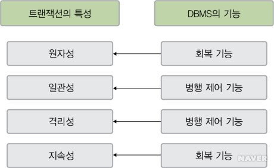
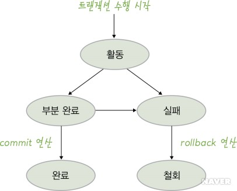

# 트랜잭션

> 하나의 논리적 기능을 수행하기 위한 작업의 단위로,  
> DB의 일관된 상태를 또 다른 일관된 상태로 변환 시키는 기능을 수행

 

## 트랜잭션 단위

> 작업 수행에 요구되는 SQL 집합

- 예시
  - 1. A 계좌에서 잔액 확인 (조회)
  - 2. A 계좌의 금액에서 이체할 금액을 빼고 다시 저장
  - 3. B 계좌의 잔액 확인
  - 4. B 계좌의 금액에서 이체할 금액을 더하고 다시 저장

 

## 트랜잭션 사용 이유

- 데이터 베이스가 항상 정확하고 일관된 상태 유지
- 장애 발생 시 복구나, 다수의 사용자가 동시에 사용할 수 있도록 하는 단위
- 트랜잭션 관리를 통해 데이터베이스의 회복과 병행 제어가 가능해져 결과적으로 데이터베이스가 일관된 상태 유지
- 트랜잭션 명령이 모두 처리되거나 하나도 처리되지 않아야 데이터베이스가 일관된 상태 유지

 

## 트랜잭션 특성

|                   트랜잭션 특성과 DBMS의 기능                    |
| :--------------------------------------------------------------: |
|  |

### 원자성

- 트랜잭션을 구성하는 연산들이 모두 정상적으로 실행되거나 하나도 실행되지 않아야 하는 all-or-nothing
- 트랜잭션을 수행하다 장애 발생시, 지금까지 실행한 연산들을 모두 처리 취소하고 DB 트랜잭션 작업 전의 상태로 되돌려 트랜잭션의 원자성을 보장

 

### 일관성

- 트랜잭션이 성공적으로 수행된 후에도 DB가 일관성 있는 상태를 유지
- `트랜잭션이 수행되기 전` DB가 일관된 상태였다면 `트랜잭션 수행 후` 결과를 반영한 DB도 일관된 상태 유지
- `트랜잭션이 수행되는 과정 중`에는 DB가 일시적으로 일관된 상태가 아닐 수 있지만, 트랜잭션의 수행이 성공적으로 완료된 후에는 DB가 일관된 상태를 유지

 

### 격리성

- 현재 수행 중인 트랜잭션이 완료될 때 트랜잭션이 생성한 중간 연산 결과에 다른 트랜잭션이 접근 할 수 없는 것
- DB 시스템에서 여러 트랜잭션이 동시에 수행되지만 각 트랜잭션이 독립적으로 수행 될 수 있도록 다른 트랜잭션의 중간 연산 결과에 서로 접근 X

 

### 지속성

- 트랜잭션이 성공 한 이후, 반영된 수행 결과는 어떠한 경우에도 손실되지 않고 영구적이어야 함
- 시스템 장애가 발생하더라도 트랜잭션 작업 결과는 없어지지 않고 DB에 그대로 남아있어야 한다.
- 트랜잭션의 지속성을 보장하려면 시스템에 장애가 발생했을 때 DB를 원래 상태로 복구하는 회복 기능 필요

 

## 트랜잭션 연산

- commit : 트랜잭션이 성공적으로 수행 되었음을 선언(작업 완료)
- rollback : 트랜잭션이 수행을 실패했음을 선언(작업 취소)

 

## 트랜잭션 상태

|                 트랜잭션 상태                  |
| :--------------------------------------------: |
|  |

### 활동

 

- 트랜잭션이 수행을 시작하여 현재 수행 중인 상태
- 활동 상태인 트랜잭션은 상황에 따라 부분 완료 상태나 실패 상태 중 하나

 

### 부분 완료

- 트랜잭션의 마지막 연산이 실행된 직후의 상태
- 트랜잭션이 수행한 최종 결과를 DB에 아직 반영하지 않은 상태
- 부분 완료 상태의 트랜잭션은 상황에 따라 완료 상태 및 실패 상태가 될 수 있음

 

### 완료

- 트랜잭션이 성공적으로 완료되어 commit 연산을 실행한 상태
- 트랜잭션이 수행한 최종 결과를 DB에 반영하고, DB가 새로운 일관된 상태가 되면서 트랜잭션 종료

 

### 실패

- 하드웨어, 소프트웨어의 문제나, 트랜잭션 내부의 오류 등의 이유로 장애가 발생하여 트랜잭션의 수행이 중단
- 트랜잭션이 더는 정상적으로 수행을 계속 할 수 없음

 

### 철회

- 트랜잭션의 수행이 실패하여 rollback 연산을 실행한 상태를 철회 상태
- 지금까지 실행한 트랜잭션의 연산을 모두 취소하고 트랜잭션이 수행되기 전의 DB 상태로 되돌리면서 트랜잭션 종료

 

## 트랜잭션 사용시 주의할 점

- 트랜잭션은 반드시 필요한 코드에만 적용
- DB 커넉션 개수가 제한적이고 각 단위 프로그램이 커넥션을 소유하는 시간이 길어진다면 사용 가능한 여유 커넥션의 개수는 줄어들게 됨

## 장애외 회복

### 장애

- 트랜잭션 장애
- 시스템 장애
  - 하드웨어 결함으로 정상적으로 수행을 계속 할 수 없는 경우
- 미디어 장애
  - 디스크 장치의 결함으로 디스크에 저장된 데이터베이스의 일부 혹은 전체가 손상된 상태

### 회복

- 즉시 갱신

  - 로그 기반 회복 기법
  - 트랜잭션 수행 도중 변경하면 변경 정보를 로그 파일에 저장하고, 트랜잭션이 부분 완료되기 전이라도 모든 변경 내용을 즉시 데이터베이스의 반영하는 기법
  - 로그 파일을 참조하여 REDO & UNDO 연산 모두 실행

- 지연 갱신

  - 로그 기반 회복 기법
  - 트랜잭션이 부분 완료 상태에 이르기까지 발생한 모든 변경 내용을 로그 파일에만 저장하고 데이터베이스에는 커밋이 발생할때까지 저장하는 기법. 회복과정에서 UNDO 필요 X
  - 이를 통해 트랜잭션의 원자성 보장.

- check point recovery

  - 이전은 신경 쓰지 않고 Check Point 이후만 즉시 갱신 혹은 지연 갱신을 수행
  - 가장 최근 CheckPoint 지점을 찾아 그 시점 이후의 로그만을 회복 대상으로 함.

- media recovery
  - 디스크와 같이 비휘발성 저장 장치의 내용이 손상되는 장애가 발생했을 시에 회복을 위한 기법이며
  - 백업, 미러링 등을 이용해 복구
