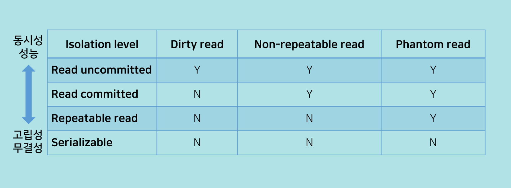
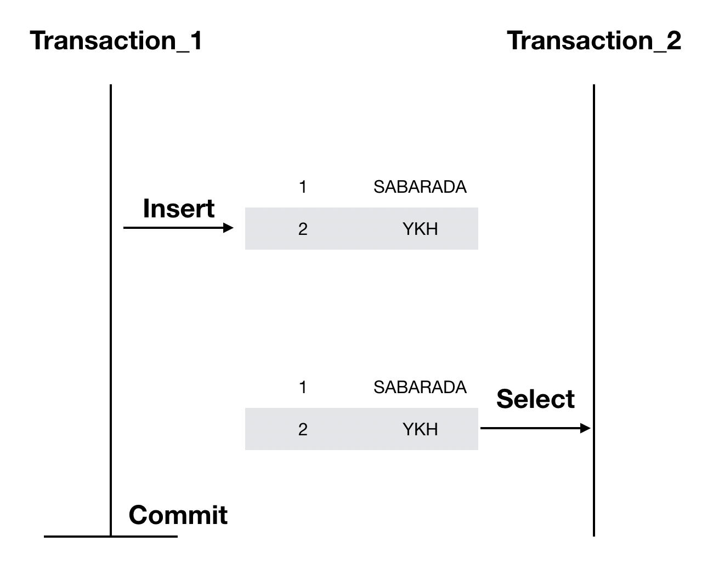
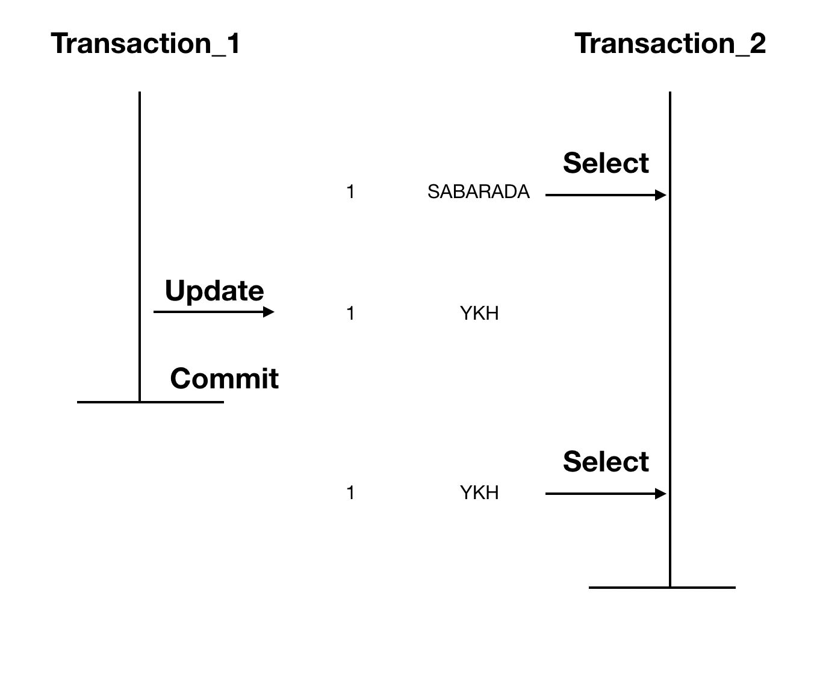
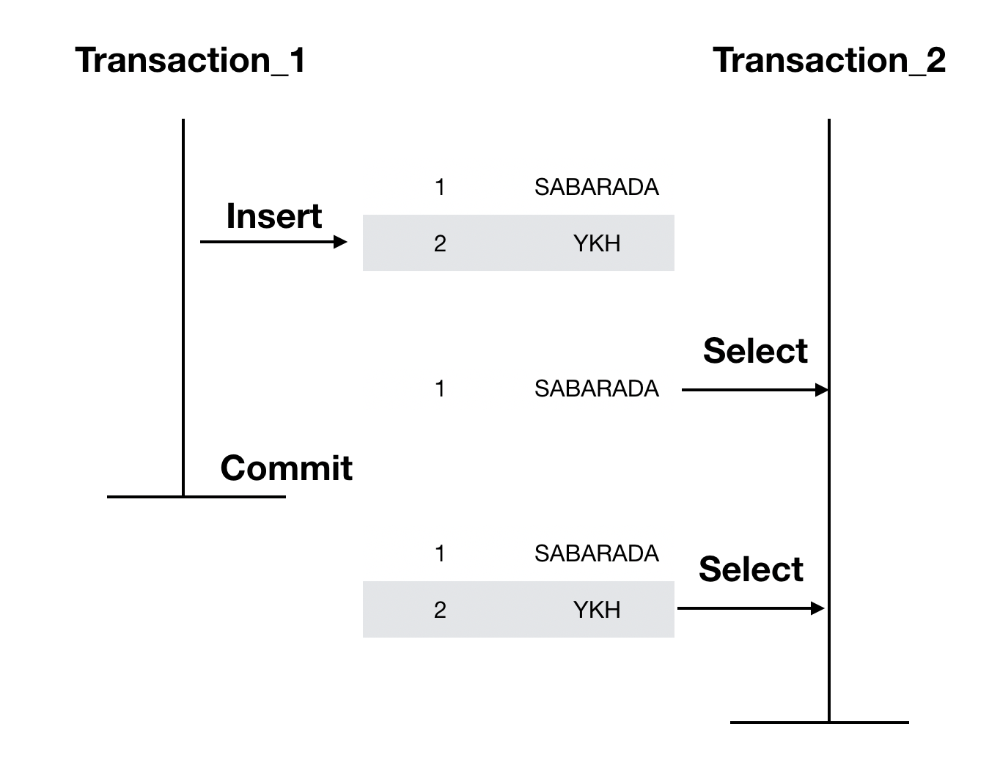
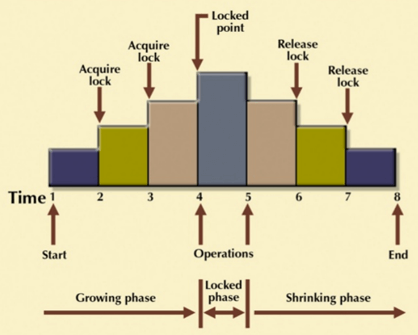
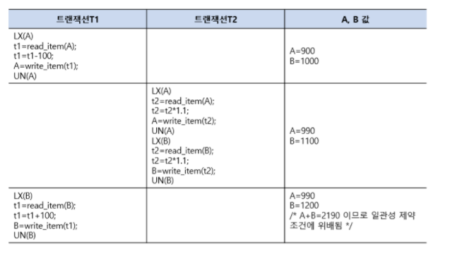

# 트랜잭션 격리수준(Transaction Isolation Level)

 

> 트랜잭션 격리수준은 동시에 여러 트랜잭션이처리 될 때, 트랜잭션끼리 얼마나 서로 고립되어 있는지를 나타내는 척도.

 

|                      트랜잭션 격리 수준                      |
| :----------------------------------------------------------: |
|  |

 

- Read Uncoimmitted

  - 트랜잭션에서 처리중인 아직 커밋되지 않은 데이터를 다른 트랜잭션이 읽는 것을 허용

- Read Committed

  - 트랜잭션이 커밋되어 확정된 데이터만 다른 트랜잭션이 읽도록 허용
  - 커밋 되지 않은 데이터에 대해서 실제 DB 데이터가 아닌 Undo 로그에 있는 이전 데이터를 가져오는 방식
  - Oracle에서 기본적으로 사용하는 격리 수준

- Repeatable read

  - 트랜잭션이 시작되기 전에 커밋된 내용에 대해서만 읽도록 허용
  - `반복 가능한 읽기`라는 이름에서 알 수 있듯이 한 트랜잭션 내에서 읽기가 여러 번 발생해도 같은 값을 가져옴
  - 즉 트랜잭션 수행 중 다른 트랜잭션에 의해 데이터가 변경되어도 변경 전의 데이터로 읽음
  - 트랜잭션 내에서 삭제, 변경에 대해서 Undo 로그에 넣어두고 앞서 발생한 트랜잭션에 대해서는 실제 데이터가 아닌 Undo 로그에 있는 백업데이터를 읽게 함
  - MySQL에서 기본으로 사용하는 격리 수준

- Serializable read
  - 트랜잭션 내에서 쿼리를 두 번 이상 수행 할 때, 첫 번째 쿼리에 있던 레코드가 사라지거나 값이 바뀌지 않음은 물론 새로운 레코드가 나타나지 않도록 설정
  - 읽기 작업에도 락이 걸려 동시성이 떨어진다.

 

## 트랜잭션 격리 수준에 따른 문제점

### Dirty Read

|              Dirty Read              |
| :----------------------------------: |
|  |

 

> 다른 트랜잭션에 의해 수정됐지만 아직 커밋되지 않은 데이터를 읽어오는 것을 말함

 

- 예시
  - A 트랜잭션에서 10번 사원의 나이를 27살에서 28살로 Update
  - 아직 커밋되지 않은 상황
  - B 트랜잭션에서 10번 사원의 나이를 조희
  - 28살이 조회 -> `Dirty Read`
  - A 트랜잭션에서 문제가 발생해 RollBack..
  - B 트랜잭션에서 10번 사원이 28살이라고 생각하고 로직 수행

### Non - Repeatable Read

|                  Non Repeatable Read                   |
| :----------------------------------------------------: |
|  |

 

> Non - Repeatable Read는 한 트랜잭션 내에서  
> 같은 key를 가진 Row를 두 번 읽었는데  
> 그 사이에 값이 변경되거나 삭제되어 결과가 다르게 나타나는 현상

 

- 예시
  - B 트랜잭션에서 10번 사원의 나이를 조회 -> 27살
  - A 트랜잭션에서 10번 사원의 나이를 27살에서 28살로 바꾸고 커밋
  - B 트랜잭션에서 10번 사원의 나이를 다시 조회 -> 28살이 조회

 

### Phantom Read

|               Phantom Read               |
| :--------------------------------------: |
|  |

 

> 한 트랜잭션 내에서 같은 쿼리를 두 번 수행 했는데, 첫 번째 쿼리에서 없던 유령 레코드가 두번째 쿼리에서 나타나는 현상  
> 예를 들어 id > 100인 쿼리를 날릴때 같은 트랜잭션에서 처음에는 101, 102, 103만 읽었다면  
> 두 번째에서는 다른 트래낵션에서 id가 104인 데이터가 추가돼서 101, 102, 103, 104를 읽는 경우

- Phantom Read와 Non-Repeatable Read 차이점
  - Non Repeatable read는 1개의 row의 데이터 값이 변경
  - Phantom read는 다건 요청에서 데이터 값이 변경 되는것

 

## 트랜잭션 병행 제어

> 병행제어란 여러개의 트랜잭션이 실행 될 때 트랜잭션들이  
> 데이터베이스의 일관성을 파괴하지 않고  
> 다른 트랜잭션에 영향을 주지 않으면서 트랜잭션을 제어하는 것을 의미

 

### 병행제어 기법

1. 로킹(Locking)

- 트랜잭션이 어떤 데이터에 접근하고자 할 때 로킹을 수행하며 로킹을 한 트랜잭션만이 로킹을 해제할 수 있음
- 로킹된 데이터에는 다른 트랜잭션 접근 불가
- 로킹 단위: 필드, 레코드, 파일, 데이터베이스 모두 로킹이 될 수 있음
- 로킹 단위가 크면 : 관리하기 용이(로킹 오버헤드 감소), but 동시성 수준 낮아짐
- 로킹 단위 작으면 : 동시성 수준 높아짐, but 관리 어려움(로킹 오버헤드 증가)

 

|                   2단계 로킹                   |
| :--------------------------------------------: |
|  |

2. 2단계 로킹 규약(Two - Phase Locking Protocol)

- Lock과 unLock이 동시에 이루어지면 일관성이 보장되지 않아 Lock만 가능한 단계와 unLock만 가능한 단계를 분리
- 확장 단계 : 새로운 Lock은 가능하고 unLock은 불가능
- 축소 단계 : UnLock은 가능하고 새로운 Lock은 불가능
- 직렬 가능성 보장
- 교착 상태가 발생 할 수 있음

|                  트랜잭션 예시                   |
| :----------------------------------------------: |
|                       :-:                        |
|  |

 

- T1, T2에서 보면 T1은 A에 대해 락을 걸고 -100 연산 한 후 언락을 걸고 B에 락을 걸고 + 100 연산 실행
- 그 사이에 트랜잭션 T2가 A와 B에 대해 \*1.1 연산 수행
- 이러면 A값에 대해 T1 트랜잭션 -> T2 트랜잭션을 수행한 결과가 나오게 되고, B값에 대해서는 T2 트랜잭션 -> T1 트랜잭션을 수행한 결과가 나오게 됨
- 일관성이 깨지기 때문에 이를 해결하기 위해서는 T1은 시작부터 A, B에 대한 락을 둘 다 걸고, 끝날때, A, B에 대한 락을 풀어야 한다.

 

3. 타임 스탬프

- 데이터에 접근하는 시간을 미리 정하여 정해진 시간의 순서대로 데이터에 접근하며 수행
- 장점: 직렬가능성을 보장하며 시간을 나눠 사용하기 때문에 교착상태가 발생하지 않음
- 단점 : 연쇄 복구를 초래 할 수 있음

4. 낙관적 병행제어

- 트랜잭션 수행동안은 어떠한 검사도 하지 않고, 트랜잭션 종료 시에 일괄적으로 검사
- 트랜잭션 수행 동안 그 트랜잭션을 위해 유지되는 데이터 항목들의 지역 사본에 대해서만 갱신
- 트랜잭션 종료 시에 동시성을 위한 트랜잭션 직렬화가 검정되면 일시에 DB로 반영

5. 다중 버전 병행제어

- 여러 버전의 타임스탬프를 비교하여 스케줄상 직렬 가능성이 보장되는 타임스탬프를 선택
- 충돌이 발생할 경우 복귀 수행, 연쇄 복귀 발생 가능성

 

### 병행제어를 하지 않으면?

1. 분실된 갱신 (Dirty write)

- 두 개의 트랜잭션이 같은 데이터에 대해서 동시에 갱신 작업을 하면 하나의 갱신 작업이 분실되는 경우

2. 모순성 (Non - repeated Read)

- 한개의 트랜잭션 작업이 갱신 작업을 하고 있는 상태에서 또 하나의 트랜잭션이 같은 작업 구역에 침범하여 작업하게 되어 데이터베이스의 일관성을 해치는 경우

3. 연쇄 복귀 (Casacade Rollback)

- 같은 자원을 사용하는 두개의 트랜잭션 중 한 개의 트랜잭션이 성공적으로 일을 수행하였다 하더라도 다른 트랜잭션이 처리하는 과정에서 실패하게 되면 두 개의 트랜잭션 모두가 복귀되는 현상

4. 비완료 의존성 (Dirty Read)

- 한 개의 트랜잭션이 수행과정에서 실패하였을 때, 이 트랜잭션이 회복되기 전에 다른 트랜잭션이 수행 결과를 참조하는 현상

5. Phantom Read

- 동일 트랜잭션에서 동일한 대상을 여러번 읽을 때 그 사이에 새로운 값(Phantom Tuple)이 삽입되어 값이 변경됨

 

## next-key lock (mysql에서 Phantom Read를 방지하는 방법)

 

### 락의 종류

- Record lock : 단일 인덱스 레코드의 락
- Gap lock : 인덱스 레코드 사이의 갭의 락, 선두 인덱스 레코드의 앞이나 말미 인덱스 레코드의 뒤의 갭의 락
- Next-key lock : 레코드락과 이 레코드 직전의 갭 락의 조합
