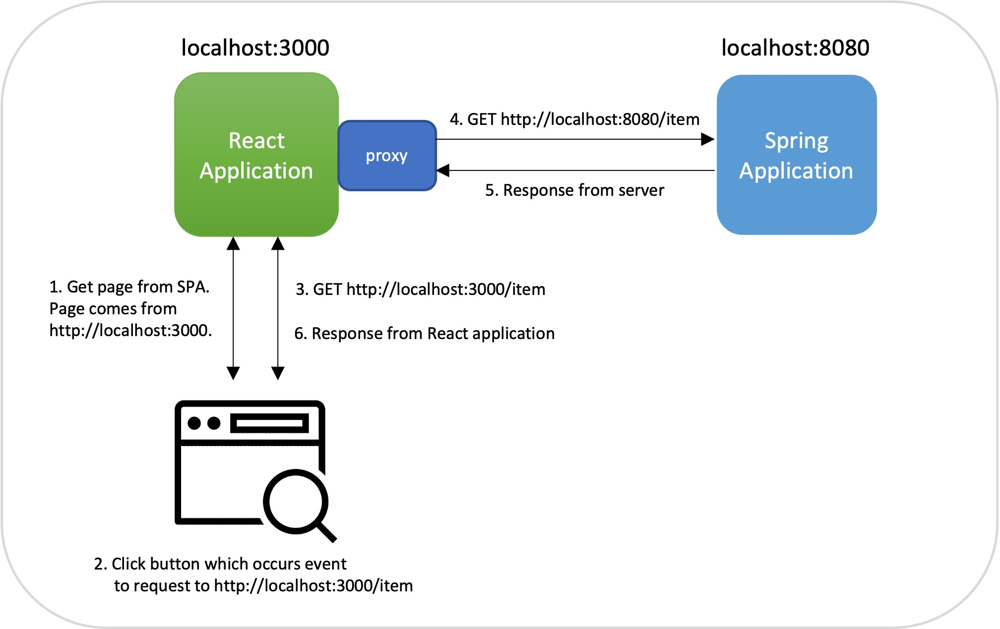
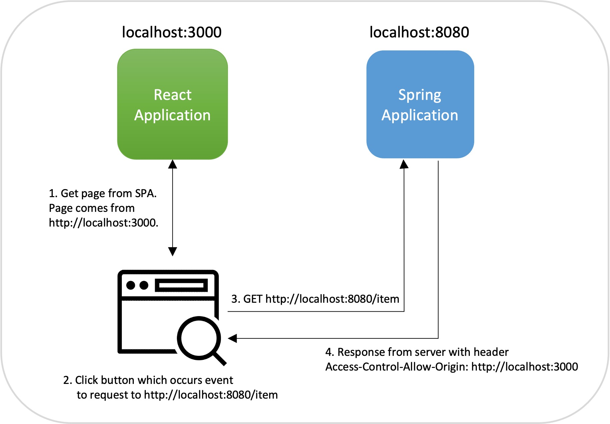

## SOP(Same Origin Policy)

</br>

- 다른 출처의 리소스에 접근하는 것을 제한하는 보안 방식
- 출처
  - Protocol, Host, Port, Path, Query String, Fragment 등 URI에 들어있는 내용
- Protocol, HOST, POST로 같은 출처인지 판단 가능
- host를 string value를 통해 비교한다.
- host 뒤쪽의 resourc나 identifier, query string, fragment등은 비교하지 않는다.

</br>

### SOP를 쓰는 이유

</br>

> 이메일 같은 곳에 target 주소를 보내게 한 후,  
> 누를 경우 악의 적인 명령을 내릴 수 있다.

</br>

## CORS(Cross-Origin Resource Sharing)

</br>

> 다른 출처의 자원을 공유하는 것을 허용하는 것이다.  
> 대표적으로 클라이언트 - 서버가 소통할 때  
> 서로 다른 출처를 가지게 됨으로(host가 동일해도 포트가 다름)  
> 이 경우 CORS를 허용해주어야 한다.

### CORS를 사용하는 이유

> 악의를 가진 사용자가 CSRF나 XSS와 같은 방법을 사용하여  
> 애플리케이션 코드가 실행된 것처럼 꾸며서 사용자의 정보를 탈취하는 것을 방지하기 위함이다.

</br>

### CORS 접근 제어

- Simple Request

  - Preflight 달리 요청없이 바로 요청을 날리낟.
  - 조건 충족 사항
    - GET, POST, HEAD 메서드 중 하나
    - Content-Type
      - application/x-www-form-urlencoded
      - multipart/form-data
      - text/plain
    - 헤더는 Accept, Accept-Language, Content-Language, Content-Type만 허용

- Preflight Request
  - OPTIONS 메서드를 통해 다른 도메인의 리소스에 요청이 가능한지 확인하는 작업
  - 서버에게 요청을 보내도 되는지 확인
  - 요청이 가능하다면 그 때 실제로 요청을 보낸다.
  - Preflight Request 요청 포맷
    - Origin: 요청 출처
    - Access-Control-Request-Method: 실제 요청 메서드
    - Access-Control-Request-Headers: 실제 요청의 추가 헤더(실제로 보내는 추가 헤더들)
  - Preflight Response 응답 포맷
    - Acceess-Control-Allow-Origin: 서버 측 허가 출처
    - Access-Control-Allow-Method : 서버 측 허가 메서드
    - Access-Control-Allow-Headers : 서버 측 허가 헤더
    - Access-Control-Max-Age : Preflight 응답 캐시 기간

### Preflight는 매번 보내지 않는다?

- Preflight 요청
- 정책에 맞는 HOST와 HTTP method라면 실제 요청

> 기본적으로 두 번 요청을 주고 받아야함으로 효율이 좋지 않다.

- 서버 설정을 통해 prefilight 결과의 캐시를 일정 시간동안 저장- 이 캐시 정보가 살아 있는 시간 동안 cross-origin 요청에 대해 prefilight 생략하고 바로 서버에 요청 전송 가능하다.

```java
import org.springframework.context.annotation.Configuration;
import org.springframework.web.servlet.config.annotation.CorsRegistry;
import org.springframework.web.servlet.config.annotation.WebMvcConfigurer;

@Configuration
public class WebConfig implements WebMvcConfigurer {

    /*
        http://localhost:3000 에서 들어오는 모든 요청 CORS 허용
    */
    @Override
    public void addCorsMappings(CorsRegistry registry) {
        registry.addMapping("/**")
                .allowedOrigins("http://localhost:3000")
                .maxAge(3600); // 3600초 동안 preflight 결과를 캐시에 저장
    }
}
```

## CORS 해결 하기

### 프론트 프록시 서버 설정 바꾸기

|               react <-> Spring               |
| :------------------------------------------: |
|  |

</br>

- 1. 리액트에서 화면을 전달 받는다
- 2. 화면 버튼을 누르면 브라우저는 리액트 애플리케이션에 요청
- 3. 리액트 애플리케이션서의 프록시를 통해 백엔드를 호출한다
- 4. 백엔드는 서비스에 대한 요청에 대한 응답을 받는다.
- 5. 리액트가 이를 다시 브라우저에게 전달한다.

</br>

- 여기서 잠깐 프록시?

> 프록시는 웹 클라이언트의 요청을 클라이언트에서 서버로 직접 보내는 것이아니라 중계 서버로서  
> 대리로 통신을 수행하는 기능을 가르킨다.
>
> 1. 프록시 서버를 사용해서 프록시 서버에 캐시를 쌓아놓고 더 빠르게 웹서핑을 가능하게 하는 이점
> 2. 익명성 혹은 막혀있는 웹사이트를 우회하여 접속할 경우.

</br>

### 서버에서 CORS 정책 설정하기

</br>

|               react <-> Spring                |
| :-------------------------------------------: |
|  |

</br>

- 1. 리액트로부터 화면을 전달 받는다
- 2. 화면 버튼을 누르면 백엔드를 직접 호출한다
- 3. 백엔드 서비스가 요청에 대한 응답을 반환한다.
- 4. 응답 헤더 정보에 Access-Control-Allow-Origin http://localhost:3000이 추가된다.
  - 백엔드 서비스가 http://localhost:3000 출처로부터 오는 요청을 허가한다는 의미이다.
