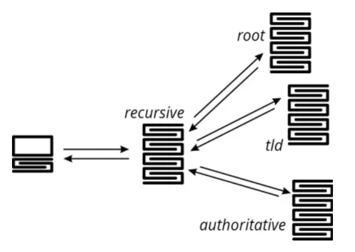

> 사용자가 웹 브라우저에서 접근하는 도메인에 대하여 IP와 라우팅 정보를 제공 해주는 시스템

 

## DNS를 사용하는 이유

- 사용자가 외우기 어려운 IP를 알아야할 필요가 없다.
- IP주소가 바뀌더라도 사용자는 도메인 이름만 알고 있어도 된다.

|            DNS Recurive Query            |
| :--------------------------------------: |
|  |

 

|     name      |                        description                         |
| :-----------: | :--------------------------------------------------------: |
|     Root      |                        루트 도메인                         |
|      TLD      |       상위 레벨 도메인과 국가 상위 레벨 도메인 관리        |
| authoritative | 실제 개인이나 기관의 도메인과 IP 주소 관계가 저장되는 서버 |
| Local(Cache)  |  도메인 이름과 매칭되는 IP 주소가 미리 캐시 되어있는 서버  |

 

## Domain으로 IP 주소를 얻는 과정

 

> 1. 사용자가 domain으로 요청시 Local DNS로 dns query 보냄.
> 2. Local DNS에 domain과 ip 주소의 관계가 캐시 되어 있으면 응답
> 3. Local DNS에 없으면 Root DNS로 요청
> 4. Root DNS에서 TLD 정보를 Local DNS로 전달
> 5. Local DNS는 authoritative에 요청
> 6. authoritative는 domain에 대한 IP를 Local DNS에 전달

 

- 사용자가 domain을 요청할때

 

> 1. Domain을 요청 받은 후 DNS 쿼리를 통해 IP 주소 반환
> 2. IP주소는 HTTP로 요청 메시지 생성 후 TCP통해 해당 IP의 컴퓨터로 전송
> 3. 도착한 HTTP 요청 메시지는 HTTP 사용 후 URL 정보에 대한 데이터 검색
> 4. 검색된 웹 페이지는 다시 HTTP 응답 메시지를 생성후 TCP를 사용하여 원래 컴퓨터로 전송
> 5. HTTP 응답 메시지가 웹 페이지 데이터로 변환 된 후 사용자에게 출력.
