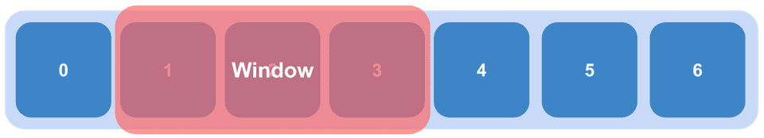
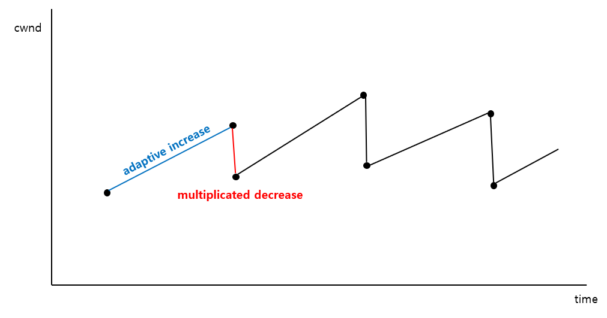
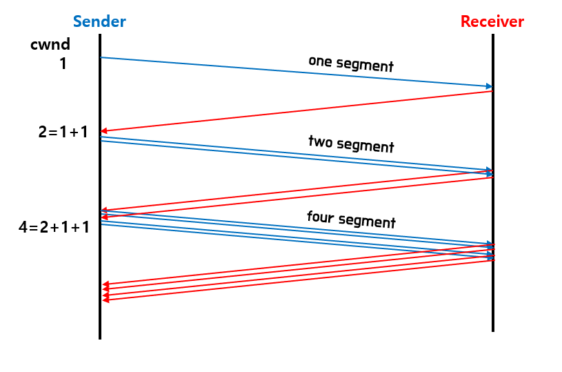

# TCP/IP 흐름제어 & 혼잡 제어

 

## TCP

 

> TCP는 전송 계층 프로토콜 중 하나로  
> 데이터를 segment로 보내기 위해 네트워크 계층의 IP와 함께 사용  
> TCP는 패킷을 추적 및 관리
> 3-way-handshaking, 4-way-hand-shaking -> `연결지향`
> 흐름제어, 혼잡제어, 오류 제어 -> `신뢰성`
> 데이터 전송 -> `순서 보장`

 

### 신뢰성

 

#### 흐름제어

 

> `송수신 사이 데이터 처리 속도 차이`에 의한 문제 해결
>
> ex) 송신측의 전송 량 > 수신측의 처리량  
> 패킷 손실 가능하기 때문에 송신측 `패킷 전송 량 제어`

 

- Stop and Wait

> 매번 전송한 패킷에 대한 확인 응답을 받은 후 다음 패킷 전송  
> 전송이 올바르게 될 때까지 주구창창 보내는 기법임으로 비효율적

 

- Sliding Window

|                   Sliding Window                   |
| :------------------------------------------------: |
|  |

 

> 수신측에서 설정한 윈도우 크기 만큼 세그먼트를 전송하는 방식  
> 즉 데이터 수신측의 응답 없이 연속적으로 전송 가능

 

#### 혼잡제어

 

> 송신측의 데이터 처리량과 네트워크의 처리 속도를 해결하기 위한 기법  
> `혼잡 상태` : 네트워크 내에 패킷 수 과도하게 증가하는 현상  
> `즉, 각 라우터의 버퍼가 유한하기 때문에 지연 및 손실 발생`
>
> 송신측의 데이터는 지역망 혹은 대형 네트워크로 전달  
> 네트워크 상황에서 특정 라우터에 패킷이 쌓이면, 처리할 수 없는 상황 발생  
> 수신측은 처리 할 수 없는 상황임에도 송신측에서 재전송
>
> `송신측에서 보내는 전송 량을 줄여서 해결`

 

- CWND (congestion window)

> 송신자가 ack를 받기 전에 보낼 수 있는 패킷 양을 의미  
> cwnd가 3으로 설정 되어 있으면 송신자는 3개의 패킷을 보내고  
> ack를 받은 후 다시 전송이 가능하다.  
> cwnd가 증가하면 더 빠르게 전송 가능하지만  
> `네트워크 상에서 혼잡 발생 가능이 증가함으로 적절히 조절하는 것이 중요`

 

- AIMD (additivie increase & multiple decrease)

|             AIMD             |
| :--------------------------: |
|  |

 

> 패킷의 loss가 발생하면 점진적으로 cwnd의 크기를 증가  
> loss가 발생 될 경우 cwnd 값을 반으로 확 줄이는 방식
> 초기에서부터 cwnd를 크게 사용하지 않고,  
> 또 미리 감지하는 것이 아닌 혼자방황에서 줄여야한다는 단점

 

- Slow Start

|                Slow start                |
| :--------------------------------------: |
|  |

> cwnd를 1로 시작하여 매 RTT마다 두 배 증가시켜 보내는 방식  
> cwnd값이 (`ssthresh`)slow start threshold 도달 될 때까지 진행 -> 도달하면 `CA 상태`  
> ssthresh는 connection이 시작 될 때 os가 설정  
> loss 발생 시, cwnd를 반으로 줄여서 진행
>  

- CA

> cwnd 값을 cwnd + MSS \* (MSS/cwnd)로 설정하는 것  
> 단순히 1 증가 시킨다는 의미  
> `CA 상태에서 cwnd값이 천천히 증가`

 

- Loss 대응

|       상황       |           설명            |             cwnd              |
| :--------------: | :-----------------------: | :---------------------------: |
| 3 duplicate ACKS |    특정 패킷에서 loss     |       cwnd/=2, CA상태로       |
|     time out     | 전송한 모든 패킷들의 loss |    cwnd=1, slow start 상태    |
|  위의 둘다 loss  |                           | cwnd = 1, ssthresh = cwnd / 2 |

 

> `TCP Tahoe` : loss를 무조건 time out으로 처리
> `TCP Reno` : 3 duplicate ACKS 혹은 time out으로 처리
> loss 유형에 따라 cwnd 설정  
> `Fast Retransmit` : 받는 쪽에서, 순서가 바뀌어 먼저 도착해야할 패킷이 안왔을때 마지막 패킷의 ACK를 전송,  
> 즉 중간에 손실이 발생 되면, sender는 중복된 ACK를 받은 후  
> 받은 ACK + 1의 패킷을 전송한다.
