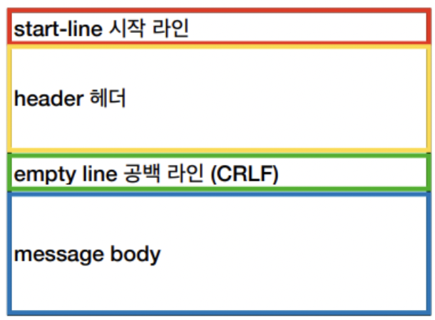
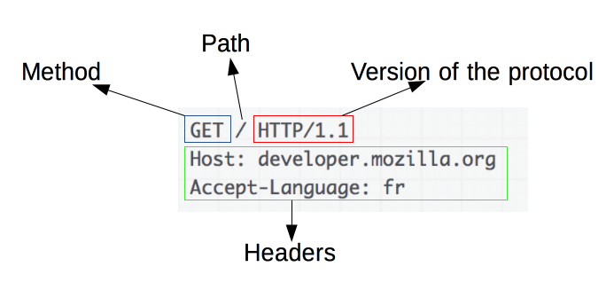
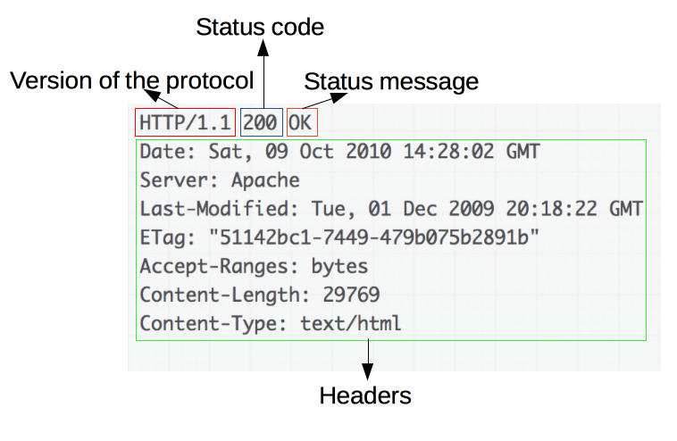

# HTTP

> Application layer에 존재하는 프로토콜로 클라이언트와 서버가 웹상에서 데이터를 주고 받을 수 있도록 해준다.

- 클라이언트 : UI와 유틸성에 대해 집중
- 서비 : 비즈니스 로직에 집중

 

## 특성

### Stateless

- 서버가 클라이언트의 상태를 보존하지 않는다
- 따라서 클라이언트의 이전 요청과 무관하게 응답한다.
  - 장점 : 서버의 확장성이 높다.(scale out - 수평확장)
  - 단점
    - 클라이언트가 전솔할 데이터가 추가 된다.
    - 로그인과 같은 경우는 쿠키와 세션등을 사용하여 상태를 유지해야함

 

- stateful, 도중에 다른 서버로 바뀔 경우...

 

- 예시

> 클라이언트 : 일식집에서 스시 대한 정보를 요청
> 서버1 : 스시 A는 15,000원이다.
> 클라이언트 : 2개 주문하겠다.
> 서버2 : 무엇을 2개 주문하려고 하는 거지?
> 클라이언트 : 계좌이체로 결제 하겠다.
> 서버3 : 무엇을 몇개로 계좌이체 결제 하겠다는 거지?

 

> stateful 할 경우,  
> 기존 클라이언트가 특정 서버에 종속하여 소통을 해야한다.  
> 위의 경우 서버2와 서버3은 `기존 정보를 알지 못하기 때문에`  
> 요청에 대한 정보를 반환해 줄 수 없다.

 

- stateless, 도중에 다른 서버로 바뀔 경우

> 클라이언트 : 일식집에서 스시 대한 정보를 요청
> 서버1 : 스시 A는 15,000원이다.
> 클라이언트 : 스시 A 2개 주문하겠다.
> 서버2 : 스시 A 2개는 30,000원이다.
> 클라이언트 : 계좌이체로 결제 하겠다.
> 서버3 : 30,000을 계좌이체로 결제 하였다.

 

> 고객이 요청한 정보에 대해 중간 중간 하나씩 모두 넘기기 때문에  
> 서버가 바뀌어도 요청을 주고 받는데 문제가 없다.

 

### 비 연결성

- 요청과 응답시에만 유지하고 연결을 종료 한다.
- 한정된 서버 자원을 효율적으로 사용 가능
- 그렇기 때문에 TCP/IP의 handshake RTT가 추가되는 단점...

 

## HTTP 메시지

|                   HTTP message                    |
| :-----------------------------------------------: |
|  |

 

- start line : method, path, http version
- header : 헤더 정보들
- empty line : 공백(필수)
- body : 바디가 요청 될 경우 해당 데이터 담는 공간

 

### 요청 메시지

|          HTTP request message           |
| :-------------------------------------: |
|  |

 

- Startline
  - method, 요청 url, http version
  - http 기본 포트가 80으로, 생략되어 있다면 80포트
- Header
  - Host, User-Agent, from, cookie 등의 데이터 포함
- Body
  - Get 메서드는 비어 있음
  - 요청에 필요한 데이터(파일, 파라미터)

 

### 응답 메시지

|          HTTP response message           |
| :--------------------------------------: |
|  |

- Startline
  - http version, 상태코드, 상태 메시지
- Header
  - Connection : keep - Alive와 같은 커넥션 정보
  - Server : 서버 종류를 나타내는 헤더
- Body
  - 요청에 대한 응답 데이터

 

## Header

 

### General Header

 

> 요청과 응다 모두에 적용되는 헤더  
> 바디에서 최종적으로 전송되는 데이터와는 관련이 없음

- Date
  - HTTP 메시지를 생성한 일시
- Connection
  - 클라이언트와 서버간 연결에 대한 옵션 설정
  - Connection : close
  - Connection : keep - Alive
- Pragma
- Tralier

 

### Request Header

 

> fetch할 리소스나 클라이언트 자체에 대한 정보를 포함하는 헤더

- HOST
  - 요청하는 호스테이 대한 호스트명 과 포트 번호
    - 1.1 이후 부터 HOST 필드 필수
  - HOST 필드에 도메인 명 및 호스트 명 모두를 포함한 전체 URI 지정 필요
  - 이에 따라 동일 IP 주소를 갖는 단일 서버에 여러 사이트 구축 가능
- User-Agent
  - 클라이언트 소프트웨어(브라우저, OS) 명칭 및 버전 정보
- referer : 바로 직전에 머물렀다 url
- accpept
  - 자신이 원하는 미디어 타입 및 우선순위
    - text/html,application/xhtml+xml,application/xml;q=0.9,image/avif,image/webp,image/apng,_/_;q=0.8,application/signed-exchange;v=b3;q=0.9
- accept-encoding
  - 원하는 인코딩 방식
  - gzip, deflate, br
- accept-language
  - 클라이언트가 원하는 언어
  - ko,en-US;q=0.9,en;q=0.8,ko-KR;q=0.7

 

### Response Header

 

> 위치 또는 서버 자체에 대한 정보(이름 버전)과 같이 응답에 대한 부가 정보를 갖는 헤더

- Cache-Control
  - max-age=(초) : 해당 시간동안 캐시 유효
  - 캐시 재검증 요청 헤더
    - if-none-match
      - 캐시된 리소스의 Etag 값과 현재 서버 리소스의 Etag값이 같은지 확인
    - if-modified-since
      - 캐시된 리소스의 Last-modified값 이후에 서버 리소스가 수정 되었는지
  - no-cache
    - max-age=0과 동일한 의미, 캐시는 저장하되 사용하려고 할때 서버에 재검증 요청 필요
  - no-store
    - 캐시로 처리해서는 안되는 리소스일 경우 사용
    - 캐시를 만들어서 저장조차 하지말라는 강력한 Cache - Control
- set-cookie
  - 서버측에서 클라이언트에게 세션 쿠키 정보를 설정
- server
  - 서버 소프트웨어 정보
  - ngx
- Etag
  - HTTP 정보가 바뀌었는지 검사 하는 태그

 

## HTTP 상태코드

 

- 2XX : 성공 -> 작업을 받고 난후 처리를 완료
  - 200 : ok
  - 201 : 생성 완료
- 3XX : 리디렉션 -> 요청을 완료하기 위한 리디렉션이 필요한 상태
- 4XX : 클라이언트 오류 -> 요청이 올바르지 않을 경우
  - 400 : Bad Request
    - IllegalArgumentException
    - IllegalStatementException
    - Duplicate : DB 중복 컬럼 방지
  - 404 : NOT FOUND 자원에 대한 요청이 없을때
  -
- 5XX : 서버 오류 -> 올바른 요청에 대해 서버가 응답 할 수 없을 때

 
