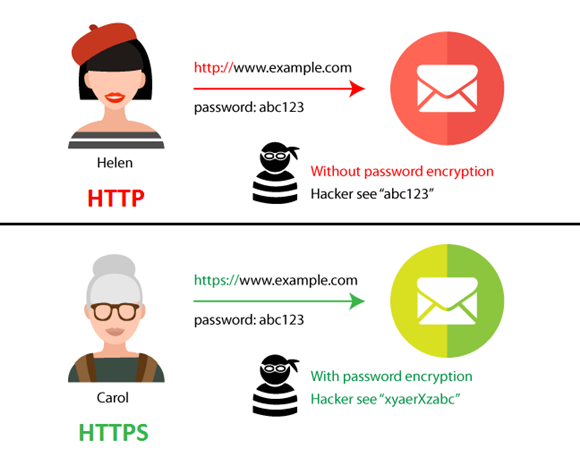
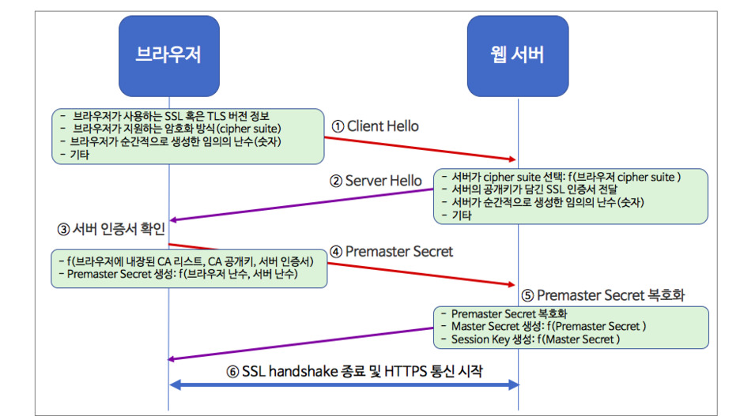

# https

## 사전 지식

- 대칭키 암호화
  - 암호화, 복호화 할 때 사용하는 키가 동일(대칭)한 경우
  - 대칭키를 통해 암호화 되었다면, 동일한 키를 갖고 있는 사용자가 아닐 경우 정보 확인 X
  - 키를 교환하는 방식이 대칭키의 가장 중요한 부분
    - 대칭키 암호화 방식은 키가 없다면 누구도 열어 볼 수 없지만,
    - `키를 가로챈다면 문제 발생`
  - `속도는 공개키 방식보다 빠름` -> SSL 통신에 사용
  - 클라이언트마다 키의 종류가 달라야 함으로, 연결된 클라이언트가 많아질 수록 `키관리 어려움`

 

- 비대칭키(공개키) 암호화
  - 공개키와 개인키 2가지 키로 암복호화 하는 방식
  - 공개키로 암호화 한 후, 개인키로 복호화 하거나
  - 개인키로 암호화하면 공개키로 복호화 하거나
  - 공개키를 알아도 개인키를 모르면 복호화 X

 

- 1. 공개키로 정보를 암호화 하는 경우
  - 부산에 살고 있는 철수는 `영희의 공개키를 통해` 보물상자를 암호화 한 후 영희에게 송신
  - `보물상자는 영희의 공개키로 암호화 `되었기 때문에, 열어보기 위해 영희의 `개인키 필요`
  - 즉, `영희의 개인키는 영희 자신만이 가지고 있기 때문에`, 받아본 보물 상자를 안전하게 열어볼 수 있음
- 2. 개인키로 정보를 암호화 하는 경우
  - 부산에 살고 있는 철수는 `자신의 개인키를 통해` 보물상자를 암호화하여 영희에게 송신
  - 보물상자는 철수의 개인키를 통해 암호화 되었기 때문에, `철수의 공개키 필요.`
  - 즉, 영희는 보물상자를 받고, `공개되어 있는 철수의 공개키를 통해 보물상자를 열어볼 수 있음`

 

> 개인키로 정보를 암호화 하는 방식은 `보물 상자안에 뭐가 들었냐`가 아닌 `누가 보냈느냐에 초점`을 둔 방식
> 즉, 철수의 개인키로 암호화 한 보물상자는 철수의 공개키를 통해서만 열어볼 수 있기 때문에  
> `어떤 보물 상자가 철수의 공개키로 열린다면, 보물상자는 철수가 보낸 것이 확실하다는 뜻`

 

- 대칭키 비대칭키 암호화 간단 요약
  - 대칭키 암호화
    - 똑같은 개인키를 송,수신자가 공유하여 정보를 암복호화 하는 것
  - 비대칭키 암호화
    - 상대방의 공개키를 통한 암호화, 상대방은 자신의 개인키로 복호화
      - `정보 자체에 대한 암호화가 필요`할 때 사용
    - 자신의 개인키를 통한 암호화, 자신의 공개키를 통한 복호화
      - `정보를 보낸 사람에 대한 정보가 필요`할 때 사용.

 

## HTTP의 보안 문제점

 

|                   HTTP 보안 문제점                    |
| :---------------------------------------------------: |
|  |

 

- TCP/IP는 도청 가능한 네트워크
  - TCP/IP 통신 구조상 패킷은 여러 경로를 거쳐서 전송됨(스위치, 라우터 등)
  - 따라서 암호화가 되지 않은 패킷은 도청 가능(sniffing)
- 통신 상태 확인하지 않기 때문에 위장 가능
  - HTTP는 요청을 보내는 source가 누구인지 확인 X
    - 악의적인 사용자도 request 가능
  - 요청을 받은 웹서버가 원래 의도한 응답을 보내야 하는 웹서버인지 확인 X
  - 응답을 받아야할 클라이언트가 원래 의도한 요청을 보낸 클라이언트인지 확인 X
  - 따라서, 상대가 접근이 허가된 상대인지를 확인 할 수 없다.
    - 의미 없는 요청도 수신한다. -> Dos 공격 방지 X
- 중간에 데이터가 변조 되어도 확인 할 수 없음.
  - 리퀘스트나 리스폰스를 빼앗아 변조하는 공격인 중간자 공격(Man-int-the_middle)을 파악 불가 X
  - 반면 HTTPS는 암호화 되어 위변조 불가능

## SSL 인증서

 

 

- 대칭키 방식과 공개키 방식을 혼합한 방식
- 공개키 방식을 이용하여 대칭키를 교환함(SSL handshake)
  - 내 서버에서 `공개키`를 생성
  - CA에서 내서버의 SSL 인증서를 발급
    - SSL 인증서는 `CA의 비밀키`로 암호화 되어 있음
    - 인증서 내부에는 `내 서버의 공개키가 저장`
  - 내 서버에 인증서를 저장하고, SSL 통신 설정
  - 브라우저가 내 서버에 접속하면 인증서를 보내준다.
    - 브라우저는 받은 인증서를 `CA의 공개키로` 복호화 한다.
      - 인증서는 `발급한 CA의 비밀키로` 암호화
  - 인증서 복호화에 성공한다면, 해당 인증서가 CA가 발급한 것임이 증명된다.
    - 인증서를 보낸 `내 서버도` CA가 인증한 서버임이 증명
  - 복호화 인증서에서 `내 서버의 공개키`를 취득하여 데이터 통신에 활용
    - 서버와 주고 받는 데이터 자체는 `대칭키 방식`으로 암호화
    - `대칭키 방식에 사용된 키`를 `내 서버의 공개키`로 암호화

 

## CA

- 인증서의 역할은 클라이언트가 접속한 서버가 클라이언트가 의도한 서버가 맞는지를 보장하는 역할
- 이 과정에서 증명해주는 민간기업들을 CA
- 브라우저는 CA의 공개키를 처음부터 가지고 있음

 

## SSL 인증서 내용

- 서비스의 정보(인증서를 발급한 CA, 서비스의 도메인 등등)
- 서버 측 공개키(공개키의 내용, 공개키의 암호화 방법)

 

### SSL handshake

|               SSL handshake                |
| :----------------------------------------: |
|  |

> TCP 위에서 동작함으로, SSL handshake 이전에 TCP 3-Way handshake를 통해 연결되어 있어야 함

- 1. Client Hello
  - 브라우저는 서버가 HTTPS를 사용하는 것을 알게되면 Client Hello를 함
    - SSL 혹은 TLS 버전 정보
    - 브라우저가 지원하는 암호화 방식 모음(cipher suite)
      - `보안의 궁극적 목표를 달성하기 위해 사용하는 방식을 패키지 형태로 묶어 놓은 것`
        - 안전한 키 교환
        - 전달 대상 인증
        - 암호화 알고리즘
        - 메시지 무결성 확인 알고리즘
    - 브라우저가 순간적을 생성한 임의의 난수
    - 만약 이전에 SSL 핸드쉐이크가 완료된 상태라면, 그때 생성된 세션 아이디
    - 기타 확장 정보
- 2. Server Hello
  - 브라우저의 암호화 방식 정보중, 서버가 지원하고 선택한 암호화 방식(cipher suite)
  - 서버의 공개키가 담긴 SSL 인증서(인증서는 CA의 비밀키로 암호화 되어 발급된 상태)
  - 서버가 순간적으로 생성한 임의의 난수
  - 클라이언트 인증서 요청(선택 사항)
- 3. 클라이언트에서 서버 인증서 확인
  - 서버에서 보낸 인증서는 CA의 개인키로 암호화
  - 이 인증서를 CA의 공개키로 복호화 할 수 있다면 해당 서버는 CA로부터 인증받은 기관임을 증명
- 4. 클라이언트는 1번 과정에서 생성한 난수와 2번 과정에서 서버가 생성한 난수를 사용하여 대칭키에 사용될 premaster secret을 만든 후 서버로 보냄
  - 서버로 보내는 과정에서 데이터는 서버의 공개키를 활용하여 암호화
  - 서버의 공개키는 서버가 보낸 SSL 인증서에 포함되어 있음
- 5. 서버는 사이트의 비밀키로 클라이언트가 보낸 premaster secret 값을 복호화
  - premaster secret을 복호화 한 값을 master secret 값으로 저장
  - 이것을 이용해 데이터를 암복호화하는데 사용하는 대칭키인 sessiong key를 생성
  - 서버는 이 session key를 이용하여 클라이언트와 통신
- 6. 서버는 SSL 핸드쉐이크가 종료 됐음을 알림

 

## HTTPS의 이점

- SEO(search engine optimization) 이점

  - SEO는 검색엔진 최적화로서 검색엔진으로부터 웹사이트나 웹페이지에 대한 웹사이트 트래픽의 품질과 양을 개선하는 과정
  - 구글은 HTTPS 웹사이트에 가산점을 주기 때문에 HTTPS를 사용하는 웹사이트는 상위에 노출될 확률이 올라감
  - 사용자들 또한 HTTPS의 안정성 때문에 더 많이 방문하기 때문에 SEO에 유리

- AMP(Accelerated Mobile Pages) 가속화된 모바일 페이지 사용 가능
  - AMP는 모바일 기기에서 훨씬 빠르게 컨텐츠를 로딩하기 위한 방법으로 구글이 만듦
  - AMP는 HTTPS에서만 사용 가능

## HTTP vs HTTPS

- [HTTPS는 HTTP보다 빠르다](https://tech.ssut.me/https-is-faster-than-http/)
  - 암호화 비용이 생각보다 크지 않음
  - 통신 속도에 비해 CPU와 메모리 성능은 월등히 발전
  - Keep-Alive와 session resumption은 대부분 요청이 핸드쉐이크 과정을 요구 X
  - 또한 HTTP/1.1보다 빠른 HTTP/2는 HTTPS위에서만 동작
  - 이러한 이유들로 HTTPS는 속도도 HTTP보다 느리지 않다고 주장
