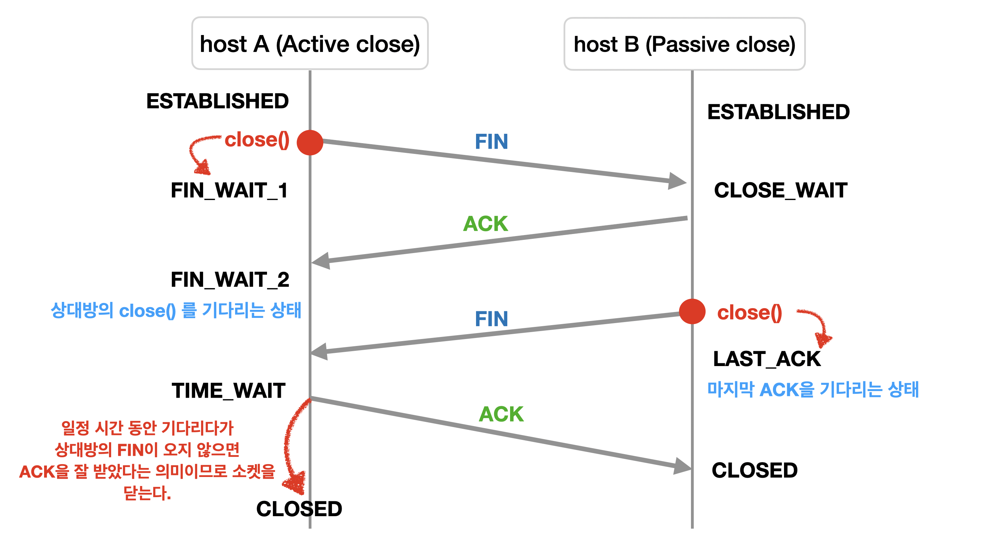

# TCP 3 & 4 handshake

 

## TCP 3 handshake

> TCP/IP 프로토콜로 통신할때 클라이언트와 서버를간의  
> 연결을 설정하는 과정

 

|                      3 handshake                      |
| :---------------------------------------------------: |
| ) |

 

- 클라이언트는 서버에 접속하는 순간 SYN(seq = x)를 보낸다 -> `SYN_SENT`
- 서버는 클라이언트가 보낸 SYN(seq = x)를 받고 그 응답으로 ACK(x+1) 패킷과, 클라이언트 포트를 열어달라고 요청하는 SYN(y) 패킷도 보낸다. : `LISTEN -> SYN_RCVD`
- 클라이언트는 ACK(x+1)과 Syn(y)를 받고 이에 대한 응답으로 서버에게 ACK(y+1)을 보내 연결된다. `ESTABLISHED`

 

## TCP 4 handshake

> 클라이언트와 서버간의 연결 상태를 종료하기 위한 방식

 

|                        4 handshake                        |
| :-------------------------------------------------------: |
| ) |

 

- **클라이언트는** 서버에 `FIN` 플래그를 보낸다. / `ESTAB→ FIN_WAIT1`
- **서버**는 FIN을 받고, 확인했다는 `ACK`를 클라이언트에게 보낸다. / `ESTAB→ CLOSE_WAIT`
  - CLOSE_WAIT : 서버 자신의 close를 wait하는 상태
  - 처리해야 할 자신의 통신이 끝날 때 까지 기다림
  - 이때, **클라이언트는** 서버가 close하기만을 기다리며 **FIN_WAIT1→ FIN_WAIT2**
- **서버**는 자신의 데이터를 다 보낸 후 연결을 종료하겠다는 `**FIN**` 플래그를 보낸다. / `CLOSE_WAIT→ LAST_ACK`
- **클라이언트**는 서버의 FIN을 받고, 확인했다는 `**ACK**`를 서버로 보낸다.
  - 이때 **클라이언트는**, **TIME_WAIT** 상태로 서버의 데이터를 기다림.
  - **서버**는 ACK을 받으면 바로 종료 / `LAST_ACK→ CLOSED`
  - 이후 TIME_WAIT이 지나면 **클라이언트** 종료 (**TIME_WAIT → CLOSED**)

 
