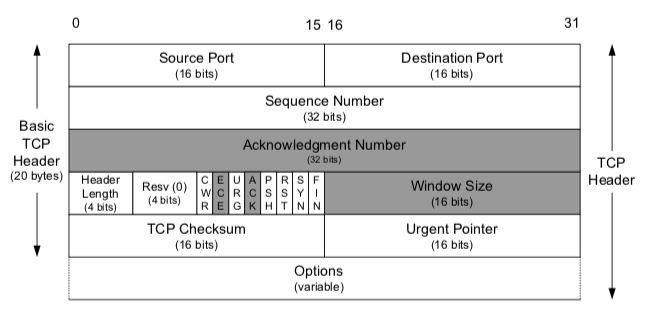
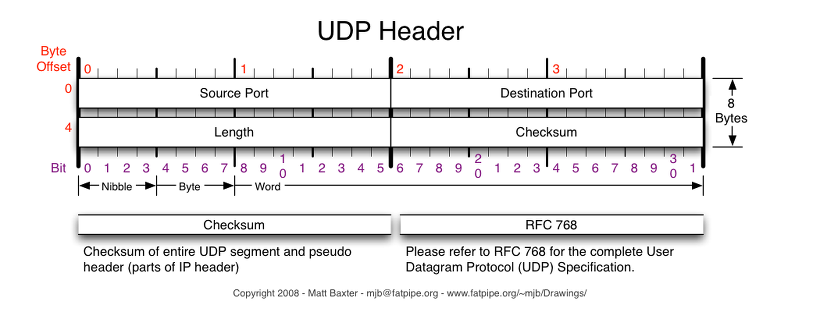

 

## UDP

> 전송 계층에서 데이터그램 단위로 데이터를 송수신하는 프로토콜  
> `TCP`는 세그먼트를 수신할 때 에러가 발생할 경우 재전송을 요청하여 에러를 복구  
> `UDP`는 에러가 발생할 경우 세그먼트를 폐기 시키고, 에러를 복구하는 기능이 없다.

 

|                |                  TCP                   |                         UDP                          |
| :------------: | :------------------------------------: | :--------------------------------------------------: |
|      연결      |                연결지향                |                       비연결성                       |
|   연결 과정    |        신뢰성을 위한 handshake         |                     연결 설정 X                      |
| 혼잡, 흐름제어 |                   O                    |                          X                           |
|   순서 보장    |                   O                    |                          X                           |
|     신뢰성     |                   O                    |                          X                           |
| 패킷 교환 방식 |               가상 회선                |                      데이터그램                      |
|      속도      |          RTT로 인한 속도 저하          |                         빠름                         |
|     사용처     | 연속성보다 신뢰성 -> 파일 전송, 이메일 | 신뢰성보다 연속성 -> 실시간 스트리밍, Multicast, DNS |
|   연결 관계    |                  1:1                   |                         1:N                          |

 

## Header

|                 TCP header                 |
| :----------------------------------------: |
|  |

 

- Sequence Number

> 시퀀스 번호는 전송하는 데이터의 순서 의미 32bit 크기의 시퀀스 넘버 가능  
> 시퀀스 번호로 수신자가 쪼개진 세그먼트의 순서를 파악하여 올바른 순서로 데이터를 재조립하는 것을 보장  
> 시퀀스 번호가 2^32를 넘어가면 다시 0부터 시작

 

- Acknowledgement Number(ACK set)

> 수신자가 예상하는 다음 시퀀스 번호 의미, 32bit 할당 받음  
> handshake 과정에서는 `상대방이 보낸 시퀀스 번호 + 1`로 승인 번호 생성하지만,  
> 실제 데이터를 주고 받을 경우 -> `상대방이 보낸 시퀀스 번호 + 자신이 받은 데이터의 bytes로 Ack 생성`

 

- Header Length

> data offset이라고도 하며 이를 표기할 때 32비트 워드 단위 사용  
> 32비트 체계에서 `1 Word = 4 Bytes`
> 즉, `이 필드의 값에 4를 곱하면 세그먼트에서 헤더를 제외한 실제 데이터의 시작 위치를 알 수 있음.`
> 4 bits로 표현할 수 있는 값은 15Word임으로 60bytes까지 오프셋 표현 가능  
> `하지만 option 필드의 길이가 고정되어 있지 않기때문에`,  
> option 필드를 제외하고 나머지 필드는 필수로 존재해야 함으로 최소 값은 20 bytes 5word로 고정적으로 표현해야함.

 

- Flags(NS ~ FIN)

| 필드 |                                                 의미                                                  |
| :--: | :---------------------------------------------------------------------------------------------------: |
| URG  |          필드에 값이 채워져 있음을 알리는 플래그, 긴급한 데이터는 높게 처리되어 먼저 처리 됨          |
| ACK  |              필드에 값이 채워져 있음을 알리는 플래그, 0이라면 승인번호 필드 자체가 무시               |
| PSH  |           PUSH 플래그, 수신 측에게 데이터를 최대한 빠르게 응용프로그램에 전달하라는 플래그            |
| RST  | Reset 플래그, 이미 연결 확립되어 ESTABLISHED 상태인 상대방에게 연결을 강제로 리셋해달라는 요청의 의미 |
| SYN  |        Synchronize 플래그, 상대방과 연결 생성 할 때, 시퀀스 번호의 동기화 맞추기 위한 세그먼트        |
| FIN  |                           Finish 플래그, 상대방과 연결 종료하고 싶다는 요청                           |

 

- WindowSize

> 최대 2^16만큼 값 표현 가능, 즉 윈도우의 최대 크기는 64KB  
> 최대 크기는 요즘 같은 대용량 고속 통신 환경에 맞지 않는 경우도 있음  
> 비트를 왼쪽으로 쉬프트하는 방식으로 윈도우 사이즈의 최대 크기를 키울 수 있는 방식도 사용, 몇 번 시프트 할 지는 옵션 필드의 WSCALE 필드 이용

 

- Checksum
  - 데이터가 변형되지 않음을 보장해준다.
  - 하지만 데이터의 순차성 및 손실에 대해서는 보장하지 않는다.

> 데이터링크가 오류검사를 제공하지만 출발지와 목적지 사이에 모든 링크가  
> 오류검사를 하는지 보장이 없기때문에 체크섬을 사용한다.  
> 세그먼트가 라우터 버퍼에 저장될 때 비트 오류가 들어오는 것이 가능하고  
> 링크간의 신뢰성과 버퍼 오류 검사가 보장되지 않음으로,  
> UDP는 트랜스포트 계층에서 어떤식으로든 오류검사를 제공해야한다.

 

- Urgent Pointer

> URG 플래그가 1이라면 수신측은  
> 이 포인터가 가리키고 있는 데이터를 우선 처리

- Option

> 아무 것도 없을 수도, 또한 있을 수도 있는 가변적인 공간  
> 20~60bytes까지 표현 가능  
> 윈도우 사이즈의 최댓 값 표현을 확장할 수 있는 `WSCALE`
> SelectiveRepeat을 사용하기 위한 `SACK` 등이 존재

 

|                 UDP header                 |
| :----------------------------------------: |
|  |

 

> TCP의 Option 필드를 제외한다하더라도 TCP 20bytes, UDP 8bytes  
> TCP는 상태 정보, 순서, 신뢰성 보장을 위한 필드들을 갖고 있는 반면  
> UDP는 그러한 점을 그렇지 않아 경량화되고 빠른 속도를 보장
