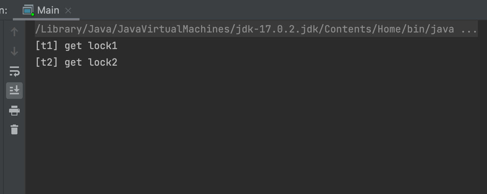
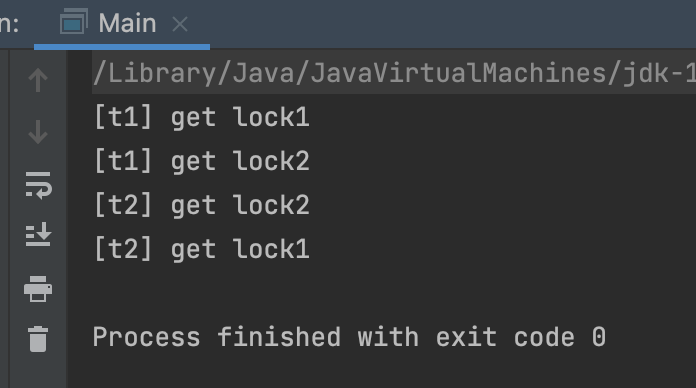

- [Dead Lock](#dead-lock)

## Dead Lock

> 두 개 이상의 프로세스 혹은 스레드가  
> 서로가 가진 리소스를 기다리는 상태

</br>

## 데드락 발생 조건

</br>

- 상호 배제(Mutual exclusion)
  - 리소스를 공유해서 사용할 수 없다
- 점유 대기(hold and wait)
  - 프로세스가 이미 하나 이상의 리소스를 취득한 상태에서 다른 프로세스가 사용하고 있는 리소스를 추가로 기다린다(wait)
- 비선점(no preemption)
  - 리소스 반환은 오직 그 리소스를 취득한 프로세스만 할 수 있다.
- 순환 대기(circular wait)
  - 프로세스들이 순환 형태로 서로의 리소스를 기다린다

</br>

## 예방

</br>

> 네 가지 조건 중 하나가 충족 되지 않게 시스템을 디자인

</br>

- 상호배제 방지
  - but, race condition 문제를 야기할 수 있음
- 점유 대기 방지
  - 모든 자원을 한 번에 요구하고 한 번에 해제 하여 다른 자원을 점유
  - 리소스를 전혀 가지지 않은 상태에서만 리소스 요청
  - but, 성능 저하 우려 -> 락이 해제 되면 바로 들어갈 수 있는 구조가 아님
- 비선점 방지
  - 추가적인 리소스를 기다려야 한다면 이미 획득한 리소스를 다른 프로세스가 선점 가능하도록 한다
  - but, 어떤 우선순위로 선점할지, 선점한 리소스를 얼마나 사용할 것인지 정하는 것이 어렵다.
- 순환 대기 방지
  - 모든 리소스에 순서 체계를 부여하여 오름차순으로 리소스를 요청
  - 그나마 현실적이지만, 프로세스 작업에서 유연성이 떨어지고, 자원의 번호를 어떻게 부여할 것인지에 대한 문제.

</br>

## 회피

> 프로세스에 자원을 할당 할 때 어느 수준 이상의 자원을 나누어주면  
> 교착 상태가 발생하는 지 파악하여 그 이하로 나누어주는 방법  
> 즉, 안정 상태를 유지할 수 있는 범위 내에서 자원을 할당하여 회피

</br>

### Banker's Algorithm

</br>

> 리소스 요청을 허락해줬을 때 데드락이 발생할 가능성이 있으면  
> 리소스를 할당해도 안전할 때까지 계속 요청을 거절하는 알고리즘

</br>

|                | Bank |  A  |  B  |  C  |
| :------------: | :--: | :-: | :-: | :-: |
|  빌려주기 전   | 100  | 60  | 40  | 50  |
| 빌려주고 난 후 |  20  | 40  | 10  | 20  |

</br>

- 가정

> 은행에 100만원이 있고, A,B,C는 각각 60만원 40만원, 50만원이 필요하다.  
> 은행은 이들의 수요를 모두 충족 시켜줄 수 없어 부분적으로 각각 20, 30, 30만원씩 대출해주었다.  
> 이제 A, B, C가 필요한 금액은 40, 10 ,20만원이고 은행은 20만원이 남은 상태

</br>

> 은행은 B와 C에게 돈을 빌려 준 후 상환 받아 다른 고객들의 수요를 해결해줄 수 있다.  
> 하지만 A에게 20만원을 빌려준다면, A는 필요한 금액을 받지 못해 상환 하지 못하는 상황.

</br>

- Safe State

> 시스템이 데드락을 일으키지 않으면서 프로세스가 요구한 자원을 할당해 줄 수 있는 상태  
> -> 안전 순서열 보장

</br>

- Unsafe State

> 안전 순서열이 존재 하지못하는 상태.  
> 따라서 불완전 상태는 데드락의 필요조건이지 필요충분 조건이 아니다.

</br>

- 은행원 알고리즘 단점

> 할당 할 수 있는 자원의 수가 일정
> 사용자 수가 일정  
> 항상 불완전 상태를 방지해야 함으로 자원 이용도가 낮다  
> 최대 자원 요구량을 미리 알아야한다.  
> 프로세스들이 제한된 시간에 자원을 반납해야 데드락을 피할 수 있다.

</br>

## 탐지 & 회복

</br>

> Allocation, Request, Available 등으로 시스템에 데드락이 발생했는지 여부 탐색.

</br>

- 데드락이 발생했는지 탐지 하였다면,
  - `프로세스를 1개씩 중단 시키면서` 다시 탐지하여 데드락인지 판단 할 수 있고,
  - 데드락에 빠진 `모든 프로세스를 모두 종료시키는 방법`이 있음.
  - 아니면 `자원 선점을 통해 데드락을 해결 할 때까지 그 자원을 다른 프로세스에 할댕해주는 방법`.
    - 비용이 최소화 되는 프로세스를 선택
    - 프로세스 상태를 문제 발생하기 이전 상태로 되돌리기
    - 하나의 프로세스만 선점 되어 starvation이 일어나는 현상을 방지.

</br>

## 자바로 살펴보는 프로그래밍 레벨에서 데드락

</br>

```java
public class Main {
  public static void main(String[] args) {
    Object lock1 = new Object();
    Object lock2 = new Object();

    Thread t1 = new Thread(() -> {
      synchronized (lock1) {
        System.out.println("[t1] get lock1"); // critical section 1
        synchronized (lock2) {
          System.out.println("[t1] get lock2"); // critical section 2
        }
      }
    });

    Thread t2 = new Thread(() -> {
      synchronized (lock2) {
        System.out.println("[t2] get lock2"); // critical section 3
        synchronized (lock1) {
          System.out.println("[t2] get lock1"); // critical section 4
        }
      }
    });

    t1.start();
    t2.start();
  }
}
```

</br>

- t1은 lock1을 얻고 critical section1에 들어간 후 lock2를 얻어서 critical section2에 들어가려고 한다.
- t2는 lock2를 얻고 critical section2에 들어간 후 lock1을 얻어서 critical section1에 들어가려고 한다
- 이 때 t1은 lock1을 t2는 lock2를 점유하고 있는 상태에서 각각 lock2와 lock1의 lock을 얻으려고 하기 때문에 교착상태에 빠지게 된다.

</br>

|          DeadLock 결과 화면           |
| :-----------------------------------: |
|  |

</br>

> 결국 프로세스가 종료되지 못하고 thread 끼리 dead lock이 발생한 것을 알 수 있다.

</br>

- 우리가 개발할 때 mutual exclusion을 꼭 사용해야하나
  - 너무 남발하진 않았는지
  - 사용하지 않고도 해결할 수 있는 방법은 없는지?

</br>

### 자바에서 데드락 해결하기

</br>

- cycle 없애기

```java
public class Main {
  public static void main(String[] args) {
    Object lock1 = new Object();
    Object lock2 = new Object();

    Thread t1 = new Thread(() -> {
      synchronized (lock1) {
        System.out.println("[t1] get lock1"); // critical section 1
        synchronized (lock2) {
          System.out.println("[t1] get lock2"); // critical section 2
        }
      }
    });

    Thread t2 = new Thread(() -> {
      synchronized (lock1) {
        System.out.println("[t2] get lock2"); // critical section 3
        synchronized (lock2) {
          System.out.println("[t2] get lock1"); // critical section 4
        }
      }
    });

    t1.start();
    t2.start();
  }
}
```

</br>

|               DeadLock 해결               |
| :---------------------------------------: |
|  |

</br>

- hold and wait 없애기

```java
 Thread t1 = new Thread(() -> {
      synchronized (lock1) {
        System.out.println("[t1] get lock1"); // critical section 1
        synchronized (lock2) {
          System.out.println("[t1] get lock2"); // critical section 2
        }
      }
    });

```

> 현재 lock1을 점유한 상황에서 다른 lock2를 요청하는 상황이다.  
> 기능에 맞춰서 이런 점유 대기 상황을 해결할 수 있는 방향으로 코드를 조작해야한다.
