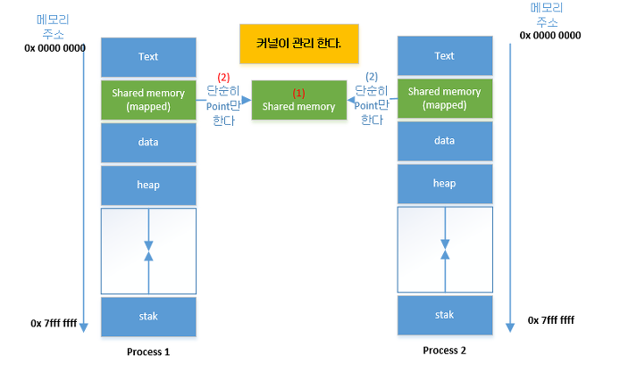
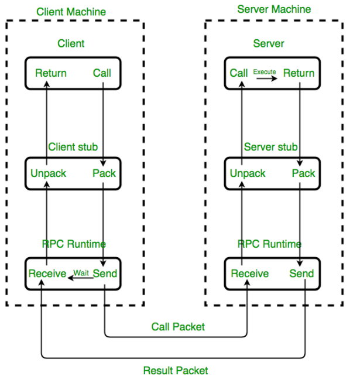
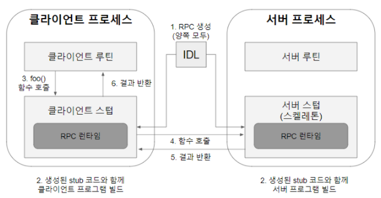

- [IPC란?](#ipc란)
- [협력 프로세스를 사용하고 허용하는 이유](#협력-프로세스를-사용하고-허용하는-이유)
- [Message Passing vs Shared Memory](#message-passing-vs-shared-memory)
- [Shared memory](#shared-memory)
- [Message passing](#message-passing)
  - [Pipe](#pipe)
  - [Message Queue](#message-queue)
  - [Socket](#socket)
  - [RPC(Remote Procedure Call)](#rpcremote-procedure-call)
    - [함수 vs 프로시저](#함수-vs-프로시저)
    - [RPC 사용하는 이유](#rpc-사용하는-이유)
    - [RPC의 목표](#rpc의-목표)
    - [RPC 동작 방식 - IDL 기반](#rpc-동작-방식---idl-기반)
    - [RPC 장점](#rpc-장점)
    - [RPC 단점](#rpc-단점)

## IPC란?

</br>

> 프로세스는 독립적으로 실행되며,  
> 독립적으로 실행된다는 것은 서로 다른 프로세스에게 영향을 받지 않는다고 말할 수 있다.
>
> 이런 독립적 구조를 가진 프로세스 간의 통신을 해야하는 상황이 발생하는데, 이를 가능하도록 해주는 것이 IPC다.  
> 프로세스는 커널이 제공하는 IPC 설비를 통해 프로세스간 통신을 할 수 있게 된다.

</br>

## 협력 프로세스를 사용하고 허용하는 이유

- 정보 공유
  - 여러 사람들이 하나의 파일을 공유하고 싶어할때 동시에 접근이 가능한 환경을 제공해주어야한다.
  - 자원을 다른 사람들과 공유하는 것이 협력 프로세스이고, 협력 프로세스를 통해 자원을 공유해야한다.
- 속도를 높일때 사용
  - 특정 작업이 더 빨리 완성되고 싶다면, 그 작업을 세부작업으로 쪼개서 각 작업들이 동시에 진행되게 하여 더 빠르게 한다.
- 모듈화
- 편의성
  - 한 번에 많은 일을 진행하기 위해서, 편집 및 음악 듣기 등

</br>

## Message Passing vs Shared Memory

</br>

> IPC에서는 크게 두가지 방법이 존재합니다.

- Message Passing
  - 커널이 memory protection을 위해 대리 전달해주는 것을 의미한다다.
  - 따라서 안전하고 동기화 문제가 없다.(Os가 대신 동기화해주기 때문)
  - 다만 성능이 떨어진다는 단점을 가지고 있다.
  - direct communication과 indirect communication이 있다.

</br>

- Shared Memory
  - 커널이 공유된 메모리 생성 후 다른 프로세스들이 메모리 공간 활용
  - 성능이 좋지만 동기화 문제 발생(`Application에서 직접 동기화 처리`)

</br>

## Shared memory

</br>

|                  Shared Memory                  |
| :---------------------------------------------: |
|  |

</br>

> 파이프, 메시지 큐가 통신을 이용한 설비라면, 공유 메모리는 데이터 자체를 공유하도록 지원하는 설비
> 프로세스의 메모리 영역은 다른 프로세스가 접근 할 수 없도록 독립적인 공간을 보장해야 한다.  
> 따라서 각 프로세스들이 별도의 메모리 영역의 공유 메모리를 이용하여 사용 할 수 있도록 한다.  
> 커널은 프로세스로부터 공유메모리 할당 요청을 받은 이후, 어떤 프로세스든 해당 공유 메모리 영역에 접근 하여 사용할 수 있다.

</br>

## Message passing

</br>

> 공유하는 메모리 영역 없이 프로세스 사이에 데이터를 송수신 및 동기화 작업  
> OS는 send()와 receive() 명령어를 제공  
> link를 구성할 때 direct or indirect 또 동기화와 비동기 통신 설정

|            수단            |                                설명                                |
| :------------------------: | :----------------------------------------------------------------: |
|           direct           | 송수신자를 명시하여 하나의 링크를 제공하여 두 개의 프로세스가 소통 |
|          indirect          |      mailbox(port)를 이용하여 두 개 이상의 프로세스들이 소통       |
|   synchronous(blocking)    |  sender(receiver) 보냈다(받았다)는 메시지를 받기 전까지 blocking   |
| asynchronous(non-blocking) |      sender(receiver)가 송수신하고 계속하여 다른 작업을 수행       |

</br>

### Pipe

</br>

- 익명 파이프

  - 부모 자식 관계에서 연결 가능

- Named Pipe
  - 통신할 프로세스들을 모를 경우에도 연결 가능
  - 익명 파이프의 확장된 상태로 부모 프로세스와 무관한 다른 프로세스도 통신이 가능하도록 하기 위해 이름 있는 파일을 사용해야 한다.

> 두 pipe 방식다 한 쪽에서 쓰고, 한쪽에서 사용하는 단순한 흐름(반이중 통신)일 때 간편
> 전이중 통신에서는 pipe를 2개 만들어 구현을 복잡하게 한다.

</br>

### Message Queue

</br>

> 입출력 방식은 Named Pipe와 유사하지만  
> 메시지 큐는 파이프처럼 데이터의 흐름이 아니라 메모리 공간이다.  
> 사용할 데이터에 번호(순서)를 붙이면서 여러 프로세스가 동시에 데이터를 다룰 수 있다.

</br>

### Socket

> 네트워크 소켓 통신을 통해 데이터를 공유하는 방식이다.
> 클라이언트와 서버가 소켓을 통해 통신하는 구조로, 원격에서 프로세스간 데이터를 공유할 때 사용한다.
> 전송을 주고 받을 프로세스들간의 ip와 port를 바인딩하여 데이터 공유

</br>

```java

import java.net.*;
import java.io.*;

public class DateServer {

    public static void main(String[] args) throws Exception{

    ServerSocket server = new ServerSocket(6013);

    /* Now listen for connections */
    while (true) {
      Socket client = server.accept();
      PrintWriter pout = new PrintWriter(client.getOutputStream(), true);

      /* write the Date to the socket */
      pout.println(new java.util.Date().toString());

      /* close the socket and resume listening for connections */
      client.close();
    }
  }
}

```

```java

 import java.net.*;
  import java.io.*;
  public class DateClient {

      public static void main(String[] args) throws Exception {

          /* make connection to server socket */
          Socket socket = new Socket("127.0.0.1", 6013);
          InputStream in = socket.getInputStream();
          BufferedReader br = new BufferedReader(new InputStreamReader(in));

          /* read date from the socket */
          String line = null;
          while ((line = br.readLine()) != null)
              System.out.println(line);

          /* close the socket connections */
          socket.close();
      }
}

```

- 서버는 소켓을 열고 클라이언트 소켓 연결 대기 - server.accept()
- 서버는 클라이언트가 소켓 연결하면 client를 반환 받은 후 client outputStream에 데이터 입력
- 서버는 클라이언트에게 전송 해준 후 client.close()
- 클라이언트는 ip와 port로 서버 바인딩
- 클라이언트는 inputStream으로 데이터를 받아온 후 client 종료.

</br>

### RPC(Remote Procedure Call)

</br>

> 별도의 원격 제어를 위한 코딩 없이 다른 주소 공간에서 함수나 프로시저를 실행 할 수 있게하는 통신 기술이다.  
> RPC를 사용하면 프로그래머는 함수 혹은 프로시저가 로컬에 있든, 원격에 있든 동일한 기능을 수행할 수 있음을 의미한다.

</br>

#### 함수 vs 프로시저

</br>

- 함수 : input에 따른 output의 발생을 목적으로 한다. 따라서 Return을 가져야하며, Client단에서 처리되기 때문에, 주로 간단한 계산 및 수치 등을 도출할 때 사용한다.
- 프로시저 : output 자체에 집중하기보다, 명령 단위가 수행하는 절차에 집중한 개념
  - 따라서 return이 없을 수도 있으며, Server단에서 처리 되기 때문에 참수보다 큰 단위의 실행, 프로세싱 등을 할 때 사용한다.

</br>

#### RPC 사용하는 이유

</br>

> 일반적으로 프로세스는 자신의 주소 공간 안에 존재하는 함수만을 호출하여 실행 가능하다.  
> 하지만 RPC는 다른 주소 공간에서 동작하는 프로세스의 함수를 실행할 수 있도록 도와주는데  
> 네트워크를 통한 메시징을 수행하기 때문이다.

- MSA 구조의 서비스를 만들 때, 언어나 환경에 구애받지 않고, 비즈니스 로직을 개발하는데 집중할 수 있다.
  - 왜냐하면 개발자가 프로세스간의 연결을 구현하는데 시간을 할애하지 않기때문이다

</br>

#### RPC의 목표

</br>

- client - server간의 커뮤니케이션에 필요한 상세 정보 감춘다 -> 언어나 환경에 구애받지 않는다.
- client와 server는 각각 일반 메서드를 호출하는 것처럼 원격지의 프로시저를 호출할 수 있다.

</br>

|                  RPC 메커니즘                  |
| :--------------------------------------------: |
|  |

</br>

#### RPC 동작 방식 - IDL 기반

</br>

|               IDL 기반의 RPC 과정               |
| :---------------------------------------------: |
|  |

</br>

- IDL(Interface Definition Language)을 사용하여 서버의 호출 규약을 정의.
  - 함수명, 인자, 반환값에 대한 데이터 타입이 저장된 IDL 파일을 'rpcgen' 컴파일러를 이용하여 stub 코드를 자동으로 생성

> IDL은 인터페이스 정의 언어로, 어느 한 언어에 국한 되지 않는 중립적인 방법으로 인터페이스를 표현하여  
> 구현 언어(C, C++, Java)가 아닌 정의 언어로, 구현언어로의 매핑 지원  
> IDL의 이러한 특징 덕분에 MSA에서 각 모듈간의 의존성을 낮출 수 있다.

</br>

- Stub은 C, Java 등의 형태로 만들어지므로, 클라이언트와 서버 프로그램에 각각 포함하여 빌드한다
- 클라이언트 프로그램 입장에서는 자신의 프로세스 주소 공간의 함수를 호출하는 것처럼 보이는데, 클라이언트 stub에 정의된 함수를 호출하는 것이다.
- Stub 코드는 데이터 타입을 XDR(External Data Representation) 형식으로 변환하여 RPC 호출 실행

> XDR 변환 이유는 기본 데이터 타입에 대한 메모리 저장 방식(Little-Endian / Big-Endian)이  
> CPU 아키텍터별로 다르며, 네트워크 전송과정에서 바이트 전송 순서를 보장하기 위함이다  
> 서버는 수신된 함수/프로시저 호출에 대한 처리를 서버 stub을 토앻 처리 완료 후, 결과 값을 XDR로 변환하여 Return
> 최종적으로 클라이언트 프로그램은 서버가 Return 한 결과값을 전송 받는다.

</br>

#### RPC 장점

- 고유 프로스세 개발에 집중 가능 하다. (하부 네트워크 프로토콜에 신경 쓰지 않아도 된다)
- 프로세스간 통신 기능을 비교적 쉽게 구현하고 정교한 제어 가능

</br>

#### RPC 단점

</br>

- 호출 실행과 반환 시간이 보장되지 않음(네트워크 구간을 통해 RPC 통신하는 경우, 네트워크가 끊겼을때 치명적 문제 발생)
- 보안이 보장되지 않는다.

</br>
