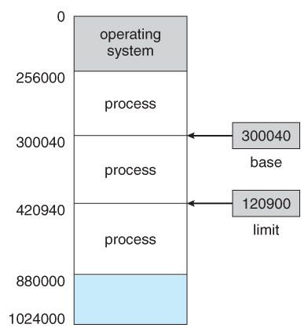

# Memory

 

- Main memory

> CPU가 직접 접근할 수 있는 기억 장치로  
> 프로세스가 실행 되려면 프로그램이 메모리에 load 되어야 함.

 

## 메모리 영역

 

|                 base-limit                  |
| :-----------------------------------------: |
|  |

 

> 프로세스들은 각자의 독립된 메모리 공간 필요  
> base < Process < base + limit  
> base와 limit은 운영체제의 커널에 의해서만 조작 가능 -> 사용자가 함부로 레지스터 변경 X

 

- phsical Address

> CPU가 생성하는 주소

 

- logical Address

> 메모리가 취급하게 될 주소

 

- 물리적 메모리와 논리적 메모리를 나누는 이유

> 프로세스는 할당된 논리적 주소를 통해 데이터 위치 표현  
> 메인 메모리의 크기가 한정되어 물리적인 메모리 크기보다 큰 프로세스 실행 불가능  
> 그리하여 가상 메모리를 이용하는데, 이때 필요한 주소가 논리적 주소.

 

## MMU

 

> 프로그램 실행 중 논리 주소 -> 물리주소 변환 해주는 과정을 해주는 하드웨어 장치

 

### Dynamic loading

> 메모리 공간의 효율성을 위해 프로그램의 일부만 load -> 200MB 프로그램과 100M 메모리?  
> 각 루틴들이 실제 호출 되기 전에 메모리에 모두 올라오지 않고, 재배치 가능한 상태로 디스크 대기.

 

- Dynamic Linking & Shared Libraries

> 사용자 프로그램이 실행될 때, 사용자 프로그램에 연결되는 시스템 라이브러리.

 

### Contiguous Memory Allocation

> 프로세스의 할당을 말 그대로 연속적으로 할당 하는 것

 

- 고정 분할

> 물리적 메모리를 정해진 개수만큼의 분할로 정해두고,  
> 각 분할에 하나의 프로세스를 적재하는 방식  
> 동시에 메모리에 올릴 수 있는 프로그램의 수가 고정되어 있고, 수행가능한 프로그램의 최대 크기 또한 제한  
> internal external fragmentation 문제

 

- 가변 분할

> 프로그램의 크기에 따라 분할의 크기, 개수가 동적을 변하는 방식  
> external fragmentation 문제
> 어디 메모리 공간에 프로세스를 올려야할지 결정해야 하는 문제

- first fit : 가장 먼저
- best fit : 가장 작은
- worst fit : 가장 큰
