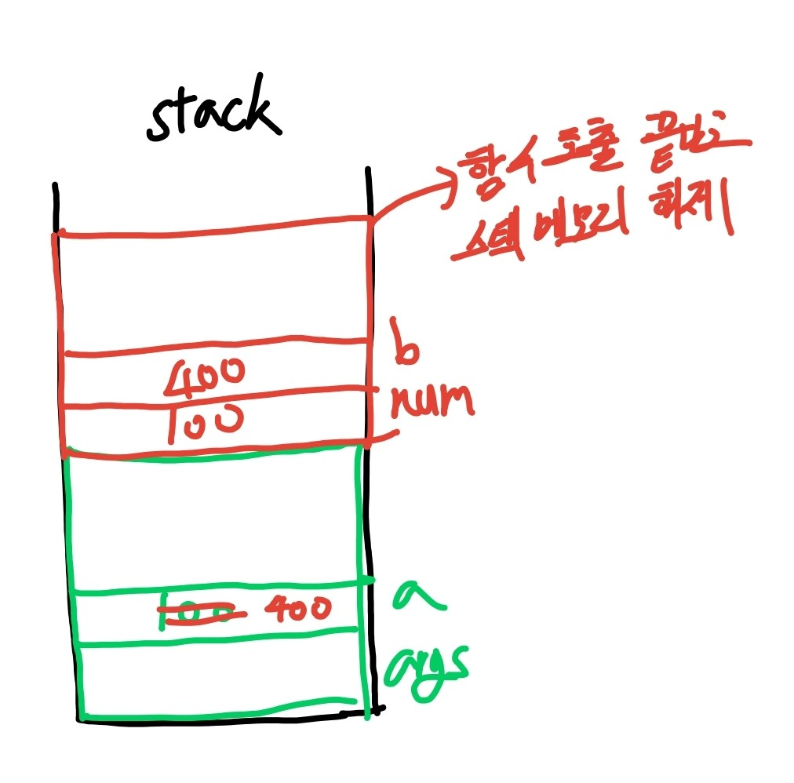
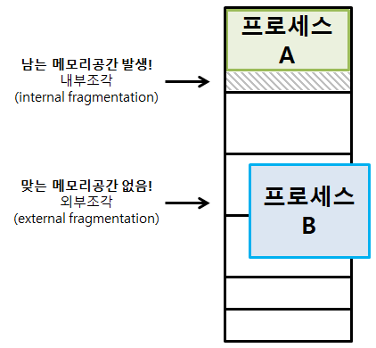

## 애플리케이션

> 일반 사용자가 사용할 기능을 제공하는, 컴퓨터가 실행할 수 있는 명령어들의 집합이다.

## 메모리

> 실행된 애플리케이션(프로세스)이 상주하는 곳이다.

## CPU

> 명령어를 실행하는 주체이다.

## 스택메모리

> 함수나 메서드가 호출 될 때마다 스택 프레임이 스택 메모리에 쌓이고  
> 스택 프레임안에 매개 변수와 지역변수가 저장되는 메모리 공간이다.

## 힙 메모리

> 모든 객체가 저장되는 공간이다.

- 참조 변수 : 객체의 메모리 주소값을 저장하는 변수
- 기본형 변수 : 기본형 타입의 값 자체를 저장하는 변수

## 코드 관점에서 메모리 예제

```java
public class Main{
  public static void main(String[] args){
    int a = 7;
    int b = 3;
    int c = a + b;
  }
}
```

|                예제 1                |
| :----------------------------------: |
|  |

- 메인 메서드 실행되는 순간 args가 스택 프레임에 쌓인다
- 그 후 a, b, c가 스택프레임이 쌓인다.

</br>

```java
public class Main{
  public static void main(String[] args){
    int a = 100;
    a = wow(a);
  }

  public static int wow(int num){
    int b = num * 4;
    return b;
  }
}
```

|                예제 2                |
| :----------------------------------: |
|  |

- main stack frame이 생성되고 args 할당
- a에 100 저장
- wow 스택 프레임 할당 되면서 num에 a 값 100저장
- b에 400 저장
- 함수가 반환되면서 스택프레임 해제
- 이후 a에 400 저장

</br>

```java
public class Main{
  public static void main(String[] args){
    Counter c = new Counter();
  }
}

public class Counter{
  private int state = 0;
  public void increment(){state++;}
  public int get(){return state;}
}
```

|               예제 3                |
| :---------------------------------: |
|  |

- main 스택 프레임 쌓으면서 args 저장
- Counter() 스택 프레임 쌓으면서 heap 메모리에 counter 객체 저장 + state = 0
- 이후 Counter() 스택 프레임 해제 하면서 c에 counter 객체 힙 메모리 주소 저장

</br>

```java
public class Main{
  public static void main(String[] args){
    Counter c = new Counter();
    two(c);
    int count = c.get();
  }

  public static void two(Counter c){
    c.increment();
    c.increment();
  }

}

public class Counter{
  private int state = 0;
  public void increment(){state++;}
  public int get(){return state;}
}
```

|               예제 4                |
| :---------------------------------: |
|  |

- main 스택 프레임 쌓으면서 args 저장
- Counter() 스택 프레임 쌓으면서 heap 메모리에 counter 객체 저장 + state = 0
- two 스택 프레임 쌓으면서 c 주소값 전달
- increment 스택프레임 쌓고 메서드 실행되어 state = 1로 만들고 해제
- increment 스택프레임 쌓고 메서드 실행되어 state = 2로 만들고 해제
- 이후 two 스택 프레임 해제
- get() 메서드 스택 프레임 쌓고 state 반환하면서 해제 후
- main 스택 프레임에 count = 2 저장

</br>

## 메모리 영역

</br>

|                 base-limit                  |
| :-----------------------------------------: |
|  |

</br>

> 프로세스들은 각자의 독립된 메모리 공간 필요  
> base < Process < base + limit  
> base와 limit은 운영체제의 커널에 의해서만 조작 가능 -> 사용자가 함부로 레지스터 변경 X

</br>

## phsical Address vs logical Address

- phsical Address : CPU가 생성하는 주소이다.
- logical Address : 메모리가 취급하게 될 주소이다.

</br>

### 물리적 메모리와 논리적 메모리를 나누는 이유

> 메인 메모리의 크기가 한정되어 물리적인 메모리 크기보다 큰 프로세스 실행 불가능하다.
> 따라서 가상 메모리를 이용하는데, 이때 필요한 주소가 논리적 주소이다.

</br>

## MMU

</br>

> 논리주소를 물리 주소로 바꿔주는 메모리 관리자 이다.

### fetch

> 프로세스와 데이터를 메모리로 가져오는 작업이다.

### placement

> 가져온 프로세스의 데이터를 메모리의 어떤 부분에 올려놓을지 결정하는 작업이다.  
> 메모리를 어떤 크기로, 어떻게 나누어서 올려놓을지에 따라서 메모리 관리 복잡성이 달라진다.

</br>

### replacement

</br>

> 메모리가 꽉 찬 상황이라면 프로세스를 하드디스크로 옮겨야 새로운 프로세스를 가져올 수 있다. 오래된 프로세스를 정리하는 작업이 재배치 작업이다.

</br>

## 연속 할당 기법 Contiguous Memory Allocation

> 프로세스를 메모리에 올릴 때 주소 공간을 메모리의 한 곳에 연속적으로 적재하는 방식이다.

### 고정 분할

|               고정 분할 방식               |
| :----------------------------------------: |
|  |

> 프로세스의 크기와 상관없이 메모리를 같은 크기로 나누는 것이다.  
> 동시에 올릴 수 있는 프로그램의 수가 고정되어 있어 융통성이 떨어진다.

- internal fragmentation 문제
- external fragmentation 문제

</br>

### 가변 분할

|                가변 분할 방식                 |
| :-------------------------------------------: |
|  |

> 프로그램의 크기에 따라 분할의 크기, 개수가 동적을 변하는 방식

- external fragmentation 문제
  - 컴팩션 방법으로 해결
    - 사용중인 메모리 공간을 한쪽으로 몰고 가용 공간을 확보하는 방법이지만 사용중인 프로세스의 메모리 주소 공간을 이동시켜야 하므로 비용이 많이든다.
- 어디 메모리 공간에 프로세스를 올려야할지 결정해야 하는 문제
  - first fit : 가장 먼저
  - best fit : 가장 작은
  - worst fit : 가장 큰
