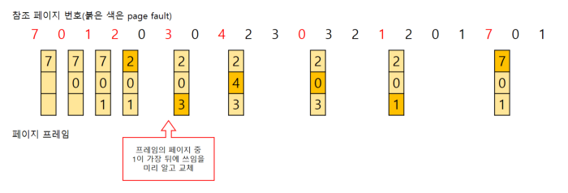
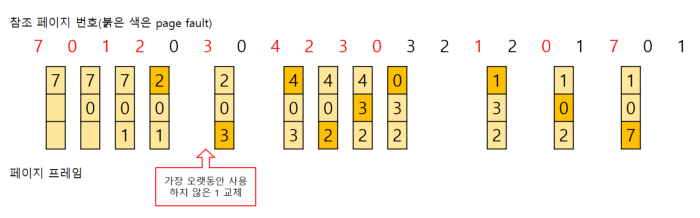
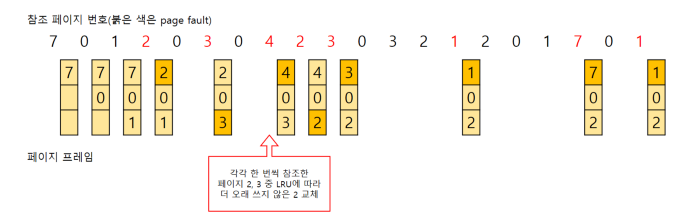
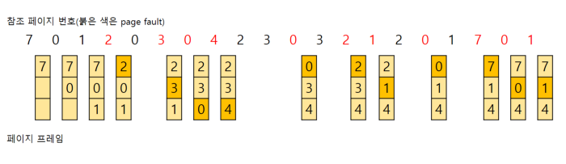

- [페이지 교체 알고리즘](#페이지-교체-알고리즘)
- [FIFO](#fifo)
- [Optimal Replacement](#optimal-replacement)
- [LRU](#lru)
- [second chance](#second-chance)
- [LFU](#lfu)
- [MFU](#mfu)

## 페이지 교체 알고리즘

> 주 기억장치 공간을 확보하기 위하여 현재 주기억 장치를 차지하고 있는 페이지 중에서  
> 어떤 페이지를 선택할 지 정하는 기법

 

- Belady's Anomaly

> 더 많은 프레임을 가지고 있음에도,
> 더 많은 page fault가 발생하여 성능이 떨어지는 현상

 

## FIFO

> 가장 먼저 올라온 페이지를 교체
> Belady's anonaly 현상이 발생할 수 있다.

 

## Optimal Replacement

|                   Optimal 알고리즘                    |
| :---------------------------------------------------: |
|  |

> 앞으로 가장 오랫동안 사용되지 않을 페이지 교체  
> but, 프로세스가 앞으로 사용할 페이지를 미리 알아야함으로 불가능

 

## LRU

|                   LRU 알고리즘                    |
| :-----------------------------------------------: |
|  |

> 가장 오랫동안 참조 되지 않은 페이지를 교체하는 알고리즘  
> 최근에 참조된 페이지가 가까운 미래에 다시 참조될 가능성이 높다는 성질 이용  
> 따라서 페이지마다 카운터가 요구됨  
> but, 프로세스가 주 기억 장치에 접근할때마다 참조 카운터를 기록해야함으로 오버헤드 발생

 

## second chance

 

> FIFO와 유사하나, 해당 페이지의 참조 비트가 1이라면  
> 교체 되지 않고 한 번의 기회를 더 준다.  
> 참조 비트가 0일 경우 교체  
> 참조 비트가 0인 페이지를 찾을 때까지 페이지 순환함으로  
> circula queue 통해 구현

 

## LFU

|                   LFU 알고리즘                    |
| :-----------------------------------------------: |
|  |

> 참조 횟수가 낮은 페이지를 교체하는 알고리즘이다.  
> LRU와 달리 LFU는 시간 규모에 따른 참조 횟수를 통해 참조 성향 고려  
> but, 가장 최근에 불러온 페이지가 교체 될 가능성이 있고  
> 시간 규모와 카운터에 따른 오버헤드 증가

 

## MFU

|                   MFU 알고리즘                    |
| :-----------------------------------------------: |
|  |

> 가장 많이 참조 된 페이지가 앞으로 사용되지 않을 것이라고 판단하여 교체하는 알고리즘
