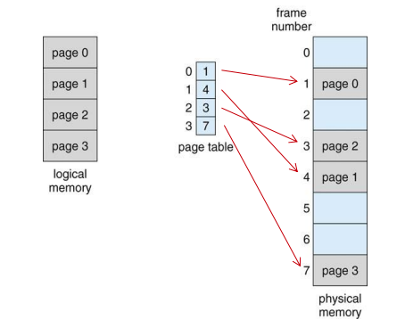

# 페이징 & 세그멘테이션

 

## 페이징

|            paging            |
| :--------------------------: |
|  |

> 프로세스를 일정한 크기의 페이지로 분할하여 메모리에 적재하는 방식  
> `페이지` : 고정 사이즈의 가상 메모리 내의 프로세스 조각  
> `프레임` : 페이지 크기와 같은 Main memory의 메모리 조각

 

### 논리 주소와 페이지 매핑 테이블

> 논리주소는 `<page,offset>`과 같은 형태로 구성  
> 이를 통해 논리주소를 물리주소로 변환

 

### page & offset

 

> page 번호 : 프로세스 페이지 테이블 접근할 때 이용  
> page 오프셋 : 참조 되는 frame 안에서의 위치  
> frame의 시작 주소와 페이지 오프셋이 결합하여 물리 메모리 주소

 

> 가정 하나의 페이지가 4KB = 2 ^ 12의 크기를 갖고,  
> os가 32bit 프로세서라고 가정하면  
> 논리적으로 4기가까지 사용 가능 하다.
> 2 ^ 32 / 2 ^ 12 = 2 ^ 20 = 4Gb

 

### 페이징 장단점

- 장점

> 페이징 기법을 통해 물리 메모리에 저장될때 연속되어 저장할 필요 없음  
> 물리 메모리의 남는 프레임에 적절한 배치를 통해 외부 단편화가 줄어듦.

 

- 단점

> 내부 단편화 문제 발생 가능성  
> 페이지 단위를 작게하면 해결 가능하나, 페이지 매핑 과정 복잡도 높아져 비효율성 증가

 
 
 

## 세그멘테이션

> 프로세스를 물리적 단위 페이지가 아닌 논리적 단위인 세그먼트로 분할하여 메모리에 적재하는 방식  
> 즉, 의미가 다른 논리적 내용을 기준으로 프로그램을 분할 하여 크기가 같지 않다.

 

### segment & offset

> 세그먼트 번호를 통해 세그먼트의 기준(세그먼트의 시작 물리주소)와 세그먼트의 길이를 파악

### 세그멘테이션 장단점

- 장점

> 내부 단편화 문제가 해소  
> 프로그램의 중요한 부분과 중요하지 않은 부분을 분리하여 보호와 공유에 용이하다.  
> 같은 코드 영역은 한 번에 저장 가능

- 단점

> 세그먼트의 크기는 가변적이라 동적 메모리 할당 -> 외부 단편화 발생 가능
