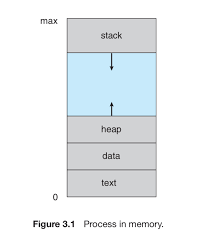
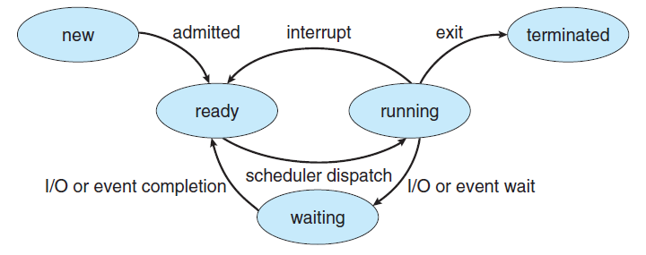
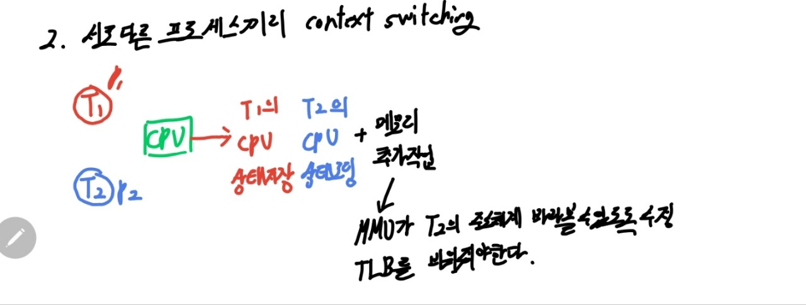
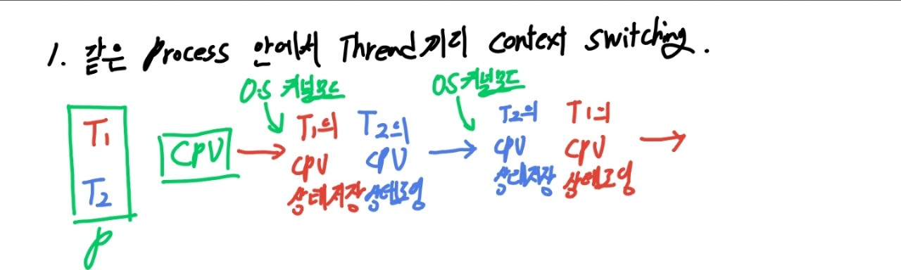

 

- [Program](#program)
- [Process](#process)
- [CPU](#cpu)
- [메인메모리](#메인메모리)
- [IO](#io)
- [멀티프로그래밍](#멀티프로그래밍)
- [멀티태스킹](#멀티태스킹)
- [Thread](#thread)
- [멀티 스레딩](#멀티-스레딩)
- [멀티 프로세싱](#멀티-프로세싱)
- [멀티태스킹, 멀티 스레디 , 멀티 프로세싱 개념 잡기 예제](#멀티태스킹-멀티-스레디--멀티-프로세싱-개념-잡기-예제)
- [Context Switching](#context-switching)
  - [Context](#context)
  - [컨텍스트 스위칭은 왜 필요한가?](#컨텍스트-스위칭은-왜-필요한가)
  - [컨텍스트 스위칭은 언제 발생하는가](#컨텍스트-스위칭은-언제-발생하는가)
  - [예제 멀티태스킹 시스템에서 컨텍스트 스위칭](#예제-멀티태스킹-시스템에서-컨텍스트-스위칭)
  - [컨텍스트 스위칭은 누구에 의해 실행되는가](#컨텍스트-스위칭은-누구에-의해-실행되는가)
  - [컨텍스트 스위칭은 구체적으로 어떤 과정으로 일어나는가?](#컨텍스트-스위칭은-구체적으로-어떤-과정으로-일어나는가)
  - [스레드 컨텍스트 스위칭이 더 빠른 이유](#스레드-컨텍스트-스위칭이-더-빠른-이유)
  - [PCB](#pcb)
- [프로세스와 쓰레드 차이](#프로세스와-쓰레드-차이)

## Program

> 컴퓨터가 실행할 수 있는 명령어들의 집합

## Process

 

> 프로세스는 메모리의 독립적인 영역을 할당 받아 실행되는 프로그램으로 OS에서의 작업 단위

|                 프로세스 - 메모리                  |
| :------------------------------------------------: |
|  |

| segment |                     description                      |
| :-----: | :--------------------------------------------------: |
| `code`  |                 실행되는 명령어 코드                 |
| `data`  |               전역변수, 정적 변수 할당               |
| `heap`  |        run time에서 동적으로 할당 받는 메모리        |
| `stack` | 함수 호출 시 관계되는 지역변수와 매개 변수 할당 영역 |

 

- initalized 영역
  - 해당 RAM뿐만 아니라 데이터의 초기 값을 가지고 있을 ROM에 할당 되어야한다
- uninitalized 영역
  - RAM에 해당 영역만큼 공간을 할당 한다.
- heap은 runtime에 크기 결정
- stack은 이미 생성되어 있는 스택에 대해 포인터 위치만 바꿔주는 CPU Instruction
- heap은 요청된 chunk의 크기 현재 메모리 fragmentation 상황 등 다양한 요소를 고려
- 따라서 stack 더 빠르다.

 

|                 프로세스 라이프 사이클                  |
| :-----------------------------------------------------: |
|  |

 

- 프로세스는 생성 된 후 ready queue에 들어감
- scheduler dispatch로 running 상태
- 실행중인 프로세스는 IO나 event 발생 시 waiting queue로 이동
- interrupt 발생시 ready queue로 이동
- running 상태에서 exit이나 프로세스를 반환하면 종료

 

 

## CPU

> 명령어들을 실행하는 연산 장치

## 메인메모리

> 프로세스가 CPU에서 실행되기 위해 대기하는 것

## IO

> 파일을 읽고 쓰거나 네트워크의 어딘가와 데이터를 주고 받는 것, 입출력 장치와 데이터를 주고 받는 것

 

- 단일 프로세스 시스템
  - 한 번에 하나의 프로그램만 실행 됨, CPU사용률이 좋지 않다

> 프로세스 P1이 있다고 할때 이것은 cpu를 사용할 수도 있고, IO를 사용할 수도 있다.  
> IO 작업을 하는동안에는 CPU사용률이 떨어진다.

## 멀티프로그래밍

> 이 문제를 해결하기 위해 여러개의 프로그램을 메모리에 올려놓고 동시에 실행 시키자!라는 개념이 나온다.
> IO작업이 발생하면 다른 프로세스가 CPU에서 실행된다.
>
> 이런 종류의 프로그래밍을 멀티프로그래밍이라고 한다
> 멀티프로그래밍은 `CPU 사용률을 극대화 시키려는 목적`이 있는 반면
> 하나의 프로세스가 CPU 점유 시간이 길어지면 다른 프로세스는 계속해서 대기해야 하는 단점이 있다.

 

## 멀티태스킹

> 멀티프로그래밍의 문제를 해결하기 위해서 프로세스는 한 번 CPU를 사용할 때 아주 짧은 시간만 CPU에서 실행되게 하자!
> 이런 종류의 시스템을 멀티 태스킹이라고 한다.
>
> 멀티 프로그래밍과 다르게 멀티태스킹은 cpu 타임을 아주 짧게 쪼개서 그 CPU타임 안에서 프로세스가 실행할 수 있도록 했다.
> `멀티태스킹은 프로세스의 응답시간을 최소화 시키는데 목적`이 있다.

 

- 멀티태스킹에서도 여전히 하나의 프로세스가 동시에 여러작업을 수행하지는 못한다.
- 여러프로세스를 만들어서 수행시킬 수 있지만, 프로세스의 컨텍스트 스위칭은 너무 무겁다...
- 또한 프로세스끼리 데이터 공유가 까다롭다.
- 듀얼코어가 등장했는데 잘 쓰고 싶다..

 

## Thread

> 이러한 문제를 해결하기 위해 나온 것이 스레드이다.  
> 쓰레드란 프로세스 내에서 독립적으로 실행되는 하나의 작업 단위(CPU에서 실행되는 단위)

- 프로세스는 한 개 이상의 스레드가 가질 수 있다.
- 같은 프로세스의 스레드들끼리 컨텍스트 스위칭은 가볍다
- 스레드들은 자신들이 속한 프로세스의 메모리 영역을 공유

 

|              Thread              |
| :------------------------------: |
|  |

- stack은 고유하게 갖고, heap, code, data영역만 공유한다.
  - 왜냐하면 스레드 내에서 호출하는 함수의 지역변수 및 파라미터 정보를 고유하게 가져야 한다.

 

## 멀티 스레딩

> 멀티스레등은 하나의 프로세스가 동시에 여러 작업을 실행하는데 목적

- 스레드가 등장하면서 멀티태스킹의 개념이 확장 됐다.
  - 여러 프로세스와 여러스레드가 아주 짧게 쪼개진 CPU타임을 나눠 갖는다

 

## 멀티 프로세싱

> 두개 이상의 프로세서나 코어를 활용하는 시스템을 멀티프로세싱이라고 한다.

 

## 멀티태스킹, 멀티 스레디 , 멀티 프로세싱 개념 잡기 예제

 

- 싱글 코어 cpu에 싱글-스레드 프로세스 두개

| 멀티 태스킹 | 멀티 스레딩 | 멀티 프로세싱 |
| :---------: | :---------: | :-----------: |
|      O      |      X      |       X       |

> (프로세스)싱글스레드가 두 개이고, cpu가 하나기 때문이다

 

- 싱글 코어 cpu에 듀얼-스레드 프로세스 한 개

| 멀티 태스킹 | 멀티 스레딩 | 멀티 프로세싱 |
| :---------: | :---------: | :-----------: |
|      O      |      O      |       X       |

> cpu가 하나이기 때문에 멀티프로세싱은 아니다.

 

- 듀얼 코어 cpu에 싱글-스레드 프로세스 두개

| 멀티 태스킹 | 멀티 스레딩 | 멀티 프로세싱 |
| :---------: | :---------: | :-----------: |
|      O      |      X      |       X       |

> 코어를 두고 경합하는 상황도 없고, 싱글 스레드만 사용하고 있다.

 

- 듀얼 코어 cpu에 듀어-스레드 프로세스 한 개

| 멀티 태스킹 | 멀티 스레딩 | 멀티 프로세싱 |
| :---------: | :---------: | :-----------: |
|      O      |      X      |       X       |

> 멀티 태스킹 x, 멀티 스레딩 o, 멀티 프로세싱 o

 

- 듀얼 코어 cpu에 듀어-스레드 프로세스 두 개

| 멀티 태스킹 | 멀티 스레딩 | 멀티 프로세싱 |
| :---------: | :---------: | :-----------: |
|      O      |      X      |       X       |

> 멀티 태스킹 o, 멀티 스레딩 o, 멀티 프로세싱 o

 

## Context Switching

 

> CPU/코어에서 실행중이던 프로세스/스레드가 다른 프로세스/스레드로 교체되는 것이다.

### Context

> context란 프로세스/스레드의 상태
> cpu, 메모리 등등의 상태

- cpu는 레지스터를 가지고 있다!

### 컨텍스트 스위칭은 왜 필요한가?

- 여러 프로세스/스레드를 동시에 실행 시키기 위함이다

### 컨텍스트 스위칭은 언제 발생하는가

- 주어진 time slice를 다 사용했거나
- IO 작업을 해야하거나
- 다른 리소스를 기다려야 하거나
- so on...

### 예제 멀티태스킹 시스템에서 컨텍스트 스위칭

그림 그리기

### 컨텍스트 스위칭은 누구에 의해 실행되는가

> os 커널 : 각족 리소스를 관리/감독하는 역할

### 컨텍스트 스위칭은 구체적으로 어떤 과정으로 일어나는가?

- 다른 프로세스끼리 스위칭인지
- 같은 프로세스의 스레드들끼리 스위칭인지에 따라 다르다

- 이 둘의 공통점은 무엇인가?
  - 커널모드에서 실행 된다.
  - cpu의 레지스터 상태를 교체해야한다

> 무슨말이냐면 cpu 안에 여러가지 레지스턱 있는데 각종 명령어를 수행하기 위해 필요한 여러 데이터를 저장하는 존재
> 프로세스 1이 cpu에서 register값들이 변경되면서 명령이 실행되는데
> p2가 cpu를 점유할때 p1의 register 상태를 pcb에 저장해야한다.

- 그럼 둘의 차이점은
  - 프로세스 컨텍스트 스위칭은
  - 프로세스끼리 메모리 주소 체계가 다름으로
  - MMU가 새로운 프로세스 주소 체계를 바라볼 수 있도록 수정해야하고
  - 가상 메모리와 실제 메모리 주소의 매핑 정보를 들고 있는 TLB도 비워줘야한다.
  - 가상 메모리 주소 관련 처리를 추가로 수행 해야한다.

|                      프로세스 컨텍스트 스위칭                       |
| :-----------------------------------------------------------------: |
|  |

|                      스레드 컨텍스트 스위칭                      |
| :--------------------------------------------------------------: |
|  |

 

### 스레드 컨텍스트 스위칭이 더 빠른 이유

> 스레드 컨텍스트 스위칭은 메모리 주소 관련 처리는 하지 않기 때문이다.

- 컨텍스트 스위칭이 미치는 간접적인 영향은?
  - 캐시(cache) 오염(pollution)

> 자주 사용하는 데이터는 memory에 직접 접근하지 않고 캐시로부터 데이터를 가져오면 더 빠른데
> 컨텍스트 스위칭이 일어나면 캐시에 있는 값이 오염 된다고 한다.  
> 왜냐하면 이전의 프로세스에 사용했던 정보들을 담고 있기 때문에  
> 현재 프로세스에서 원하는 정보가 없을 수 있다.

- 유저 관점에서 컨텍스트 스위칭이란? -의도하지 않은 순수한 오버헤드..

 

### PCB

|          Data          |                    description                     |
| :--------------------: | :------------------------------------------------: |
|          PID           |                  프로세스 식별자                   |
|     Process state      |            프로세스 cycle에서 현재 상태            |
|           PC           |     현재 프로세스가 실행할 다음 명령어의 주소      |
|    CPU resigisters     |                       DR, IR                       |
| Accounting information |     페이지 테이블, 스케줄링 큐 포인터 부모 등      |
|       I/O status       | 프로세스에 할당된 입출력 장치 목록, 열린 파일 목록 |

 

> 쓰레드는 프로세스와 다르게 code, data, heap 영역을 공유하고, stack은 공유하지 앟는다.  
> 왜냐하면 thread 내의 함수에 대한 개별 저장 공간이 요구 되기 때문  
> 또한 같은 주소 안에서 thread간의 switching은  
> 해당 쓰레드의 정보 PC, registers만 저장하면 됨으로 훨씬 가볍다.

 

## 프로세스와 쓰레드 차이

> 프로세스는 독립적인 주소 공간을 할당 받고 해당
> 프로세스에서 문제가 발생한다면 다른 프로세스에
> 영향을 주지 않는다.  
> 그러나 공유 자원을 사용하고 싶다면 IPC와 기법을 사용해야하는데 별도의 설비 및 구현이 쉽지 않고,
> Context switching의 오버헤드 문제도 고려
> 쓰레드는 반면 하나의 프로세스가 가지고 있는 공유자원을 사용 할 수 있고, Context 스위칭에 비하면 thread의 스케줄링은 보다 더 비용이 적은 편이다.
> 다만 하나의 쓰레드에서 문제 발생시 프로세스에 악영향을 줄 수 있고, 이에 따라 다른 쓰레드들도 영향을 받는다.  
> critical section에 대한 동기화 문제를 고려해야한다.
