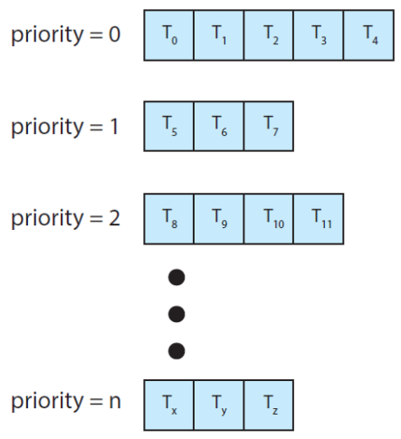

# CPI Scheduling

 

> CPU 이용률을 최대화 하기 위해 우선순위를 정하여 레디큐에서 프로세스를 꺼내오는 순서 정하기

 

## 선점(preemtive)

> CPU가 스케줄러에 의해 프로세스를 선점 할 수 있는 경우

 

## 비선점(non-preemtive)

> 프로세스가 CPU를 반환하기 전까지 CPU 사용을 유지하는 경우

 

- dispatcher

> CPU의 제어를 주는 모듈로, context switch를 실행  
> 즉 잦은 context switch는 dispatcher 지연을 발생 시켜 오버헤드 발생 가능성

 

### **스케줄링의 척도**

> - Throughput : 단위 시간당 처리되는 프로세스들의 수(작업량)
> - Turnaround Time : 프로세스의 수행 시간(start ~ end)
> - Waiting Time : 프로세스가 ready queue에서 대기하는 시간
> - Response Time : 작업이 실행 되기까지의 시간

 

#### **FCFS**

 

> 말 그대로 먼저 온게 먼저 나간다.  
> but, CPU burst time이 긴 프로세스가 들어올 경우 평균 대기시간이 증가함(convoy effect)

 

#### **SJF**

 

> CPU burst가 짧은 프로세스 순으로 실행  
> but, 다음에 들어올 CPU burst의 예측이 지수 평균 근사치로 계산하기 때문에 예측 어려움

 

#### **SRTF**

 

> 프로세스가 진행 중일때 새로운 프로세스가 들어올 경우 더 짧은 시간이 남아있는 프로세스를 선점하는 스케줄링  
> 이것 역시 이론상 효율적이지만 잦은 context switching으로 오버헤드 높아짐

 

#### **RR**

 

> 일정 타임퀀텀을 두고 스케줄링하는 기법  
> 타임퀀텀이 너무 짧을 경우 잦은 context switching  
> 너무 길 경우 FCFS와 근사해지는 문제점

 

#### **Priority-based**

 

> 우선순위 순으로 실행되는 스케줄링 기법  
> 단 우선순위가 낮은 프로세스에서 starvation 현상 발생  
> 대기하는 프로세스의 우선순위를 증가시키는 aging으로 문제 해결

 

#### **MLQ**

 

|             MLQ              |
| :--------------------------: |
|  |

 

> 작업들을 그룹화 하여 각 그룹의 우선순위를 지정한 후 그룹별로 큐를 사용하는 방식

 

#### **MLFQ**

 

|              MLFQ              |
| :----------------------------: |
|  |

 

> 타임퀀텀을 상이한 RR queue를 두고  
> 타임퀀텀을 다 소비하고도 종료되지 않으면 점진적으로  
> 더 타임퀀텀이 긴 RR queue로 이동하여 수행되도록 하는 것

 
 
 
