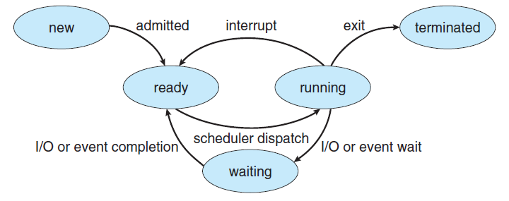

|               Process State                |
| :----------------------------------------: |
|  |

## 스케줄러

 

- cpu에서 프로세스가 running중이다가 다른 상태로 변경 될 때이때 cpu가 놀지 않고 다른 프로세스를 실행시켜야한다.
- 스케줄러는 CPU가 놀지않고 일을 할 수 있도록 프로세스를 선택하는 역할을 한다.

 

## 디스패처

 

> 디스패처는 스케줄러가 다른 프로세스를 선택하는데 이 프로세스가 실제 cpu에서 실행 될 수 있도록 만드는 역할을 한다.  
> `선택된 프로세스에게 cpu를 할당하는 역할`

- Context switching과 같은 역할을 디스패처가 한다.

> 이런 경우는 커널모드에서 실행되고 이후 다른 프로세스가 실행 될 수 있도록 유저모드로 전환이된다. 다시 컨트롤을 새롭게 선택된 프로세스에게 넘겨준다.

- 이렇게 커널모드에서 유저모드로 변경해주는 역할도 디스패처가 하고
- 어디서부터 작업이 실행되어야할지 적절한 위치로 이동하는 역할도 디스패처가 한다.

> 즉 잦은 `context switch는 dispatcher 지연을 발생 시켜 오버헤드 발생 가능성`

 

## 선점(preemtive)

> CPU가 스케줄러에 의해 프로세스를 선점 할 수 있는 경우

- 스케줄링의 선점 방식은 time slice를 다 쓰게 되면 ready queue로 보내거나
- waiting 상태에 있던 프로세스가 io 작업이 완료돼서 ready 상태에 있는 프로세스가 지금 실행되고 있는 프로세스보다 우선순위가 높다면 실행되고있는 프로세스를 ready queue로 보내는 스케줄링 방식이다.

- 적극적
- 강제적
- 빠른 응답성
- 데이터 일관성 문제

 

## 비선점(non-preemtive)

> 프로세스가 자신의 할일을 끝내고 종료, io작업, 자발적으로 다른 프로세스에게 cpu를 반환할 경우에만 os에서 개입을 해서 스케줄링 하는 것을 비선점이라고 한다.

- 신사적
- 협력적
- 느린 응답성

 

 

### **스케줄링의 척도**

> - Throughput : 단위 시간당 처리되는 프로세스들의 수(작업량)
> - Turnaround Time : 프로세스의 수행 시간(start ~ end)
> - Waiting Time : 프로세스가 ready queue에서 대기하는 시간
> - Response Time : 작업이 실행 되기까지의 시간

 

#### **FCFS**

 

> 말 그대로 먼저 온게 먼저 나간다.  
> but, CPU burst time이 긴 프로세스가 들어올 경우 평균 대기시간이 증가함(convoy effect)

 

#### **SJF**

 

> 댜음 CPU burst가 짧은 프로세스 순으로 실행  
> but, 다음에 들어올 CPU burst의 예측이 지수 평균 근사치로 계산하기 때문에 예측 어려움

 

#### **SRTF**

 

> 남은 CPU burst가 가장 짧은 프로세스부터 실행
> 프로세스가 진행 중일때 새로운 프로세스가 들어올 경우 더 짧은 시간이 남아있는 프로세스를 선점하는 스케줄링  
> 이것 역시 이론상 효율적이지만 잦은 context switching으로 오버헤드 높아짐

 

#### **RR**

 

> 일정 타임퀀텀을 두고 스케줄링하는 기법  
> 타임퀀텀이 너무 짧을 경우 잦은 context switching  
> 너무 길 경우 FCFS와 근사해지는 문제점

 

#### **Priority-based**

 

> 우선순위 순으로 실행되는 스케줄링 기법  
> 단 우선순위가 낮은 프로세스에서 starvation 현상 발생  
> 대기하는 프로세스의 우선순위를 증가시키는 aging으로 문제 해결

 

#### **MLQ**

 

|             MLQ              |
| :--------------------------: |
|  |

 

> 작업들을 그룹화 하여 각 그룹의 우선순위를 지정한 후 그룹별로 큐를 사용하는 방식

 

#### **MLFQ**

 

|              MLFQ              |
| :----------------------------: |
|  |

 

> 타임퀀텀을 상이한 RR queue를 두고  
> 타임퀀텀을 다 소비하고도 종료되지 않으면 점진적으로  
> 더 타임퀀텀이 긴 RR queue로 이동하여 수행되도록 하는 것
