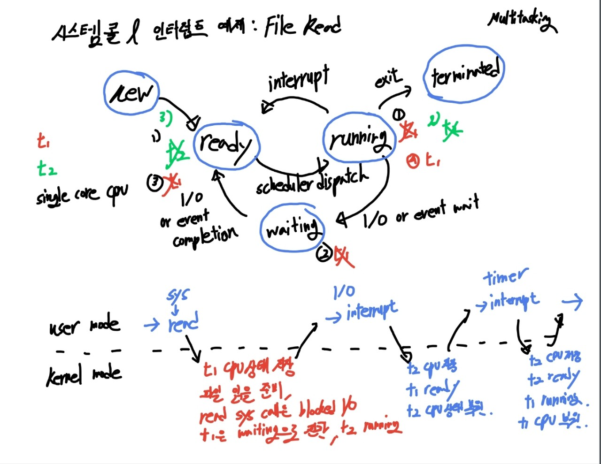

## 유저 모드

> user mode는 우리가 개발하는 프로그램은 일반적으로 유저 모드에서 실행  
> 프로그램 중에 인터럽트가 발생하거나 시스템 콜을 호출하게 되면 커널 모드로 전환된다.

</br>

## 커널 모드

> kernerl mode 프로그램의 현재 cpu 상태를 저장한다.  
> 커널이 인터럽트나 시스템 콜을 직접 처리한다.  
> cpu에서 커널 코드가 실행된다. 처리가 완료되면 중단됐던 프로그램의 cpu 상태를 복원  
> 그 후 다시 통제권을 프로그램에게 반환하면서 usermode로 변경되어 프로그램이 이어서 실행된다

</br>

## 커널

- 운영체제의 핵심
- 시스템의 전반을 관리/감독하는 역할
- 하드웨어와 관련된 작업을 직접 수행

</br>

## 커널 모드가 있는 이유

> 운영체제의 커널이 제공하는 서비스를 응용프로그램이 요청하여 접근 할 수 있도록 하는 인터페이스  
> 직접접근을 하지 않고 고급언어에서 제공해주는 API를 사용하는 이유는 내부 시스템을 악의적인 의도로 부터 보호하기 위해서다

</br>

## Interrupt

> 시스템에서 발생한 다양한 종류의 이벤트 혹은  
> 그런 이벤트를 알리는 메커니즘

</br>

- 인터럽트 종류

  - 전원에 문제가 생겼을 때
  - i/o 작업이 완료됐을 때
  - 시간이 다 됐을때(timer 관련)
  - 0으로 나눴을 때 (trap)
  - 잘못된 메모리 공간에 접근을 시도할 때 (trap)

- 아래에서 두개는 프로그램레벨에서 발생할 수 있다. trap이라고도 부른다

</br>

> 인터럽트가 발생하면 cpu에서는 즉각적으로 인터럽트 처리를 위해  
> 커널 코드를 커널모드에서 실행

</br>

## System call

> 프로그램이 os 커널이 제공하는 서비스를 이용하고 싶을 때
> 시스템 콜을 통해 실행

- 시스템 콜의 종류
  - 프로세스/스레드 관련
  - 파일 i/o 관련
  - 소켓 관련
  - 장치 관련
  - 프로세스 통신 관련

</br>

## 시스템 콜 & 인터럽트 에제 : File Read

</br>

- t1, t2, 싱글코어 cpu, 멀티태스킹 상황

|                      시스템 콜 & 인터럽트 예제                      |
| :-----------------------------------------------------------------: |
| .png) |

</br>

- t1이 running중이고, t2가 대기하고 있는 상황에서 file read system call 발생하면 유저모드 -> 커널모드
- 커널모드에서 t1의 cpu 상태 저장, 파일 읽을 준비, read system calld은 blokced i/o임으로 wating으로 상태 전환 되고, t2가 cpu 점유하여 running 상태로 전환
- 그후 i/o 인터럽트 발생하여, t1이 ready 상태로 전이
- timer 인터럽트가 발생되어 t2의 점유 시간이 다 끝나게 되면, t2의 cpu 상태 저장, t2는 ready 상태로 전이, t1은 running 상태로 전이되면서 cpu 상태 정보가 복원된다

> 시스템 콜이 발생하면 해당 커널 코드가 커널 모드에서 실행  
> 보통 우리는 개발할 때 직접 os 시스템 콜을 사용한 적이 없다  
> 그럼에도 우리는 지금까지 파일 I/O, 네트워크 I/O, 프로세스/스레드 관련작업을 해왔다  
> 어떻게 이게 가능했던것일까
>
> 이것은 우리가 사용하는 `프로그래밍 언어들이 시스템 콜을 wrapping`하여
> 간접적으로 사용할 수 있도록 제공했기 때문

- java.lang.Thread class

```java
Thread thread = new Thread();
thread.start()
```

> 그런데 이 작업은 반드시 시스템 콜을 요구하는 작업인데  
> 이게 어떻게 작동하느냐

```java
public synchronized void start(){
  boolean started = false;
  try{
    start0();
    started = true;
  }
  finally{

  }

}

private native void start0()
```

> 이런식으로 내부 메서드가 구현 되어 있는데  
> start 메서드 내에 native void start0가 실행 됨을 확인할 수 있다.  
> 보통 native 키워드가 붙게 되면 운영체제를 말하는 경우가 대부분이다
>
> 자바 네이티브 인터페이스 JNI를 통해서 기반이 되는 os의 시스템 콜을 호출한다.  
> 리눅스 기반의 os라면 clone이라는 시스템 콜을 호출하게 된다.

</br>

## POSIX API

</br>

| Process Control() |                                                                         설명                                                                          |
| :---------------: | :---------------------------------------------------------------------------------------------------------------------------------------------------: |
|      fork()       |                                     새로운 자식 프로세스를 생성 시키고, 부모 프로세스의 주소 공간을 복사하여 할당                                     |
|      exec()       |                                                exec()에 의해 호출된 프로세스가 메모리 공간을 할당 받음                                                |
|      exit()       |                                                               exit(0) 와 exit(1)의 차이                                                               |
|      wait()       | wait() 함수 발생 시 현재 프로세스는 wait queue로 이동, 자식 프로세스가 종료되면 부모 프로세스가 ready queue로 이동 하여 다시 실행 가능한 상태가 된다. |

</br>

> 자식 process의 pid는 0

</br>

- 고아 프로세스

</br>

> 부모 프로세스가 자식 프로세스보다 먼저 종료될 경우 init 프로세스가 자식 프로세스의 부모가 되는 경우

- 좀비 프로세스

> 자식 프로세스가 부모 프로세스가 먼저 종료 될 경우  
> exit() 함수 및 return문으로 반환되는 값을 운영체제는 부모 프로세스에게 전달 할 때까지 소멸 시키지 않는다.  
> 즉 좀비프로세스는 운영체제가 유지시키는 상태이고 부모 프로세스에게 return 및 exit으로  
> 좀비 프로세스의 종료 상태를 알려 소멸함으로써 주의 사항을 어길시 리소스가 낭비된다.

</br>

```cpp
// fork() 기본 예제

#include <stdio.h>
#include <unistd.h>
#include <wait.h>

int value = 5;

int main()
{
  pid_t pid;
  pid = fork();

  if(pid == 0){ // child
    value +=15;
    return 0;
  }
  else if(pid > 0){ // parent
    wait(NULL);
    printf("Parent: value = %d\n", value); // value=?
  }

}

```

</br>

| File management |
| :-------------: |
|     open()      |
|     read()      |
|     write()     |
|     close()     |

</br>

| Device Management |
| :---------------: |
|      ioctl()      |
|      read()       |
|      write()      |

</br>

| Information maintenance |
| :---------------------: |
|         pipe()          |
|       shm_open()        |
|         mmap()          |

</br>

| Protection |
| :--------: |
|  chmod()   |
|  umask()   |
|  chown()   |
