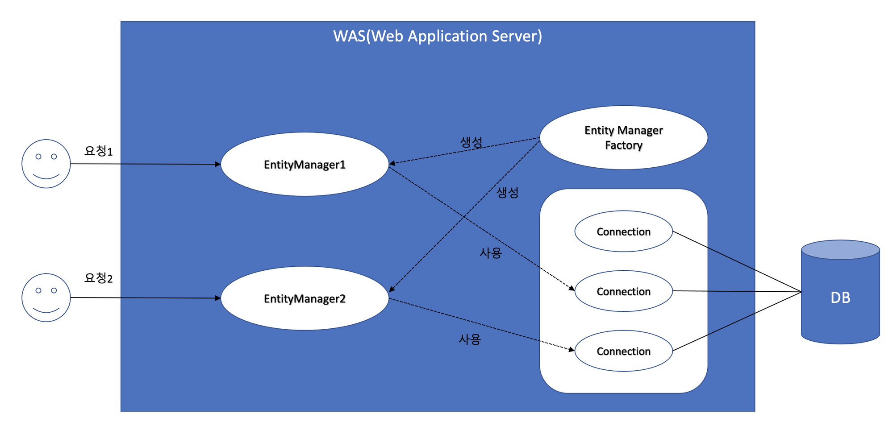
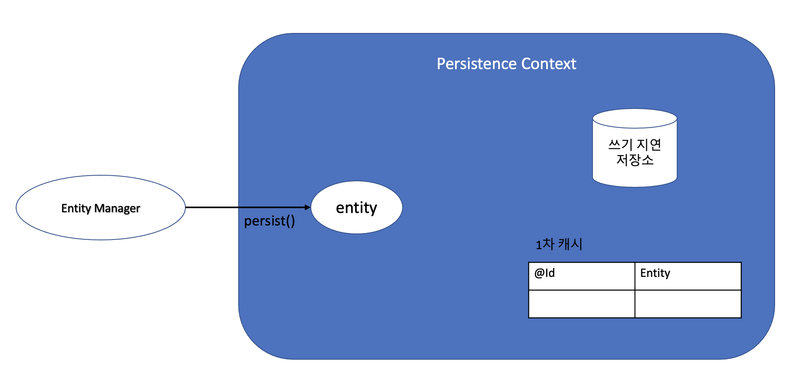
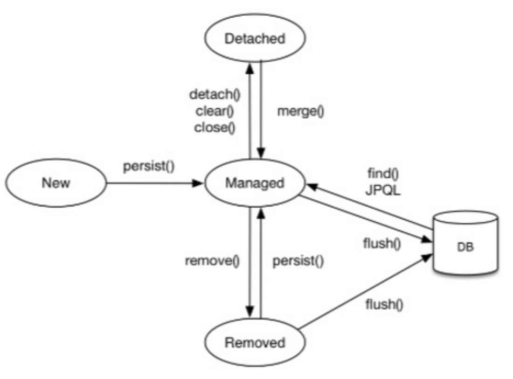
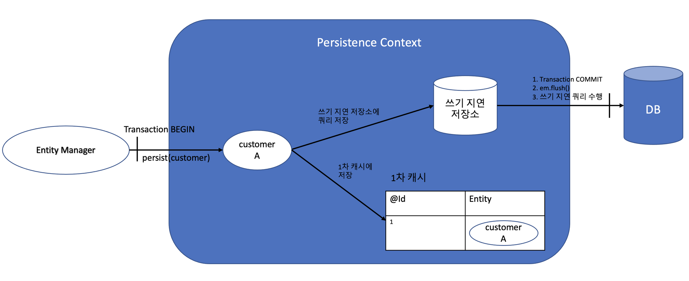
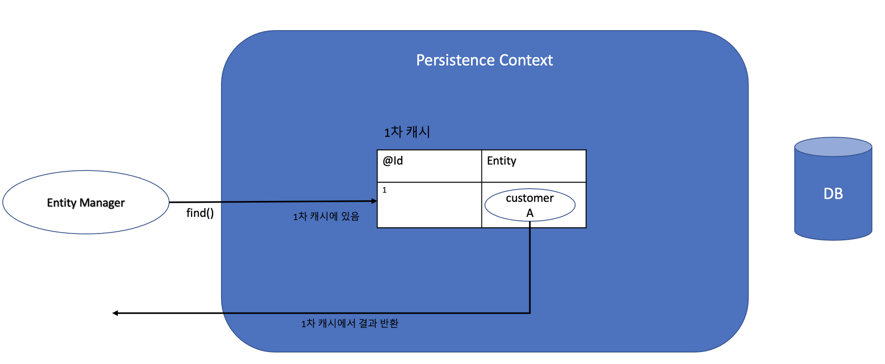
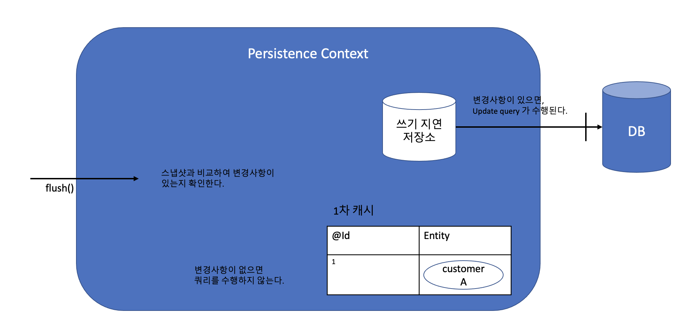

# JPA 영속성 컨텍스트란?

</br>

|                        WAS                         |
| :------------------------------------------------: |
|  |

</br>

## EntityManagerFactory

- Entity를 관리하는 EntityManager를 생산하는 공장
- EntityManager를 찍어내기만 하는 역할
  - Thread Safe
- EntityManagerFactory를 생성하는 비용 큼
  - EntityManagerFactory는 DB당 하나 사용

</br>

## EntityManager

- Entity에 대한 CRUD와 관련된 모든 일을 처리
- `NOT Thread-Safe`
  - 멀티쓰레딩 환경에서 공유하여 사용하면 Race Condition 발생
    - HTTP requests
  - Entity Manager에서 발생하는 예외는 `RollBack을 의미`
  - 따라서 EntityManager를 애플리케이션 단위로 설정할 경우 애플리케이션이 정지

</br>

## 영속성 컨텍스트

</br>

|                    영속성 컨텍스트                     |
| :----------------------------------------------------: |
|  |

</br>

> 영속성 컨텍스트란 엔티티를 영구 저장하는 환경이라는 뜻  
> 즉, 애플리케이션과 데이터베이스 사이에서 객체를 보관하는 가상의 DB같은 역할  
> 엔티티 매니저를 통해 엔티티를 저장하거나 조회할 때 엔티티 매니저는 영속성 컨텍스트에 엔티티를 보관하고 관리

</br>

- 엔티티 매니저와 영속성 컨텍스트는 1 : 1 관계.
- 엔티티 매니저를 통해 영속성 컨텍스트에 접근하고 관리 할 수 있다.

</br>

- 1차 캐시
  - 1차 캐시가 되는 것은 오직 식별자로 쿼리 할 때만 가능
  - 즉 @Id 어노테이션을 붙여둔 Key
- 동일성 보장
- 트랜잭션을 지원하는 쓰기 지연
- 변경 감지
- 지연 로딩

</br>

|                       영속성 컨텍스트 생명주기                       |
| :------------------------------------------------------------------: |
|  |

</br>

- new/transient : 비영속
- managed : 영속성 컨텍스트에 저장
- detached : 준영속
- removed : 삭제된 상태

</br>

## Customer 엔티티 통한 영속성 컨텍스트 이해

- 저장

|저장|
||

</br>

```java

EntityManager em = emf.createEntityManager(); // 1)엔티티 매니저 생성

EntityTransaction transaction = em.getTransaction(); // 2)트랜잭션 획득
transaction.begin(); // 3)트랙잰셕 begin

Customer customer = new Customer(); // 4-1)비영속
customer.setId(1L);
customer.setFirstName("honggu");
customer.setLastName("kang");

em.persist(customer); // 4-2)영속화

transaction.commit(); // 5)트랜잭션 commit
// 트랜잭션이 커밋이 되는 순간 쿼리가 수행된다. flush DB와 동기화가 된다.

```

</br>

> persist로 영속화 한 후  
> 트랜잭션 commit 되는 순간 flush 되어  
> DB와 동기화가 된다.

</br>

- 조회

|조회|
||

</br>

```java

@Test
void 조회_1차캐시_이용() {
	EntityManager em = emf.createEntityManager();
  EntityTransaction transaction = em.getTransaction();
  transaction.begin();

  Customer customer = new Customer();
  customer.setId(1L);
  customer.setFirstName("honggu");
  customer.setLastName("kang");

	em.persist(customer);
  transaction.commit();

  Customer entity = em.find(Customer.class, 1L); // 1차 캐시에서 조회한다.
  log.info("{} {}", entity.getFirstName(), entity.getLastName());
}

```

</br>

> transaction 시작 후 영속화 된 customer를  
> 식별자로 조회 하여 DB에 질의하는 것이 아닌  
> 1차 캐시로 조회 한다.

</br>

- 수정

|수정|
||

</br>

```java

@Test
void 수정() {
    EntityManager em = emf.createEntityManager();
    EntityTransaction transaction = em.getTransaction();
    transaction.begin();

    Customer customer = new Customer();
    customer.setId(1L);
    customer.setFirstName("honggu");
    customer.setLastName("kang");

    em.persist(customer);
    transaction.commit();
    // 엔티티를 영속화한후, 커밋을해서 flush()를 통해 DB에 저장.

    transaction.begin();

    Customer entity = em.find(Customer.class, 1L);
    entity.setFirstName("guppy");
    entity.setLastName("hong");

    // em.update(entity) ??!!
    transaction.commit(); // flush -> UPDATE ...
}

```

</br>

> 영속성 컨텍스트에서 식별자로 찾아 온 후  
> dirty checking하여 기존 스냅샷과 엔티티를 비교하여 변경된 엔티티를 찾는다.  
> 변경된 내용이 있을 경우 update 쿼리가 수행

</br>

## 결론

- EntityManager의 사이즈가 크면 안되는 이유

  - Transaction 도중 rollback 시키는 단위가 커진다.
  - Thread safe하지 않음으로 함부로 공유해서는 안된다.

- DBCP와 영속성 컨텍스트

  - 쓰기지연을 통해 커넥션 횟수를 줄일 수 있다면
    - 커넥션 풀을 받아오고 반환하는 시간을 줄일 수 있다.
    - 커넥션 풀 사용이 줄어듦으로 Http Request가 대기하는 시간이 줄어든다
    - 어찌됐든 더 적은 커넥션으로 더 좋은 성능을 낼 수 있다.

- 하지만 Spring Jpa에서는 조금 다르게 동작함으로 좀 더 알아보자!
