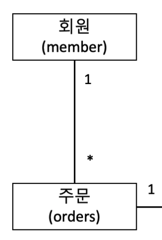

# Jpa 엔티티 매핑

</br>

## **Entity Class 특성**

</br>

### **1. Entity Class는 기본 생성자로 만들어야 한다.**

- 기본 생성자

```java
// Lombok
@NoArgsConstructor(access = AccessLevel.PROTECTED)
class Memeber(){}

```

</br>

```java

protected Memeber(){}

```

</br>

- 기본 생성자를 public으로 열어둬도 이상 X
- but, database table과 직접적으로 연결되는 class로 불완전 객체 생성을 막는 것이 좋다.
- 사실 의도가 없다면 불완전 객체 생성을 설계시에 막는 것이 좋다.

</br>

- Refelction

</br>

> 구체적인 클래스 타입을 알지 못해도, 그 클래스의 메소드, 타입, 별수들에 접근할 수 있도록 해주는 API  
> 이미 로딩이 완료된 클래스에서 또 다른 클래스를 Dynamic Loading하여  
> 생성자, 멤버 필드, 그리고 멤버 메서드 등을 사용할 수 있도록 한다.  
> `즉. 컴파일 타임이 아니라 런타임에 동적으로 특정 클래스의 정보를 객체화를 통해 분석 및 추출해내는 프로그래밍`

</br>

- 기본 생성자가 있어야 하는 이유
  - Java Reflection이 가져 올 수 없는 정보 중 하나가 생성자의 인자 정보
  - 따라서 기본 생성자 없이 파라미터가 있는 생성자만 존재한다면 Reflection이 객체 생성 할 수 없게 된다.

</br>

## **Entity mapping**

</br>

|              회원 - 주문 관계               |
| :-----------------------------------------: |
|  |

- 다음과 같이 회원과 주문 관계는 1 : N 관계
- 둘의 엔티티 매핑은 단방향으로도 이뤄질 수 있고 양방향으로도 이뤄질 수 있음
- 객체지향 관점에서는 양방향이 적합하나, 단방향으로 해도 이슈는 없음
- 단 양방향시 순환참조 에러 및 연관관계를 신경써 줘야함

</br>

```java

package com.prgrms.test.domain;

import javax.persistence.*;

@Entity
@Table(name = "members")
public class Member {

    @Id
    @GeneratedValue(strategy = GenerationType.SEQUENCE)
    private Long id;

    private String name;

    @Embedded
    private Orders orders = new Orders();

    protected Member(){}

    public Member(String name){
        this.name = name;
    }

    public void addOrder(Order order){
        order.setMember(this);
    }

    public Long getId() {
        return id;
    }

    public String getName() {
        return name;
    }

    public Orders getOrders() {
        return orders;
    }
}


```

</br>

```java

package com.prgrms.test.domain;

import javax.persistence.*;
import java.util.ArrayList;
import java.util.List;

@Embeddable
public class Orders {

    @OneToMany(mappedBy = "member", orphanRemoval = true)
    private List<Order> orderList = new ArrayList<>();

    public Orders() {

    }

    public void add(Order order){
        orderList.add(order);
    }

    public void remove(Order order){
        orderList.remove(order);
    }

    public int size(){
        return orderList.size();
    }

}


```

</br>

```java

package com.prgrms.test.domain;

import javax.persistence.*;
import java.util.Objects;

@Entity
@Table(name = "orders")
public class Order {

    @Id
    @GeneratedValue(strategy = GenerationType.SEQUENCE)
    private Long id;

    private Long price;

    protected Order(){}

    @ManyToOne(fetch = FetchType.LAZY)
    @JoinColumn(name = "member_id", referencedColumnName = "id")
    private Member member;

    public Order(Long price){
        this.price = price;
    }

    public Long getId() {
        return id;
    }

    public Long getPrice() {
        return price;
    }

    public Member getMember() {
        return member;
    }

    public void setPrice(Long price) {
        this.price = price;
    }

    public void setMember(Member member) {
        if(Objects.nonNull(this.member)){
            this.member.getOrders().remove(this);
        }

        this.member = member;
        member.getOrders().add(this);
    }
}

```

- Member와 Order는 양방향 관계
  - 일급컬렉션을 사용하여 1:N 관계 맺기
  - JPQL에서 역방향으로 탐색 추가
  - 양방향 매핑은 말 그대로 반대 방향으로 조회 기능이 추가 된 것일 뿐.

</br>

## 반드시 양방향? 반드시 단방향?

</br>

- 단방향으로 매핑 후, 역방향 참조가 필요할 경우 양뱡향 매핑 추가.'
- 단방향 매핑시 @OneToMany X
  - @OneToMany는 외래키를 갖는 객체가 관리하는 것이 아님.
  - 이로인한 불필요한 update 쿼리가 발생
- @ManyToOne 외래키가 존재하는 객체에서 연관관계를 맺어준 후 필요 여부에 따라 양방향 매핑

</br>

## FetchType.Lazy vs FetchType.Eager

</br>

- 위의 예제로 Member를 호출 할 때 Member가 갖는 모든 Orders를 불러올 거냐 아니냐라는 선택.
  - Orders가 필요하다면
    - Eager로 설정하여 proxy로 바인딩 하지 않아도 된다.
  - 단 참조된 order가 너무 많다면
    - N + 1 쿼리 문제로 성능 저하가 발생
- 따라서 정말 특수한 경우가 아니라면 Lazy loading을 권장한다.

</br>
