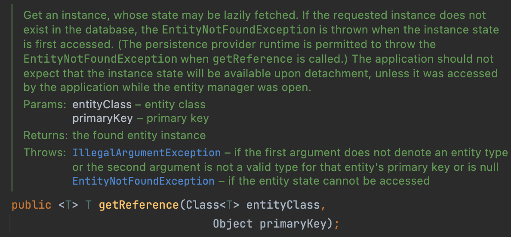

# 프록시와 연관관계

 

## LAZY LOADING vs EAGER LOADING

 

- LAZY LOADING을 사용하는 이유는
  - 비즈니스 로직상 참조 된 객체를 모두 불러들이지는게 확실하지 않다면 EAGER를 사용하지 않는다,
  - N + 1 쿼리문제 발생을 막기 위해.

 

## 프록시 객체

 

> 양방향 매핑시  
> @ManyToOne(fetch = FetchType.LAZY)를 설정할 경우
> 참조된 객체를 모두 불러오지 않고 프록시객체로 받아온다.  
> -> 불필요한 쿼리 방지

 

- EntityManager(getReference method)

 

|            getReference Method             |
| :----------------------------------------: |
|  |

 

- getReference()를 호출하면 프록시 객체를 생성한 뒤 영속성 컨텍스트 1차 캐시에 저장
- 실제 데이터를 얻기 위해 getName()을 호출한다
- 프록시 객체는 영속성 컨텍스트에 실제 엔티티 생성을 요청한다.
- 프록시 객체는 target 변수에 저장된 실제 엔티티 객체의 getName()을 호출해서 결과를 반환한다.

 

- 프록시 객체 특징
  - 프록시 객체의 초기화는 딱 한 번만 실행, target 객체에 저장되면 그것을 계속 사용
  - 원본 엔티티를 상속 받은 객체이므로 타입 체크에 주의
  - EntityManager.getReference() 실행 시 영속성 컨텍스트에 찾는 엔티티가 이미 있으면, 프록시 객체대신 실제 엔티티를 반환한다.
